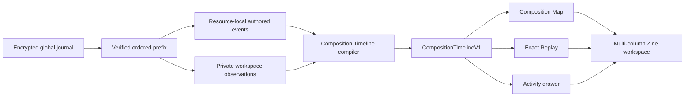

# Design: Zine Composition Replay — The Full Making of a Folder

**Status:** DRAFT FOR SPEC REVIEW  
**Mode:** BUILDER — PERSONAL INSTRUMENT  
**Date:** 2026-08-01  
**Repository:** `metanoos/zine`  
**Branch:** `codex/dogfood-ui`  
**Owner and first writer:** Peter Wei  
**Supersedes:** `/Users/peterwei/.gstack/projects/metanoos-zine/peterwei-codex-zine-design-20260726-090720.md`  
**Approved wireframe:** `/Users/peterwei/.gstack/projects/metanoos-zine/designs/composition-replay-wireframe-20260801-094605.html`

## Decision

Broaden Zine from deletion-first Ghost playback into **Composition Replay**: a truthful reconstruction of the whole text-composition process, including insertion, late insertion, deletion, replacement, undo/redo, settled selections, folder membership, and the logical multi-column workspace in which those actions occurred.

The default view is a **Composition Map** over the full current text. The prose remains static and fully readable while restrained trails show how surviving text arrived, where alternatives were removed or replaced, and which selections settled long enough to matter. Historical text is never fuzzily overlaid onto final-text geometry. Evidence that cannot map exactly to surviving positions moves to an explicit margin lane.

**Exact Replay** is one switch away. It reconstructs the document, folder membership, selections, columns, tabs, and active resources at each recorded frontier. “Exact” refers to authored bytes, event order, stable text identity, membership, and logical workspace state. It does not claim historical pixels, scroll offsets, panel widths, typing cadence, or window geometry.

One shared, versioned Composition Timeline compiler feeds both views. Files and folders are first-class replay scopes. A folder replay is the federated chronology of every action taken within that folder and its descendants, rendered across the editor’s multiple columns and per-column tab lists without copying descendant events into ancestor traces.

The manual **Step** mechanic is removed outright. No legacy Step reader, migration, storage, UI, or protocol compatibility is required. Exact trace frontiers and purpose-specific concepts replace every job Step previously performed.

## Problem Statement

Ordinary revision history makes the writing process a destination away from the present document. It replays old states after the writer leaves the current text, and it usually treats revision as a sequence of snapshots rather than a composition with surviving lineages, discarded branches, delayed returns, and movement across files.

Zine already records exact insertions, deletions, replacements, undo, redo, stable scalar identities, voices, and durable resource heads. But the product center and playback vocabulary remain deletion-first: Ghosts are the visible history, and manual Steps are the navigation landmarks. That model omits much of what makes composition meaningful:

- a sentence introduced late after its surroundings had stabilized;
- a phrase moved from notes into an essay;
- a replacement that changed the argument’s direction;
- a settled selection that shows what the writer was working on before the next authored action;
- a folder composed through actions across several files; and
- the actual logical workspace of columns and tabs in which those files were considered together.

Overlaying historical glyphs directly on the final text does not solve this. Earlier states had different line breaks and geometry. Once surrounding text changes, a literal overlay either drifts or pretends to precision the trace does not possess.

The product needs two complementary truths:

1. **How the current work came to be**, visible without leaving the current text.
2. **What the work actually was at an earlier frontier**, reconstructed without forcing that state into current geometry.

## What Makes This Cool

The current manuscript remains sovereign. Zine does not turn writing into analytics, a miniature DAW, or a forensic dashboard. At rest, the writer sees the complete present text. Its history is nearby as faint physical evidence. During playback or direct inspection, paths briefly illuminate: an insertion blooms from its stable anchor, a deletion peels into the margin, a replacement reveals the path between alternatives, and a settled selection appears as a quiet envelope.

A folder becomes a composition rather than a container. Playing **Writing Under Observation** can move from field notes to fragments to the main draft, open the tabs that were logically present, focus the column where the next action occurred, and show the phrase that crossed from one file into another. The writer sees the making of the work across files without any event changing ownership or being stored twice.

This is the product distinction: existing history tools make the past a place you visit; Zine makes composition history a truthful layer of the present while retaining exact-state replay underneath.

## First Lake

Use one authentic authored folder for **Writing Under Observation**. It contains the main essay and the real notes, fragments, sources, or conversations used to compose it.

The first lake is complete only when it demonstrates:

- exact file replay from the first action to current material;
- Composition Map and Exact Replay from the same compiled timeline;
- insert, late-insert, delete, replace, undo, redo, and settled-selection evidence;
- multi-file folder replay in global journal order;
- historical folder membership and logical column/tab reconstruction;
- explicit unavailable states for partial history or unmappable evidence;
- normalized playback without raw action timing; and
- a fixed-height transport that remains fixed regardless of descendant count.

This is not yet a corpus-wide resident replay engine or a public history format. It is one authentic folder-scale instrument built on architecture that does not need to be discarded when the scope grows.

## Constraints

### Truthfulness

- Current material remains byte-exact CommonMark.
- Stable position identities, never offsets or fuzzy matching, determine surviving mappings.
- Historical glyphs never pretend to align with final layout when their identities do not survive there.
- Unmappable deletions, replacements, and selections remain visible with an explicit reason.
- Exact Replay reflows exact historical text into current panel geometry and says so.
- Composition Map and Exact Replay must resolve the same compiled event identity at the same playhead.

### Privacy

- No keystroke-adjacent timestamps or pause durations are stored.
- No scroll offsets, pixel coordinates, viewport dimensions, panel widths, or window geometry are stored.
- Raw cursor motion is not stored.
- Logical workspace observations and settled selections are private local evidence, separate from authored resource traces.
- The observation stream is excluded from model context, publication, relay transport, and export by default. No disclosure control for it is part of this lake.

### Writing experience

- Backspace, typing, IME composition, tab changes, and selection cannot wait for replay projection work.
- Map animation is quiet and interruptible. At rest, the map settles into a faint static state.
- Reduced-motion mode replaces moving trails with state changes and static leaders.
- The full current text stays readable and selectable.
- The fixed transport never becomes one permanent row per resource.

### Existing architecture

- The append-only encrypted journal remains authoritative.
- Resource events keep their actual resource identity.
- Files retain material traces; folders retain ordered membership traces.
- Descendant events do not bubble into ancestor traces.
- The projections layer remains disposable and is the natural home for timeline compilation.
- Existing stable position identities, deterministic reducers, source mapping, folder membership, and column/tab UI are reused.

## Premises

1. **Composition Replay is the parent concept.** Ghosts remain disposition-aware discarded alternatives within the broader record of insertion, replacement, selection, movement, and workspace change.
2. **One evidence model feeds both views.** The Map cannot have a separate interpretation of history from Exact Replay.
3. **Files and folders are replay scopes.** A file replay follows one resource. A folder replay federates resource-local events through historical containment and global journal order.
4. **Logical workspace state matters.** Columns, tab lists, active tabs, tab moves, and settled focus are part of the private composition observation record.
5. **Physical workspace state does not.** Pixels, scroll, viewport, panel width, and transient focus are not captured.
6. **There are no manual Steps.** Authored actions are the chronology; exact frontiers identify stable states.
7. **There is no Step compatibility obligation.** This is a pre-release personal instrument. The new schema may reject or discard development-era Step traces.
8. **Timing is normalized.** Event order is exact; playback cadence is a presentation choice.
9. **Present-text geometry is not historical geometry.** Surviving identities may map to the current manuscript. Deleted, displaced, or unavailable branches use an honest margin lane.
10. **The default transport has constant height.** Detailed resource lanes are an on-demand inspection surface.

## Cross-Model Perspective

The external landscape reinforced the product distinction:

- Google Docs, Draftback, and Etherpad primarily replay earlier document states in a separate history mode.
- ProseMirror’s immutable steps, selections, and mappings validate the pattern of storing exact semantic actions and deriving views from them.
- Research on organic revision visualization demonstrates the value of insertion/deletion graphs and revision density, while also documenting overlap and scalability problems when every branch becomes a persistent visual object.

Two independent visual reviews converged on a manuscript-first direction:

- Treat Zine as a writer’s light table or palimpsest desk, not a timeline dashboard.
- Keep present prose dominant; reveal history through restrained illumination, leaders, underlines, margin fragments, and selection envelopes.
- Do not directly overlay duplicate historical glyphs on current glyphs.
- Keep the activity drawer optional and overlay it rather than resizing the writing surface.
- Avoid synthetic chapters after removing Steps. Pauses, automatic checkpoints, and resource switches may affect density, but they do not become authored landmarks.

One suggested interaction—**hold to expose lineage**—fits the evidence model but is not required for the first lake. Pressing and holding a surviving phrase would temporarily quiet unrelated history and reveal only that phrase’s insertion, replacements, deleted alternatives, moves, and settled selections.

## Approaches Considered

### Approach A: Renderer-first prefix player

The UI reads raw trace records, repeatedly reduces prefixes, and computes trails as it renders. Settled selections live in a small sidecar list.

This is the shortest prototype but makes the UI responsible for trace semantics, risks repeated prefix-reduction cost, and allows Composition Map and Exact Replay to drift. It is rejected as the product architecture.

### Approach B: Shared Composition Timeline compiler

A pure compiler consumes resource events plus a private logical-workspace observation stream and emits one immutable, versioned Composition Timeline. Both Map and Replay render that timeline.

This is chosen. It is the smallest coherent architecture that makes two views, file scope, folder scope, selection, workspace replay, normalized timing, unavailable states, and future performance work agree by construction.

### Approach C: Composition scene graph

The primary representation becomes an animated scene graph of text objects and lineages. It offers expressive cinematic playback but duplicates layout semantics, complicates accessibility and selection, and risks becoming a second source of truth.

It is rejected for the first lake. Scene-graph techniques may later render particular trail effects, but never become the authority.

## Recommended Architecture

### Authority boundaries

There are three distinct layers:

1. **Authored resource events** change file material or folder membership and advance that resource’s head.
2. **Private composition observations** describe settled selection and logical workspace state without advancing any authored resource head.
3. **Composition Timeline** is a disposable deterministic projection over a verified journal prefix.

Neither UI geometry nor a compiled timeline is authoritative. Rebuilding from the same verified prefix and compiler version produces the same timeline.

### Authored event families

File traces contain:

- `text.insert`
- `text.delete`
- `text.replace`
- `history.undo`
- `history.redo`
- attributed model material actions through the same text primitives

Folder traces contain typed structural events:

- membership insert
- membership remove
- membership move
- membership reorder
- child rename where the folder’s authored arrangement changes

The exact event names may follow current workspace-journal conventions, but they must be expressible as resource-local ordered events that the shared compiler can consume. Folder events do not masquerade as text records.

### Private observation families

The separate observation lane contains:

- `selection.settled`: resource, stable anchor range, direction, and bound authored frontier;
- `tab.opened` and `tab.closed`;
- `tab.activated`;
- `tab.moved`: source column and destination column;
- `column.opened` and `column.closed`;
- `column.focus.settled`; and
- optional observation-unavailable markers when capture was disabled or interrupted.

Observations carry durable global journal order or bind to the nearest acknowledged authored frontier. They do not carry raw duration. Repeated transient events coalesce before persistence.

Selection capture occurs:

- after a short quiet interval when the anchored selection remains unchanged;
- immediately before the next authored edit, model dispatch, resource switch, tab move, or column transition; and
- after IME composition has committed, never from provisional composition text.

Direction is retained because anchor-to-focus order communicates how a selection was made. Pixel rectangles are derived at render time and never stored.

### CompositionTimelineV1

The compiler emits an immutable intermediate representation containing:

- scope resource and scope kind;
- compiler and schema versions;
- verified journal boundary;
- ordered frames with global sequence and resource-local identity;
- exact affected resource frontier before and after each authored action;
- material action kind and stable position lifetimes;
- folder membership state at each structural frontier;
- logical columns, tab lists, active tabs, and settled focused column;
- settled selection episodes;
- normalized display duration and coalescing group;
- derived lineage: inserted, deleted, replaced, moved, retried, or late-added;
- current-text mappability and explicit unavailable reason;
- keyframes for bounded seeking; and
- provenance back to source event IDs.

Derived labels such as “late insertion” or Ghost disposition are projection results, not stamped authored facts. Changing a threshold recompiles the timeline without rewriting the journal.

### Single-pass compilation and seeking

The compiler walks the verified prefix once, maintains per-resource reducer state, and emits sparse keyframes. Seeking starts from the nearest prior keyframe rather than reducing from the first action on every scrub movement.

Keyframe cadence is an implementation tuning parameter. It may adapt to action density and resource switches, but it is never user-visible or treated as a semantic landmark.

Long folder histories hydrate descendants on demand. The activity drawer virtualizes rows and filters without changing the underlying folder chronology.

## Folder Federation

A folder replay is a projection over a graph of resource-local traces, not a new trace.

For each journal event, the compiler reconstructs historical containment. An authored or observation event participates in folder scope only if its resource was a descendant of that folder at that global journal sequence.

Consequences:

- A file moved into the folder appears at the move frontier with its then-current exact state. Its earlier actions do not appear as though they happened inside the destination folder.
- Subsequent actions participate until the file moves out.
- A nested folder moved in brings its current descendant states at that frontier; later descendant actions participate normally.
- The folder’s own membership event remains the only authoritative move record.
- No descendant event is copied into the folder trace.
- Moving a resource later cannot rewrite the history of where earlier actions occurred.

Global journal sequence supplies the cross-resource replay order. Resource-local causality remains authoritative within each trace. If the verified prefix cannot establish an unambiguous order or containment state, folder replay stops at the last complete frontier and says why.

## Removing Step Completely

Automatic checkpoints do not justify Step removal by themselves; they solve different physical problems. Step removal is safe because every acknowledged authored event already creates an exact frontier, and each former Step responsibility has a direct replacement.

| Former Step responsibility | Replacement |
|---|---|
| User-visible playback landmark | Ordered authored actions plus derived, non-semantic keyframes |
| Previous / Next | Previous / next compiled action or coalesced display frame |
| Stable current state | Exact acknowledged resource head |
| Folder stable state | Frozen scope frontier manifest of membership head plus descendant resource heads |
| Ghost settlement | Survival through a configurable number of subsequent authored actions, undo/redo state, and disposition |
| Search scope | Latest durable head or an explicitly selected resource/scope frontier |
| Citation target | Resource frontier plus stable position boundaries |
| Publication target | Explicitly frozen file or folder scope frontier |
| Relay promotion / witness target | Signed frontier or publication manifest, not a semantic Step event |
| Recovery accelerator | Existing technical material checkpoints and journal-verified snapshots |

Required removal includes:

- `StepId`, `StepLandmark`, `currentStepId`, `stepCount`, and `step` trace records;
- Step creation commands and buttons;
- Step-aware reducer and writer invariants;
- Step encoding, material-checkpoint tables, fixtures, and recovery validation;
- Step-driven Ghost survival;
- Step-bound search, citation, publication, and retry logic;
- signed Step promotion and Gate 2 object classes; and
- Step terminology in UI, documentation, tests, and protocol claims.

This is a schema break. Existing development traces containing Steps need not open or migrate. Technical Commit and checkpoint concepts remain, but they are invisible physical persistence mechanisms rather than authored history.

### Scope frontiers

A file frontier is its exact resource head.

A folder scope frontier is a deterministic manifest binding:

- folder resource ID and membership head;
- ordered direct membership at the frontier;
- recursively included descendant resource IDs and their exact heads;
- conflict or unavailable status for every included resource;
- visibility and disclosure policy; and
- a domain-separated hash of the canonical manifest.

Publication, folder citations, and signed durability bind this manifest. They do not require a user to create a landmark before acting.

## Composition Map

Composition Map is the default Read presentation and the quiet history layer in Write.

### Write

- The current edit or recent action may leave a short active trail.
- The trail settles quickly into the faint static map.
- Writing input never waits for map compilation or animation.
- The author can hide the history layer without disabling capture.

### Read

- The full current text is the default.
- Play and scrub animate the history layer over that text.
- Exact Replay is one switch away.
- The map remains a projection over present geometry and labels its limits.

### Visual grammar

- Surviving insertions: fine underlines, gutter-to-range leaders, or brief illumination.
- Late insertions: the same stable mapping with a distinct restrained cadence or mark, never a permanent alarm color.
- Deletions: faded exact removed text in the nearest honest margin lane.
- Replacements: paired removed and inserted evidence.
- Settled selections: translucent envelopes over surviving ranges.
- Unmappable selections: margin brackets with the unavailable reason.
- Movement across files: stable lineage leaders across the relevant visible columns or a focused lineage view.

The first aesthetic pass may start from the external review’s “palimpsest desk” palette:

- warm paper `#F4F0E7`;
- manuscript ink `#24221F`;
- graphite `#777169`;
- rules `#D8D1C5`;
- active history ultramarine `#526FA8`;
- deletion oxide `#A9695B`; and
- selection wash `#DCE3EF`.

This palette is a design-review starting point, not an approved replacement for the repository’s existing visual system. The approved decision is the interaction hierarchy and manuscript-first restraint.

## Exact Replay

Exact Replay advances through compiled frames and reconstructs:

- exact material bytes for every visible file;
- folder membership at that frontier;
- logical column count and order;
- each column’s tab list and active tab;
- the settled focused column;
- settled selections; and
- the action currently being applied.

It deliberately does not reconstruct:

- historical line wrapping or page coordinates;
- scroll positions;
- window size;
- panel widths;
- cursor motion between settled selections;
- time between keystrokes; or
- the user’s attention or intention.

If more logical columns existed than the current viewport can legibly display, replay preserves column identity and order while adapting presentation through horizontal access or temporary compression. It must say that geometry has been reflowed rather than silently implying a pixel-perfect recording.

## Transport and Activity Drawer

The folder transport remains roughly 72–76px and never gains one permanent row per descendant.

It contains:

- Previous, Play/Pause, and Next;
- one aggregate folder chronology;
- playhead and action index;
- current action kind and resource path;
- normalized-playback disclosure;
- `Map | Exact Replay`; and
- one **Activity** control.

The aggregate rail may show density, resource switches, structural events, and unavailable gaps without assigning a permanent color to every file.

Activity opens a searchable, virtualized drawer over the lower workspace. The drawer exposes the folder tree and detailed resource lanes. Selecting a resource filters emphasis or seeks; it does not create a different chronology. Closing the drawer returns the full editor height immediately.

## Failure and Unavailable States

Truthful replay must fail visibly rather than interpolate.

- **Partial journal prefix:** replay stops at the last verified sequence.
- **Damaged resource trace:** that resource becomes unavailable; folder replay may continue only where the missing state cannot affect containment or visible material, otherwise it stops.
- **Missing observation range:** authored replay continues with `workspace state unavailable` for the gap.
- **Unmappable current-text evidence:** evidence remains in the margin lane with its exact payload and reason.
- **Redacted evidence:** the frame preserves the authored absence and chain position but never reconstructs destroyed content.
- **Capture disabled:** the timeline marks the interval rather than implying nothing happened.
- **Reduced motion:** all information remains available through static state changes and labels.

## Open Questions

These are tuning questions, not architecture blockers:

1. What quiet interval best distinguishes a settled selection without capturing ordinary cursor motion?
2. What normalized duration curve makes small edits legible without making long traces tedious?
3. What action-distance threshold earns the “late insertion” label?
4. Should hold-to-expose-lineage enter the first lake or follow after the basic Map is trustworthy?
5. Which current Zine typography and color tokens should absorb the palimpsest-desk direction during design review?

## Success Criteria

### Evidence correctness

- Recompiling the same verified prefix produces byte-identical timeline output for a pinned compiler version.
- Every Map mark and Exact Replay frame links to the same source event identity.
- Text at every replay frontier equals direct core reduction of the same resource prefix.
- Folder replay order equals global journal order and respects historical containment.
- No event is duplicated into an ancestor trace.
- Undo and redo preserve original position identities and lineage.
- IME composition creates no observation or authored record from provisional text.

### Selection and workspace correctness

- Settled selections use stable anchors and direction.
- Tab, column, and settled-focus replay reproduces the recorded logical state.
- Missing observation ranges are explicit.
- No pixels, scroll offsets, panel widths, viewport dimensions, or raw timing enter persistence.

### Product behavior

- Composition Map opens on the full current text by default.
- Exact Replay is reachable with one switch and no separate forensic workspace.
- Deleted or unmappable evidence is never fuzzily placed.
- The transport height is unchanged for one, one hundred, or ten thousand descendants.
- The activity drawer remains responsive through virtualized large-folder fixtures.
- Reduced-motion mode communicates the same evidence without moving trails.

### Step removal

- New trace schemas contain no Step record or Step foreign key.
- Search, Ghost classification, citations, publication, recovery, and Gate 2 designs compile and test without Step.
- No user-facing Step command, count, label, or playback dependency remains.
- Development-era Step traces are rejected or discarded rather than silently reinterpreted.

### First authentic use

- Peter completes a real **Writing Under Observation** folder cycle in Zine.
- He can identify at least one late insertion, moved passage, replacement path, deletion, and settled selection from the Map.
- Exact Replay reconstructs the multi-file sequence without coaching.
- The Map answers a composition question faster than stepping through historical states alone.

## Distribution Plan

This remains a private local personal-instrument feature for the first lake.

- No public composition replay.
- No observation-stream relay sync or export.
- No sharing of selection or workspace state.
- No reader analytics.
- No claim that the trace proves attention, intent, or human authorship.

If composition history is later disclosed, it requires a separate product decision and an explicit disclosure manifest. The private default is structural, not a checkbox that can be accidentally inherited from material publication.

## Next Steps

### Assignment

Use one authentic **Writing Under Observation** folder to prove exact action replay, logical multi-column workspace replay, settled-selection capture, and the default Composition Map from one shared Step-less timeline.

### Execution sequence

1. **Remove Step from the target model.** Define frontier replacements across core trace, checkpoints, Ghosts, search, citations, publication, and Gate 2 before building replay UI.
2. **Define resource and observation schemas.** Add typed folder trace events and a private logical-workspace observation lane without mixing observations into material causality.
3. **Build the pure compiler.** Emit `CompositionTimelineV1`, keyframes, mappability, normalized frames, and deterministic fixtures in the projections layer.
4. **Capture one authentic file.** Record settled selection and produce both Map and Exact Replay for the main essay.
5. **Federate the authentic folder.** Add historical containment, multi-column workspace reconstruction, and movement across supporting files.
6. **Build the fixed transport and drawer.** Reuse the approved wireframe hierarchy and large-resource virtualization.
7. **Dogfood and correct claims.** Compare Map against direct replay, inspect unavailable states, and remove any visual element that implies geometry, timing, attention, or intent the trace does not hold.
8. **Run architecture, design, privacy, and performance review.** Only then treat the first lake as complete.

## What I Noticed About How You Think

You repeatedly widened the object only when the narrower model stopped matching lived composition. Deletion history became composition history because late insertion and selection were equally revealing. File replay became folder replay because the work actually happens across notes, drafts, and conversations. The playbar lost permanent rows because the real folder will not remain a demo-sized folder.

You also preferred conceptual subtraction over compatibility layering. Once exact action frontiers made Steps redundant, you chose to remove the mechanic rather than hide it or preserve an internal fossil. That is a strong signal about the instrument: fewer concepts, each with one honest job.

The durable design instinct here is not “record everything.” It is **record the smallest logical state that makes composition truthful**. That is why settled selections belong, while pixels, scrolling, raw timing, and transient focus do not.
