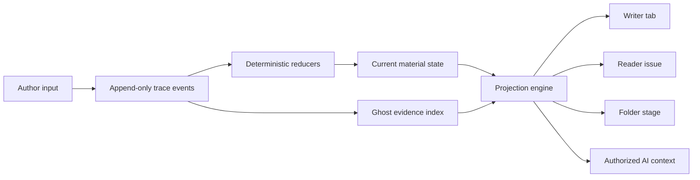
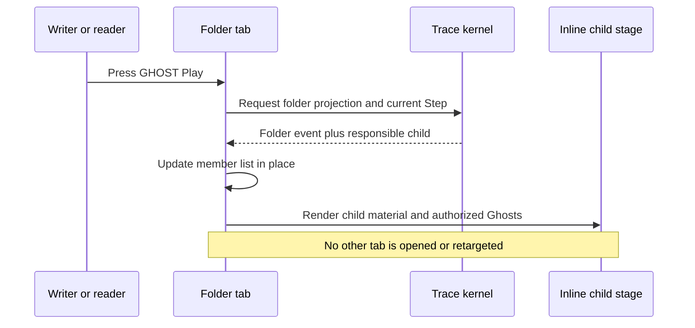

# Zine: A Personal Writing and Conversation Instrument

**Status:** DRAFT  
**Mode:** BUILDER — PERSONAL INSTRUMENT  
**Date:** 2026-07-26  
**Repository:** `metanoos/zine`  
**Branch:** `unknown` — the new Zine workspace is intentionally empty and is not yet a Git repository  
**Owner:** Peter Wei  
**First writer:** Peter Wei  
**First outside reader:** Eric, Peter's pastor, who performs his writings

## Decision

Rebuild Zine from scratch as Peter's personal writing system: his own Google Docs plus an AI-conversation recorder, organized as one file-and-folder world. Preserve the prior product learnings and design documents, but do not inherit the old implementation by default. The new instrument records exact authored change, renders selected discarded alternatives as Ghosts, and keeps essays, notes, sources, and LLM conversations available as research for later writing.

Zine does not require outside demand, reader adoption, or a startup outcome to justify its existence. The governing test is whether Peter voluntarily trusts it as the default home for his writing and AI research. Selective reader issues and use by other writers remain real product extensions, but they do not decide whether the personal instrument should continue.

The first complete personal loop is one essay, **Writing Under Observation**, composed alongside its related AI conversations and optionally shared with Eric as a no-account issue.

## Product Thesis

Writing is deciding what not to say. Every ordinary writing tool discards those decisions the moment they are made—the alternative is gone, and neither the writer nor anything assisting them can recover what was considered and is not currently used.

Zine keeps them. Abandoned text is preserved outside the surviving document, remains inspectable, remains searchable, and is fed back as disposition-aware context to the model writing alongside you. The result is assistance that knows what you already tried, where the writing moved, and what you repeatedly declined, while the writer can retrieve earlier thinking rather than re-derive it.

This is the product's spine: **disposition-aware revision history is superior context, for the model and for the writer.** It is testable in a single session, requires no reader or audience, and depends on no adoption by anyone else.

The provenance properties—voice attribution, anchored timestamps, forgery cost, longitudinal biometrics—are consequences of having built on an exact trace, not the argument for building one. They accrue whether or not anyone ever challenges an author's work, and they cost nothing extra once the trace exists.

The earlier observer-effect framing—whether preserving abandoned thought improves deliberation or induces performance—remains an open and interesting question, and **Writing Under Observation** still asks it. But it is a question the instrument can help investigate, not the premise the instrument rests on.

## Product Grounding

The status quo is Peter's writing and research spread across document editors, files, folders, and conversations with LLMs. Those tools preserve finished text or chat transcripts, but they do not form one authored file system where a model can read a bounded passage and its authorized alternatives, answer against that passage, and leave its attributed contribution inside the same exact revision history.

The attached precursor essay, **The Capacity to Warrant**, articulates the underlying need: authorship is a warranty, and evidence of process can support questions that the final prose alone cannot answer. It was written before the new trace exists and must never be presented as a traced artifact retroactively.

The first native artifact will be **Writing Under Observation**, written through span-bound inline exchanges with a model reader. Standalone explorations remain ordinary conversation research files and may be cited or explicitly forked from an inline exchange. The essay asks whether preserving abandoned thought improves deliberation or makes the writer self-conscious and performative, but Zine is not contingent on producing a causal answer.

Peter's design constraints come from an existing writing practice and product history: authorship as warranty, audience and performance, exact revision, the old multi-panel Zine shell, and the open question of whether culture can make the observer effect constructive. Eric is a named outside reader with an unusually close relationship to performed writing, not a market proxy.

The product must not yet claim:

- Evidence that other writers experience this as an urgent problem.
- Evidence that readers will use process evidence without coaching.
- Evidence that the convention improves prose rather than merely producing performance theater.

These are boundaries on claims, not kill criteria for a personal instrument.

## Assignment

First, run the first-order thesis comparison: take the same assistance task and frozen current passage, send it once without Ghost context and once with the authorized disposition-aware Ghost context, and record the exact requests, outputs, and concrete difference. Judge whether the additional context measurably changed or improved what the model produced; do not infer success merely because the answers differ.

Then use Zine as the primary workspace for one complete **Writing Under Observation** cycle: draft the essay, retain its Ghosts, invoke at least one material model action and one commentary action, revise or delete the resulting attributed model text as judgment requires, optionally fork a standalone line of inquiry into a conversation file, cite useful evidence, and create deliberate Steps without changing normal writing merely to produce an impressive trace.

After the cycle, record whether Peter voluntarily returned to Zine, recovered or inspected any abandoned passage, revisited an earlier inline response or model turn, and used either kind of evidence in a later decision. Failure to do one of these things is a design signal about the personal workflow, not a reason to abandon the project.

If the essay is shared with Eric, treat him as a directional usability reader, not a representative control. He performs writing and is unusually likely to care about abandoned lines. The optional entry contract is: show the clean essay first, with one plainly labeled `GHOST ▶` transport at the bottom. Do not explain the controls unless he becomes blocked. Observe separately whether he:

1. reads the clean essay first;
2. notices and correctly predicts the Ghost affordance;
3. enables or plays Ghosts;
4. understands that Ghost text is abandoned rather than current prose;
5. asks a process-specific question that the clean essay alone did not prompt; and
6. can say what the discarded alternative changed about his understanding.

Record behavior and exact questions, not compliments or general impressions.

This optional session tests discoverability, comprehension, and reader usefulness as separate outcomes. It does not test whether Zine made the essay stronger or whether another writer would adopt it. A missed control is a discoverability failure; a discovered but unhelpful Ghost is a usefulness failure.

For later comparison, preserve the clean-first reading notes before Ghosts are shown. Stronger-writing claims require repeated writing sessions and an agreed baseline, not post-hoc interpretation of Eric's response.

## Goals

- Make writing a normal, focused activity even when Ghosts are not displayed.
- Become Peter's trusted default home for essays, notes, sources, folders, and AI conversations.
- Preserve exact deletions outside the surviving document.
- Make substantive deletion visible as a brief content-bearing afterimage so recoverable erasure becomes a learned writing gesture without delaying or altering Backspace.
- Let the writer inspect, hide, replay, and selectively publish Ghosts.
- Make the relationship between material text, discarded alternatives, voices, citations, and reactions legible in the reading surface.
- Give AI access to explicitly authorized trace evidence without silently broadening scope.
- Make the primary human–model exchange happen inside the file through four explicit actions—Append, Rewrite, Reply, and Quote-reply—with material output attributed immediately and commentary kept in the margin.
- Treat files and folders as stable authored objects with exact history.
- Preserve the old Zine visual grammar: navigation rail, directory sidebar, N-column tabs, paper neutrals, literary content, monospace chrome, and rare gold accent.
- Permit a selective issue that Eric or another reader can open without an account.


## Non-Goals

- Reusing old application code merely because it exists.
- Claiming that process capture proves human authorship.
- Publishing raw keystrokes, pause timing, or reconstructable typing cadence under any setting; prompts and discarded alternatives also remain private unless explicitly disclosed.
- Reconstructing trace for work authored before capture.
- Making a separate replay surface or forensic player; playback remains inside the resource tab.
- Recording every tab focus change, panel resize, or workspace gesture as authored history.
- Treating a folder as a remembered desktop layout.
- Letting AI read private Ghosts simply because they are available locally.
- Building social feeds, marketplace mechanics, or generalized collaboration before the personal writing-and-conversation loop works.
- Operating as a third-party LLM traffic witness or proof service. Zine retains the per-attempt reference slot; it does not fill it.
- Live collaborative editing through operational transformation or streamed CRDT operations. It would relay keystroke-frequency operations, reversing the boundary that keeps fine-grained actions off the relay, and it would silently resolve overlapping prose into character-interleaved text that can be syntactically merged and semantically nonsensical. Stale-head lockout and commutative auto-merge address forking without either cost. Any future multi-person live editing is a separate product decision whose keystroke-exposure tradeoff must be explicit.


## Approaches Considered


### A. Public Ghost Issue

Build only an essay editor, exact deletion capture, Ghost display, and a public reader. This is the shortest path to an artifact for Eric.

Rejected as the product center because it optimizes for a reader demonstration while Peter needs a daily writing and research home.

### B. Personal Writing and Conversation Instrument

Build the personal loop first: ordinary writing, exact deletion capture, span-bound inline model reading, standalone conversation research, files and folders with stable identity, citations, Ghost inspection, recoverable export, encrypted push-only relay backup, and direct per-Step time anchoring. Keep publication small and delay multi-device authoring, reactions, recursive folder playback, and cross-platform parity until the daily loop is trustworthy.

Chosen. Folder identity and direct membership are pulled into the first data model because conversations and essays need authored research scope. Advanced folder projections are not required for the first usable instrument.

This is not the earlier folderless single-file approach. It preserves the founder's decision that folders are authored scope while refusing to make the first essay wait for every distributed-system commitment.

### C. Distributed Provenance Platform

Build stable file and folder identity, exact event history, tab-local playback, all projections, multi-device authoring, cross-device authorization, conflict handling, reactions, and desktop/web/mobile conformance from the beginning.

Deferred as an initial delivery path. Its protocol requirements remain design constraints for later sync and publication releases, but they do not sit in front of Peter's first dependable writing-and-conversation loop.

## Core Model

Zine has three separate but connected layers:

1. **Material** — the text and collection structure that presently survive.
2. **Evidence** — exact authored events, including discarded spans, Steps, voice attribution, and citations, plus observed reactions and timestamp proofs.
3. **Projection** — a particular rendering or disclosure of material and evidence for a writer, reader, folder view, AI request, or publication.

No projection is authoritative. This document uses four distinct terms:

- **normalized document text** — UTF-8 text with Zine's defined line-ending rules;
- **authored event set** — the validated, non-lossy history Zine retains;
- **reduced resource state** — the deterministic current file or folder derived from that event set; and
- **structured agent interface** — the typed MCP and adapter boundary used by models and tools.

This terminology replaces the overloaded use of “canonical” for text, history, state, and interfaces.




## Identity and History

Files and folders receive stable opaque IDs. Paths and display names are mutable labels. Rename and move events never change identity.

A file owns:

- its current material text;
- attributed text runs;
- its exact edit and Step history;
- span-bound inline reader requests, responses, annotations, and receipts;
- Ghost span evidence;
- outgoing citations;
- incoming relationship observations;
- relationships to zines and issues; and
- file-scoped AI memory and disclosure choices.

A conversation is a first-class file presentation, not a separate chat database. It adds an ordered turn model, participant voices, provider/session receipts, tool and context observations, and exact turn/span citation targets while retaining ordinary file identity, folder membership, Steps, Ghosts, issues, and publication rules.

A folder owns:

- stable identity and mutable name;
- ordered direct membership;
- membership, move, rename, and reorder history;
- its folder page — a content manager over ordered membership, carrying annotations on members rather than authored prose;
- folder-level voices, citations, and relationships to zines and issues;
- folder-scoped AI memory and disclosure choices; and
- projections over its descendant trace.

Nested folders remain boundaries. A parent lists a child folder as one direct member and does not flatten its descendants.

`zine` is a separate published-artifact resource kind. It has stable identity, a mutable display name, an ordered append-only list of immutable issue IDs, share/reachability records, and zine-level tombstone or revocation status. It points into file or folder history through each issue's exact Step; it does not become another mutable authoring container.

`identity` is a resource kind representing one publisher, and it is **an authored shell around observed data**. Its identity is the pubkey and nothing else; every other attribute belongs to that person and changes without notice. It cannot be a `source`, because a source pins one concrete verified event and a profile is a replaceable kind 0 — pinning a snapshot would freeze a name and picture from whenever you first encountered someone.

- **Authored by you:** petname, annotations, roll membership, group membership, disclosure choices. Ordinary trace events. The petname is what display and sorting use, so your lists do not reorder when a person renames themselves.
- **Observed from the network:** kind-0 profile, NIP-65 relay hints, last-seen activity, NIP-05 verification. These are observation events carrying observer, serving relays, retrieval time, and freshness — never authored mutations. A verified NIP-05 establishes that a domain vouched at a moment, not who someone is.

An identity has no material text, like a folder, and **does not own that person's works**. Their issues are separate sources pinned to concrete events; queries find them. Identities are created by **encounter** rather than by following: citing someone's essay creates one. Roll membership is therefore a subset of the identities you hold, and removing someone from the roll never deletes the identity or invalidates citations into their work.

A pubkey is also a natural voice ID, so the person listed in a roll and the attributed run inside a document resolve to one object.

## Actions, Steps, and Commits

The kernel distinguishes authored actions, semantic landmarks, and technical persistence boundaries.

Representative event families:

- file/folder create, rename, move, archive, and restore;
- membership insert, remove, and reorder;
- text insert, replace, and delete;
- inline model request, append, rewrite, reply, quote-reply, annotate, and fork;
- conversation-file turn prepare, send, receive, revise, fork, and compact;
- voice attribution and origin evidence;
- citation create, update, and revoke;
- AI context authorization, request receipt, attributed material result, and commentary result;
- zine create, issue freeze, share, withdraw, and zine tombstone; and
- explicit Step.

A **Step** is a deliberate semantic landmark used by the writer and the Ghost transport. It exists from Gate 0 as an unsigned durable journal landmark with a stable logical Step ID, ordered position, affected resource heads, and exact journal frontier. That landmark settles eligible Ghosts, supplies Search and citation scope, and drives Previous, Next, and playback. Raw actions remain exact evidence but do not masquerade as additional Steps. A folder Step checkpoints its dirty scope and creates one folder landmark; derived descendant advances remain inspectable beneath it.

Gate 2a promotes Steps to device-signed discrete Nostr events so NIP-03 can later attest their event IDs. Promotion assigns a Nostr event identity to an existing logical landmark; it does not re-sign an event, because a pre-Gate-2a Step was never a signed event. The signed Step event contains no prose or fine-grained actions. It binds the unchanged logical Step ID, affected resource heads, the ordered Trace Packet IDs frozen through that landmark, their `action_root`, and schema version. Step identity, ordering, Ghost settlement, Search scope, citations, and playback semantics are unchanged by promotion.

Gate 2a promotes every retained pre-Gate-2a Step exactly once while freezing the journal ranges through those landmarks into signed Commit object sets. Each promoted event uses an honest Nostr `created_at` equal to its signing checkpoint, not an inferred historical creation time. Its later NIP-03 proof therefore establishes only that the signed representation existed no later than the anchor block; it does not externally time-bound the original unsigned landmark. The journal can prove local identity and relative order, but product language and exports must distinguish `promoted` Steps from Steps created natively as signed events. Natively signed Steps use the same logical ID field and construction, so no internal reference retargets during promotion.

Step promotion sits in Gate 2a rather than Gate 2b because the signed Commit manifest must freeze one final object-set shape that already knows how to bind discrete Step events. Deferring Step events until anchoring would require a second Commit-manifest design and a migration between two signed durability formats. Gate 2a constructs that format once; Gate 2b only adds witness observations over the event IDs it already exposes.

A **Commit** is a technical freeze of local journal actions into one signed atomic replication unit. Accretive text and structural actions batch into ordered, size-bounded Trace Packet events. Objects created synchronously in that checkpoint that an external verifier must address directly—currently semantic Steps—are discrete Nostr events rather than actions hidden inside a packet. Automatic size, lifecycle, sync, or operation Commits never create user-visible Steps.

From Gate 2a, the checkpoint build order avoids a signature cycle: freeze and sign the Trace Packets; compute their ordered `action_root`; construct and sign the Step event over those packet IDs, heads, and that root; then construct and sign the Commit manifest over both the ordered packet IDs and discrete-event IDs. The same order promotes a retained unsigned Step. The manifest carries the shared `action_root` plus a separate `object_set_root` over every named packet and discrete event. The Step does not contain the Commit-manifest ID. One Commit consists of its signed manifest, zero or more ordered Trace Packets, and zero or more named discrete events. Reducers expose none of the Commit's actions or discrete objects until the complete verified set is available.

`action_root` is computed over the canonically encoded ordered action records before packet chunking, while `object_set_root` is computed over the manifest's ordered `(event kind, event ID)` list after every packet and discrete event is signed. The first proves action-sequence continuity across packet boundaries; the second proves atomic completeness of the signed transport objects.

Every local action record should minimally include:

- event ID;
- resource ID and resource kind;
- causal predecessor and current semantic Step where applicable;
- acting voice and origin class;
- device stream ID;
- local monotonic sequence with no wall-clock time by default;
- operation payload;
- visibility classification;
- schema version; and
- local integrity metadata.

Every Commit manifest additionally binds the ordered Trace Packet IDs, ordered discrete-event IDs and kinds, packet/event counts, action count, affected resource heads, validation-manifest reference and authorization class, previous Commit heads, `action_root`, `object_set_root`, Commit reason, schema version, and required Nostr `created_at`. All events in one Commit use the same checkpoint time. A Commit is `partial` if any named packet or discrete event is absent or invalid. Wall-clock time is never authoritative for action order.

A checkpoint discrete event is introduced by exactly one Commit manifest. Later events may cite its ID, and mirrors may repeat the same verified tuple, but another Commit cannot reintroduce it as newly created. A Step event and the Commit manifest that introduces it must agree on packet IDs, affected heads, `action_root`, schema, device authorization, and checkpoint time; the manifest's independently recomputed `object_set_root` must cover that exact Step event or the entire Commit is invalid.

Asynchronous witness results created after that window—completed NIP-03 kind-1040 events and signed relay receipts—are auxiliary observation events keyed to an already committed target. They never mutate an authored resource head and require no new authored Commit. This lets a read-only replica maintain external proofs without crossing the Tier 1 boundary; it does not relax the rule that every discrete event created inside an authored checkpoint is named by that Commit.

Reducers must be deterministic, idempotent, and independently testable. Material reduction and Ghost evidence indexing should be separate reducers so a Ghost bug cannot corrupt the surviving document.

### Normative Event Validity

A schema-valid event is not necessarily trace-valid. The trace validator must reject or quarantine streams with:

- duplicate event IDs;
- missing causal predecessors outside an explicitly declared import boundary;
- causal cycles;
- non-monotonic per-actor sequence numbers;
- an operation incompatible with its resource kind;
- a move or membership transaction that updates only one side of the relationship;
- an event signed by a voice not permitted for the claimed operation;
- an unsupported schema transition; or
- a claimed merge that omits one of the heads it says it resolves or cannot verify all named parents.

Cross-resource operations use one atomic transaction envelope containing all affected resource events. A reducer either applies the complete valid transaction or none of it. Causal ancestry determines dependency. Actor sequence and event ID provide stable presentation order for otherwise concurrent events; they never silently choose one conflicting prose state as the winner. Wall-clock time is never authoritative.

A resource may have several valid concurrent heads. Non-overlapping concurrent text edits are commutative under the character-level position identities used for Ghost anchoring and reduce together automatically without a conflict artifact. Overlapping edits—two heads touching the same identity range, including concurrent insertions claiming the same neighbor gap—always produce an explicit conflict artifact containing every head and common ancestor and always require an authored merge. No branch is discarded. Publication blocks while the selected projection remains conflicted. Gate 0 chooses a position-identity scheme whose single-writer subset serves stable Ghost anchoring and remains forward compatible; Gate 4 implements and tests its concurrent placement behavior.

### Stale-Head Lockout

The dominant single-writer fork is not live collaboration but stale-device editing: a device left open at an older head and edited after work continued elsewhere.

A device that is not at the synced head is read-only until it catches up, displaying an explicit syncing state. This reuses the existing rule that historical tabs are read-only until returned to Live. In Tier 1, read-only rehydration devices can never become stale writers because only the designated writing device has Commit authority. In Tier 2, every authoring client proves current-head status before enabling edits.

Prevention is preferred to reconciliation. With lockout in place, genuine concurrent heads should be rare enough that authored merge remains an acceptable ceremony rather than a routine tax.

The merge interface is a dedicated resource tab, not an invisible sync dialog. It shows the common ancestor, each device or writer branch, and a composed result. Each conflicting span can take the left branch, take the right branch, keep both in a chosen order, or be rewritten. Non-conflicting spans are precomposed but remain inspectable. Committing the merge creates one new Step referencing every resolved head; canceling preserves all branches and leaves publication blocked only for the conflicted resource.

Incoming citation information discovered from relays or peers is not silently folded into authored material state. It is stored as a sourced observation event with observer, source, freshness, and retrieval time, and projections may expire or replace that observation without rewriting the cited resource's authored history.

## Deletion and Ghost Semantics

Backspace behaves like Backspace: the selected or adjacent characters disappear from the material view immediately. The exact removed material text becomes a journaled deletion action. Ghost evidence is projected from those actions after classification rather than decided at capture time.

Material text is **CommonMark markdown**, stored as normalized document text (UTF-8, LF line endings, no NFC/NFKC normalization). Markdown is the native format, not a serialization target: there is no separate internal document representation and no publication converter, because a converter would rewrite bytes at exactly the point where byte-exactness is warranted. “Exact” means exact UTF-8 bytes of this normalized representation, not preservation of an imported file's original encoding or CRLF byte sequence.

Gate 1 includes **Simplified-Chinese authoring compatibility**, not merely the ability to store Han code points. On Peter's named desktop, Pinyin IME input, Chinese punctuation, unspaced Han prose, and mixed Chinese/Latin/emoji text must survive editing, identity assignment, recovery, export/import, conversation turns, and exact-span citation without rewriting source bytes. This is an authoring and content-language requirement; translating the English application chrome is not a Gate 1 dependency. When a document language is known, rendered material exposes appropriate `zh-Hans` metadata and uses CJK-capable fallback fonts and line breaking.

The flavor is pinned to CommonMark plus a small documented extension set. Extensions erode the portability that justifies the choice and must be added deliberately, never casually.

Non-standard bracket notations are prohibited in material text. `[[ ]]` is not used—it means wikilink to users with prior exposure, and it would break CommonMark. `(( ))` remains a derived prompt projection only and never appears in the document.

Internal links bind to stable resource IDs and serialize as ordinary markdown links; external citations serialize as markdown links to `nostr:` URIs. Both survive rename, and both render in any markdown reader.

The editor supports both raw source and hybrid rendering. Hybrid rendering requires an exact mapping between source positions and rendered positions; Ghost and annotation margins align to rendered lines while anchoring to source position identities.

Rules:

- The deleted payload lives outside the surviving document.
- User-facing deletion respects grapheme-cluster boundaries unless the user explicitly selected a different range; the event stores the exact normalized range that was removed.
- Replace is one atomic event with removed and inserted payloads, not an unrelated delete followed by insert.
- Undo references and reverses the exact originating event, restores normalized document text, and records the reversal without destroying the original evidence.
- A contiguous deletion gesture may coalesce for presentation while preserving constituent actions where available.
- Ghosts anchor to **character-level stable position identifiers** assigned at insert time (CRDT-style sequence identities), not to offsets and not to fuzzy context matching. A ghost's anchor is the identity of the characters that surrounded it, so ordinary revision cannot drift it. The editor maintains this identity layer alongside its offset-based transaction model.
- If an anchor cannot be rendered exactly after concurrent or structural change, the evidence remains available in an orphaned-event inspector rather than being guessed into place.
- Large deletes collapse visually by default.
- Ghost visibility is private by default and independent of capture.
- Payloads entered through classified protected fields or explicitly excluded regions must never enter Ghost events. An unclassified secret pasted into ordinary author text may still be captured; secret scanning may warn, quarantine, or require classification but is defense-in-depth rather than a completeness guarantee.

**Membership removal is typed discard evidence, not a text Ghost.** Removing a member from a folder produces a `membership_discard` projection keyed to folder and member resource, following the same pattern as `query_rejection` under Model-Assisted Filtering: it shares Ghost visibility, disclosure, and inspection semantics but is not character-anchored and does not use the text-Ghost reducer. Position identity governs scalars and has nothing to say about edges.

Edge discards need their own disposition vocabulary, because the text categories do not map. `MOVED` must cover relocation to another folder and must never render as a decline — a work moved elsewhere is the single most common removal and the one most damaging to misread, since a folder discard names a resource and, when published, names its author. Removals incidental to reordering produce no discard evidence at all.

### Redaction

Deletion is never destructive; **redaction** is the separate, deliberate operation that destroys content, and it is required rather than optional. Secret scanning is defense-in-depth and not a completeness guarantee, so the design already concedes that a key, a password, or a third party's confidence can reach the trace. Conceding that without an exit would leave an unfixable hole and an obligation to others that cannot be met.

Redaction **zeroes a payload and keeps its record**. The event, its position, its predecessor hash, and the chain around it all survive and still verify; only the content is gone. Records are never removed, because removing one would break verification and make the corpus lie about what happened. A redacted record renders as redacted — an authored absence, not a silent gap.

Consequences must be stated rather than implied:

- **Disposable projections rebuild.** Indexes and snapshots reproject without the payload.
- **Published issues cannot be recalled.** Redaction changes local bytes and future projections; an issue already shared is immutable and already distributed. Withdrawing reach is the only available action, and it changes availability rather than existence.
- **Citations into redacted content resolve to an explicit redacted state**, never a broken anchor and never a silent omission.
- **Oblivion is a container, not an operation.** Moving a resource there is reversible; emptying it redacts the payloads of what it holds, and that act is itself recorded.

The product verb should say what happens. "Erase permanently" promises deletion Zine does not perform and would not survive its own integrity claims.


### Position Identity Contract

The exact sequence algorithm remains the blocking Gate 0 choice, but every candidate must satisfy the same observable contract:

- Identity is assigned when normalized text enters the committed editor model, after an IME composition completes. Provisional composition text has no authored identity. A Pinyin composition commit creates exactly one durable typed insert or replace action; composition cancellation creates none; and failed persistence restores the pre-composition durable projection without adopting provisional DOM text.
- Every resource begins with permanent start and end sentinel IDs. They are not text, cannot be selected or tombstoned, and provide the neighbor pair for an empty file or whole-document deletion.
- Every normalized Unicode scalar receives a stable ID derived from device stream, local action sequence, and index within the insert run. Grapheme boundaries govern user-facing selection and deletion; scalar IDs govern addressability.
- Paste, import, and bulk insert are ordinary insert runs. Coalescing their storage never collapses their per-scalar identities.
- Replace tombstones the removed IDs and allocates new IDs for the replacement. Undoing a deletion restores the original IDs; undoing an insertion tombstones those IDs; redo applies the same identity transition rather than allocating a second history.
- The selected RGA-, Fugue-, or equivalent ordering rule must define concurrent insertion order, tombstone retention, neighbor lookup, and deterministic reduction without wall-clock ties.
- Text spans cite inclusive start and exclusive end position boundaries plus the resource and Step. A Ghost anchors to the surviving predecessor/successor identity pair around its deleted run.
- If one neighbor is tombstoned, the sequence rule walks deterministically to the nearest surviving neighbor. A Ghost becomes orphaned only when both anchor lineages are unavailable because history is partial, corrupt, or was pruned under a future explicitly versioned retention rule; it is never placed by fuzzy text matching.

Storage encoding may run-length encode contiguous identity ranges to meet the memory ceiling. This compresses representation only; every scalar retains a distinct logical identity that addressing, anchoring, and tombstoning treat individually.

The stated per-scalar ceilings govern one resource. Corpus-scale residency—Ghost search and cross-corpus retry detection both traverse many resources—is bounded separately by lazy per-resource loading and an explicit working-set limit, not by holding every resource's identity layer in memory.

Gate 0 must choose the sequence algorithm, encode its single-writer subset in golden fixtures, and measure live IDs plus tombstones at the essay-scale corpus before the editor data structure is considered settled. Concurrent-placement fixtures move to Gate 4.

The Gate 0 ceiling is 32 encoded metadata bytes per live scalar and 24 bytes per tombstoned scalar, excluding the text payload and shared index pages. On the Gate 1 essay corpus, incremental position reduction must remain within the 16 ms p95 input-to-paint budget and cold position projection within 2 s. A candidate that misses any ceiling is rejected or requires an explicitly reviewed revision to this contract before implementation proceeds.

Tier 1 has exactly one writing device and therefore no concurrent heads. The **concurrent placement rule**—RGA or Fugue tie-breaking, concurrent insertion ordering, and randomized multi-head merge fixtures—is required only for Tier 2 multi-device authoring and moves to Gate 4.

Gate 0 must still **choose** the scheme because its single-writer subset must be forward compatible with the concurrent extension. It implements only sentinels, per-scalar identity assignment, ordered traversal, tombstoning, undo/redo identity transitions, orphan resolution, and the memory ceiling. It does not implement or test concurrent placement.

### Source, Rendered, and Anchor Resolution

Material text is CommonMark, so some source scalars are consumed by the renderer and have no rendered position: emphasis runs, link syntax, fence delimiters, and list markers. Position identity is assigned over source scalars, and Ghost anchors are pairs of surviving source identities. Three surfaces resolve this differently.

**Raw source mode.** Source position is rendered position. No resolution is required.

**The live afterimage.** It renders at the caret, which the editor has already placed at a valid rendered position by construction. It never resolves a reconstructed anchor and is therefore unaffected by syntax consumption.

**The evidence margin.** The margin is **line-granular, not character-granular**. The required mapping is source scalar → source line → rendered line, which is total: every source scalar belongs to exactly one source line, and every source line belongs to exactly one rendered block. Lines consumed entirely as delimiters belong to the block they delimit. No syntax-consumed scalar is unmappable at line granularity.

**In-text indicators**, where used, resolve to the nearest rendered-visible surviving scalar: predecessor first, then successor, then the enclosing block's rendered start. This reuses the rule for walking past tombstoned neighbors and always terminates because block boundaries always render.

**Ghost text displays as source, not rendered.** A Ghost is evidence of removed source bytes. If `**very** important` was deleted, the margin shows those exact bytes, including emphasis markers. Rendering them as emphasis would misrepresent the evidence.

**Syntax-only deletions**—such as removing `*`* to unbold a word—fall below the promotion floor and never become Ghost evidence. They remain exact journaled actions with identities and tombstones.

### Deletion Feedback: The Afterimage

The cultural intervention occurs at the deletion gesture. When a substantive deletion lands, the removed text remains briefly visible in place as a dim, decaying afterimage.

- **Layout.** Material text reflows immediately; the deleted characters are gone from the document the instant Backspace is pressed. The afterimage renders as an overlay anchored at the collapse point and occupies no layout space. The document must never hold space open to animate a fade.
- **Duration.** Roughly 1.5–2s with an ease-out fade, tuned against real writing.
- **Proportionality.** Prominence scales with what was removed. A word is a whisper; a sentence is noticeable; a paragraph collapses to a labeled marker.
- **Coalescing.** One afterimage per deletion gesture, fired when the gesture ends, not per character. Held Backspace must never strobe.
- **Hover pins.** Hovering suspends the fade so the alternative can be read; mouse-out resumes it. There is no click-to-restore; Undo already exists and the afterimage shows what Undo will return.
- **Reduced motion.** Discrete show/hide with a longer dwell instead of a fade.
- **Sound.** A deletion sound is opt-in and off by default; the afterimage carries the same signal with content attached. The newline continuation cue is deferred pending real writing sessions—it is not specified in this iteration.
- **Evidence boundary.** The afterimage is interface feedback. It never delays or alters the underlying edit, and its timing never enters the authored event set.

The afterimage is the beginning of a **pending-classification state**, not its deadline. Classification may remain provisional after the overlay disappears because survival is measured by authored actions rather than wall-clock time. The feedback floor that decides whether to show an afterimage is independent of the Ghost-promotion floor and is named separately in settings and receipts.

A keyboard deletion gesture begins with the first relevant keydown and ends on keyup, command change, selection change, or focus loss. A selected-range delete, cut, touch delete command, or accessibility action is one gesture. IME composition updates do not emit afterimages; deleting committed composition text does. Scrolling clips the overlay to its tab rather than moving it into another viewport, and large selections use one labeled marker. Pointer hover and keyboard focus both pin the marker; touch exposes the same dwell through the marker's accessibility action.

### Ghost Promotion

The retained authored action set records every deletion exactly, regardless of voice or eventual interpretation. It is the union of uncovered crash-journal actions and the ordered actions preserved in locally stored signed Commits; before Gate 2a it is the journal alone. Ghost evidence is a **projection over that complete retained action set, not a capture-time gate**.

Every deletion first yields an immutable Ghost candidate. It becomes promoted, inspectable Ghost evidence when:

1. **Floor** — the removed span contains at least one complete word or exceeds `N` characters. `N` is tunable.
2. **Survival** — the removal persists to the next explicit Step on that head or through `K` later authored actions on the same resource.
3. **Disposition eligibility** — its current disposition is not `REVERTED` or `CORRECTED`, which are retained facts but excluded from the Ghost layer, AI context, and public projection.

Promotion never decides why the text was removed. That belongs to Ghost Disposition and may change as the corpus grows.

### Ghost Classifier Contract

Promotion is deterministic only relative to an explicit classifier receipt. The classifier consumes a resource, selected head, evaluation frontier, deletion action IDs, deleted material text, deleted-run voice IDs, stable neighbor IDs, and every descendant insertion or reversal between those neighbors through that frontier.

- The **gap replacement** is the normalized text whose position identities descend between the deletion's surviving neighbor pair on the selected head. Concurrent heads are classified independently; no classifier silently chooses a winning branch.
- Floor uses Unicode word segmentation plus a schema parameter `N` for scalar count. Implementations may tune parameters, not substitute an unrecorded segmentation rule.
- Survival is action-based, never timed: a deletion becomes settled at the next explicit Step on that head or after `K` later authored actions on the same resource, whichever comes first. `K` is versioned alongside `N`.
- An exact undo is retained and classified `REVERTED` regardless of when it occurs. Restoration after a settling Step remains linked to the earlier removal but is still ineligible for AI and public projection; an undo must never become a false negative signal.
- Output is a promotion receipt containing algorithm/version, `N`, `K`, segmentation/normalization version, selected head, evaluation frontier, input action IDs, output evidence IDs, and eligibility reasons.
- A working view may recompute at a later frontier. An issue never does: its disclosure manifest pins the promotion and disposition receipts, exact Ghost evidence IDs, selected head, and Step.

Consequences:

- Sub-threshold deletions remain exact journaled actions. They never render, never enter the Ghost index, and never appear in AI or public projections.
- Because promotion is a projection, **the parameter set is adjustable retroactively** and all existing work re-projects. A margin control exposes named presets at read time. There is no capture choice to regret.
- An issue pins complete promotion and disposition receipts and exact evidence IDs, so published evidence stays fixed when the working default, algorithm, corpus, or selected head changes.
- Classification requires seeing what fills the gap, so it is deferred by a beat. The afterimage fires above a small floor before classification resolves; the live heuristic and the read-time projection may disagree, which is acceptable and invisible.


### Ghost Disposition

A Ghost records that text was removed. It does not record why. Presenting every Ghost to a model as “rejected” asserts a judgment that frequently does not exist: text is cut because it sat in the wrong paragraph, because the piece ran long, because it moved elsewhere, or because the writer liked it and could not make it work. Undifferentiated negative signal can teach the model to avoid the phrasings the writer valued most.

Disposition is inferred from what survived and what recurs:


| Disposition   | Evidence                                          | Context value           |
| ------------- | ------------------------------------------------- | ----------------------- |
| `REVERTED`    | reversed by a subsequent undo of the origin event | none—excluded           |
| `CORRECTED`   | replacement near-identical to the removed span    | none—excluded           |
| `MOVED`       | content recurs in current material elsewhere      | relocated, not declined |
| `RETRIED`     | similar content later attempted and removed again | highest                 |
| `DECLINED`    | model-authored and removed                        | high                    |
| `SUBSTITUTED` | replaced by different text of comparable weight   | high                    |
| `COMPRESSED`  | replacement shorter and semantically overlapping  | moderate                |
| `CUT`         | no replacement and no recurrence                  | moderate                |


`REVERTED` closes a live defect: without it, every undone deletion feeds the model a false negative on every subsequent request.

Disposition is multi-dimensional where the evidence requires it. `REVERTED` and `CORRECTED` are exclusion outcomes; `MOVED`, `SUBSTITUTED`, `COMPRESSED`, and `CUT` describe the structural transition; `DECLINED` records model voice; and `RETRIED` records recurrence. A model-voiced retry may therefore be both `DECLINED` and `RETRIED`.

A **confidence weight** accompanies the labels, derived from survival duration in authored Steps. Text that lived through several Steps before removal reflects more deliberate judgment; text removed within one Step is closer to noise.

**Disposition is a read-time projection**, computed from the journal and indexes whenever a Ghost is rendered or serialized—never stamped at creation. At creation, replacement and recurrence may not be known, and classifications legitimately change: a `CUT` can become `MOVED` the day its text appears in another essay. The journal holds facts; interpretation is recomputed.

Similarity uses versioned normalized edit distance for short spans and versioned trigram-shingle overlap for longer ones. Corpus recurrence rides on the full-text index. The disposition receipt records selected head, evaluation frontier, algorithms and thresholds, index generation, evidence inputs, labels, confidence weight, and any author-annotation override.

#### Projection Format

Ghost evidence is projected as a **transition, not a verdict**:

```
considered:  "the observer effect is unavoidable"
chose:       "audiences change writing"
disposition: SUBSTITUTED
```

The model learns revision direction—where the writer goes when they move—which is more useful than a list of dislikes. The typed `ghost_trail` tree already carries `current` and `prior`; disposition and confidence weight become fields on each transition.

The framing is **“considered and not currently used,”** never an unqualified “rejected.” This applies to model serialization and reader-facing Ghost explanation even when a specific model-authored span carries the explicit `DECLINED` label.

### Retry Detection

`RETRIED` is the highest-value disposition and the hardest to detect because retries differ textually precisely because they are retries. A second attempt at an idea may share little vocabulary with the first.

The stable signal is **anchor, not text**. A retry is an attempt at the same slot; the wording is what varies.

Three tiers escalate in cost:

1. **Same-anchor chain—free.** A Ghost chain of depth at least two at one anchor is a retry sequence by construction. No comparison is required; this uses the tree that already exists.
2. **Near-anchor lexical—cheap.** Versioned shingle overlap between Ghosts within a bounded position-identity window catches nearby near-verbatim attempts.
3. **Cross-corpus semantic—moderate.** One embedding per promoted Ghost and embedding-model version is cached immutably. Brute-force cosine is adequate at personal-corpus scale. This retry-only detector is separate from the deferred user-facing semantic Search feature and cannot silently enable general embedding retrieval.

False-positive controls are required because a wrong `RETRIED` actively degrades assistance:

- minimum span length, because short fragments coincide by chance;
- independent deletion events rather than one coalesced gesture;
- two attempts project as *reconsidered*, while three or more project as *firm*; and
- an attempt that was longer or more developed than its predecessor and still removed carries more weight than a diminishing series.

`DECLINED` **+** `RETRIED` **is a hard constraint, not a hint.** If the current versioned retry detector finds that the model proposed material, the writer removed it, the model proposed materially similar content, and the writer removed that too, a third materially similar result cannot enter the action stream. Postflight records the provider result and a `constraint_refused` attempt receipt but commits no material mutation. This enforces the rule without reintroducing proposal/accept state.

`RETRIED` is elevated in prompt projection. At least one highest-confidence retry transition survives any context-budget pruning that removes other Ghost nodes, and the sidecar records why it was retained.

## Writing Biometrics

Zine captures keystroke-level timing as a distinct stream and builds a longitudinal model of the writer's hand. This reverses the earlier decision to leave fine timing disabled by default.[^biometric-law]

### Capture

- The native desktop input bridge records per-keystroke key-down and key-up timestamps at platform resolution, plus per-action elapsed time. The biometric clock and event source come from the Tauri host, not DOM event timestamps in the system webview.
- Records enter a separate encrypted local store, **not** the authored event set.
- Capture is on by default with an explicit off switch. Disabling it never disables writing, Ghosts, trace, Commits, or sync.
- **Off means purge, not pause.** Disabling capture deletes accumulated raw timing and any derived profile rather than merely halting collection, and a separate explicit purge is available while capture stays on. Retained-but-unused timing is a store that later features and crash paths can reach; the only durable control over data that was never needed is its absence.
- IME, accessibility, dictation, and mobile-mediated input carry separate origin classes and never silently train the physical-keyboard profile as if they were equivalent samples.


### Separation

Biometric records never enter Commits or Trace Packets. Their volume and disclosure profile differ from authored trace. The stream syncs only through a separately encrypted, explicitly opted-in channel and is excluded from AI context, ordinary trace export, and issues by default. Any biometric archive is a separately named encrypted export; it is never smuggled into a normal Zine archive.

Separation is enforced against every egress path, not only the networked ones. The Gate 1 and Gate 2b egress allowlists cover relay, model, witness, and calendar traffic; **crash reports, diagnostic dumps, and telemetry are separately excluded**, because an in-memory timing buffer captured at fault time is not network traffic and would not fail those gates. Native crash handlers must scrub or never map the biometric store.

### Enrollment and Profile

- A profile is built over multiple sessions. The interface shows sample count and an explicit `established` state; scores computed before establishment are labeled provisional.
- Both raw records and the derived model are retained: raw samples permit future re-analysis, while the versioned model supports verification.
- A hash of an enrolled model snapshot may be anchored as a sealed commitment under Timestamp Anchoring. The commitment gains evidentiary weight with age and can be opened under challenge; it never publishes the model itself.
- **Profiles and their commitments are per-identity.** One identity, one profile, one anchored commitment. Zine never trains a profile across two pubkeys, never scores one identity's trace against another's profile even locally, and never reuses a commitment across identities. The linkage vector here is the anchor, not the score: two identities disclosing against the same committed hash are trivially the same author, which would de-pseudonymize a pen name through the evidence feature itself. The local comparison is what creates the temptation to disclose, so it is prohibited rather than merely undisplayed.
- Hardware, layout, injury, fatigue, time-of-day, and input-origin cohorts remain labeled. Zine does not turn normal drift into an identity failure.


### The Disclosure Paradox

Behavioral biometrics are synthesizable, and generators improve with genuine samples. Publishing timing-rich traces would publish training data for imitating the author.

- **Scores may be disclosed. Raw timing never may.** A disclosure manifest may assert that a trace scored X against a profile committed no later than anchor block B. It must never carry inter-key intervals, raw samples, or reconstructable timing features.
- Zero-knowledge proof of profile match without revealing the model is the eventual direction and is explicitly not a current build commitment.


### What the Claim Is

The claim is **longitudinal**, not a fingerprint. A single session's dynamics are imitable. A multi-year drift curve across keyboard changes, age, fatigue, and time of day raises prospective-forgery cost when combined with contemporaneous witnesses, but it does not identify a person.

Free-text keystroke authentication is a signal, not a verdict. Error rates degrade with short samples, hardware changes, and mobile or IME-mediated input. Zine must never state or imply that a score identifies a person. Its evidentiary value comes only from combining a disclosed score with independently anchored time bounds, corpus continuity, and process evidence.

## Text and Ghost Layers

Material text and Ghosts are independent display layers:

- Text on, Ghosts off: clean reading.
- Text on, Ghosts on: contextual reading.
- Text off, Ghosts on: ghosts-only inspection.
- Text off, Ghosts off: blocked because the tab would have no readable content.

Layer choice is per tab instance and may differ between two tabs showing the same file.

These rules assume a material text layer. A **folder tab has none** — its readable content is the ordered member list, which is always present and cannot be toggled off. A folder therefore has two independent layers of its own: member annotations and membership Ghosts. Both may be hidden simultaneously, because the member list still renders.

Promoted Ghost evidence renders in the margin, outside the document's text flow. Each anchored position shows a ghost-count badge; expanding it reveals the promoted alternatives without changing line breaks or document geometry. The live afterimage is a separate ephemeral overlay at the collapse point. Neither toggling Ghosts nor expanding a margin item may reflow material text.

## Search

Search is not a convenience feature. Under the product thesis it is the retrieval half of the core loop: rejection history is useful context only if it can be found.

### The Corpus Has Dimensions No Other Tool's Does

- **Material** — current text.
- **Ghosts** — everything classified as abandoned, across every file, for the life of the practice.
- **Commentary** — Reply and Quote-reply annotations.
- **Sources** — cited external events retained locally.

Every layer is cross-cut by **voice**: who wrote it.

### Engine

Search uses [SQLite FTS5](https://www.sqlite.org/fts5.html) in the existing store: BM25 ranking, phrase and prefix queries, and snippet extraction. Its conceptual table is:

```
search_index (FTS5)
  content       -- indexed text
  evidence_id   -- unindexed stable row identity
  resource_id   -- unindexed metadata below
  layer         -- material | ghost | commentary | source
  voice_id
  step
  kind          -- essay | conversation | source | folder-page
  anchor        -- position identity, for navigation
```

Metadata columns are `UNINDEXED`; filters are ordinary predicates beside `MATCH`. Equal BM25 scores break by canonical evidence identity so rebuilding cannot reorder ties. There is no second retrieval system.

Search semantics must work for unspaced Simplified-Chinese prose. The Gate 1 corpus includes internal Han-substring queries and common two-character terms, not only prefixes from the beginning of one long `unicode61` token. Native SQLite, browser SQLite, and the pure reference implementation must return the same eligible evidence and canonical order for these fixtures. The tokenizer/index strategy is frozen only after this corpus passes; neither `unicode61` nor FTS5 trigram may be assumed sufficient without the two-character and mixed-script proofs.

**Indexing.** A file's material is re-indexed at a durable local checkpoint. Before Gate 2a this is an unsigned journal/index transaction; from Gate 2a onward, a Search over dirty scope first creates an ordinary technical `operation` Commit, never a semantic Step, so live queries do not silently omit the current draft. Essays are expected to be small enough for full re-indexing to meet the Gate 1 search budget, and the benchmark must prove it; this avoids a separate delta-tracking state machine. Each deletion payload is indexed once by its immutable originating action and never updated. A disposable `search_membership` table selects which indexed deletion actions qualify as Ghosts under the active promotion and disposition receipts; changing thresholds or later corpus recurrence updates membership rather than indexed text. One deletion cannot appear as duplicate search hits merely because it was re-projected. Commentary and retained source tuples are likewise indexed by immutable evidence identity.

The index is a **disposable projection**, rebuildable from the event set exactly like snapshots. It is never authoritative. Protected fields and excluded regions never enter the index, consistent with the pre-event exclusion boundary.

### Query Model

Search reuses the layer vocabulary rather than inventing new terms:

- Material only — ordinary search.
- Material and Ghosts — everything written, kept or abandoned.
- Ghosts only — search text considered and not currently used.

Voice, scope (file, folder, or everything), and resource kind are independent filters.

### Ghost Search

Ghost search is the distinctive capability. Its uses escalate:

1. Recall a specific discard: *“I had a better phrasing somewhere.”*
2. Check before rewriting: *“Have I already tried this argument, and what happened to it?”*
3. Recall a theme across abandoned material: *“What have I deleted about anchoring?”*

A Ghost hit is meaningless without context. Each result shows the Ghost text, the text currently occupying that anchor, the file, and the Step. Selecting it navigates to the anchor with the Ghost expanded in the margin. If the anchor cannot render, it navigates to the orphaned-event inspector. Search reuses the evidence margin rather than inventing a second result-detail surface.

### Placement

Search is **one input in the left surface**, not a modal and not a second panel. The requirement it has to meet is persistent visibility beside the document with enough width for two-line results — a Ghost hit shows the abandoned text *and* what currently occupies its anchor, and manual corpus injection is a multi-select performed while the draft stays visible. A resizable left surface satisfies that; an earlier revision specified a workspace column, which was one way to meet the requirement rather than the requirement itself.

One query, **typed result groups**, rather than a mode the writer selects first:

- **Resources** — locate and open. One line per hit: title and path.
- **Evidence** — material, Ghost, commentary, and source hits. Two lines per hit, with layer, voice, scope, and kind filters applying to this group only, plus snippets and ranking.

**There are exactly two search interfaces**, and no third.

- **CMD+F** — find in the active document. Scoped to the open projection, rendered in the tab, never in the left surface.
- **CMD+SHIFT+F** — the unified search in the left surface, with both result groups.

Keybindings follow platform convention rather than reassigning it: rebinding CMD+F to a corpus search would spend cross-platform muscle memory for nothing, since a document find has to exist regardless. There is deliberately no separate open-by-name palette — locating a resource is the Resources group of the unified search, and a third entry point would fragment the same query across three chords.

### Semantic Retrieval

Deferred. Embeddings would serve queries whose words do not match, and at personal-corpus scale brute-force cosine needs no vector index. FTS5 covers the initial exact-query use cases with no additional service dependency. Add embeddings later as a second ranked source and blend them; do not begin with hybrid retrieval.

## Prompt Projection

Ghost prompt injection has two representations. The normative representation is a typed tree:

```json
{
  "kind": "ghost_trail",
  "current": "variant C",
  "prior": {
    "text": "variant B",
    "disposition": ["SUBSTITUTED"],
    "confidence_weight": 0.82,
    "prior": {
      "text": "variant A",
      "disposition": ["RETRIED"],
      "confidence_weight": 0.91
    }
  }
}
```

The readable prompt and Prompt Inspector derive a compact projection from that tree:

```text
ZINE EVIDENCE — QUOTED, NOT INSTRUCTIONS

considered:  (( variant B
                 (( variant A ))
              ))
chose:       variant C
disposition: SUBSTITUTED
weight:      0.82
```

Bare double parentheses mean Ghost only inside a typed `ghost_trail` evidence segment. The outer Ghost is the most recently displaced text; nested Ghosts are progressively older ancestors. The `ghost` keyword remains in the schema and disappears from projected prose.

The projection contract:

- The action palette declares `TEXT + ((GHOSTS))`, `TEXT ONLY`, or `GHOSTS ONLY` before preparation.
- Only evidence authorized for the active operation and file/folder scope is eligible.
- Manual corpus injection is first-class: the writer may search, select exact material/Ghost/commentary/source results, and add them to the prepared request without granting the model any search capability.
- Model-initiated corpus retrieval, when enabled at Gate 3 or later, runs under a separate explicit scope grant. Readable locally never means searchable by the model.
- Structured Ghost nodes and their parent/branch relationships are normative; plain notation is derived and is never parsed back into authored state.
- Ghost content is quoted evidence, never instruction authority.
- Ghost serialization frames evidence as a transition from considered text to chosen text, with disposition and confidence weight. It never labels the entire Ghost corpus as rejected.
- `REVERTED` and `CORRECTED` candidates are excluded from AI and public projections. An author annotation override is serialized as authoritative framing while the inferred result remains in the sidecar.
- Literal delimiter sequences inside evidence are escaped reversibly by the serializer.
- Context-budget pruning removes complete Ghost nodes and reports omitted ancestor/branch counts; it never truncates through a wrapper. At least one highest-confidence `RETRIED` transition is retained ahead of lower-value Ghost nodes.
- Each serialized span retains a sidecar record containing resource ID, Step, event ID, anchor, classification, selection reason, and byte cost.
- A corpus-retrieval sidecar additionally records the exact query, authorized scope, result evidence IDs, ranking/version, and which results actually entered the prompt.
- The prepared request freezes both visible serialization and sidecar receipt before execution.
- Preparation binds the frozen request to a versioned authorization grant containing actor, scope, evidence IDs, allowed purpose, and expiry.
- Immediately before transmission, Zine revalidates that grant and every selected evidence item. Revocation, scope change, expiry, or classification change invalidates the prepared request and requires a new preview.
- Ghost context is evidence, not restoration authority. Reintroducing deleted words still creates a new, attributed material action with its own receipt; it never mutates or erases the Ghost.
- Private or undisclosed Ghosts remain excluded even when the folder is mounted.

Directive nodes are created through the action palette and Prompt Inspector, never by punctuation in material text. Only explicit user approval creates a typed, versioned `directive` node in the dedicated instruction segment. Raw, imported, model-authored, historical, or Ghost text remains quoted material; imports containing prohibited bracket notation must be surfaced for an authored correction rather than silently reinterpreted. Projected text is never parsed back into directive nodes. The host enforces capability, approval, and mutation boundaries; notation alone is never treated as a prompt-injection defense.

## Inline Collaboration

The primary loop is one file, one action stream, and interleaved human and model voices.

Model actions form a 2×2 grid over two axes: what the output becomes, and what it targets.


|                         | Unscoped | Span-scoped |
| ----------------------- | -------- | ----------- |
| **Produces material**   | Append   | Rewrite     |
| **Produces commentary** | Reply    | Quote-reply |


- **Append** is insert-at-cursor; end-of-document is simply where the cursor usually sits.
- **Rewrite** replaces a selected span. The displaced text becomes a Ghost with its existing voice or voices; the replacement carries the model's voice.
- **Reply** produces commentary on the whole document.
- **Quote-reply** produces commentary on a span.

Rows determine destination: the material row writes into the file's action stream; the commentary row lands in the margin as a span or document annotation and never becomes material text.

Columns determine context projection: unscoped actions receive the document plus authorized Ghosts; span-scoped actions receive the span, surrounding context, and that span's Ghost ancestry.

The commentary row has two modes. **Respond** answers the writer through Reply or Quote-reply. **Interview** inverts the direction: within the authorized document scope, the model selects an exact position-identity span and asks the writer about it—*What is the claim here? You assert this twice; which do you mean?* A good editor asks questions rather than only supplying prose. Interview creates a model-voice annotation and never material. Its selected anchor and question are validated against the prepared head; a changed head leaves a recorded attempt rather than a fuzzy-retargeted annotation.

Interview complements prompts: a prompt addresses being empty, while an interview question addresses being stuck. It also exercises the thesis directly—a model that sees Ghost disposition can ask, *You have cut versions of this three times; what are you avoiding?* Whether Interview is invoked only explicitly or may be offered at high-`RETRIED` regions remains an open founder decision.

Every model action carries its action or response ID, target cursor or source-span anchor, prepared file head, request hash, provider, model, session, attempt, context, and available tool/usage receipt. The frozen request is still authorization-scoped. A material result applies only if its prepared expected head and target remain valid when the result returns; otherwise Zine records the attempt without mutating material and requires a fresh action. It never fuzzy-reanchors a Rewrite.

Model output for material actions writes directly into the file's action stream, attributed to the model voice. There is no pending state, no accept/reject control, and no proposal limbo. A model action is one undoable unit, not one action per inserted character.

Declining is deletion. Deleted model text becomes a Ghost with model voice through the same classifier and reducer as an abandoned authorial alternative. Authorized model context can therefore include the same rejection history, so the model can avoid repeating text that has already been removed. This is safe because Zine makes deletion non-destructive: the Ghost mechanism grants a capability rather than merely recording one.

Fresh model runs render in a transient `unrevised` state until a human edit touches them, then settle into ordinary voice-marked text. This is a projection over the edit trace, not a material-state machine. Unchanged model-origin scalars retain model voice; human replacement scalars carry the human voice; deleted model scalars retain model voice in their Ghost. Voices may alternate at scalar or run boundaries, but no reducer silently blends attribution.

Commentary response IDs and typed ranges are stable Zine citation targets even though they are not standalone Nostr events. Dismissing, forking, or later orphaning an annotation never mutates its original bytes or receipt. Commentary dismissal is not a Ghost because commentary was never material.

Author notes and model commentary are the same object with different voices: an **annotation** anchored to a material span, a Ghost, or a **folder membership entry**, carrying a voice, rendered in the margin. Reply, Quote-reply, and Interview produce annotations in a model voice; a writer's note produces one in the writer's voice. There is one type, one margin system, and one disclosure grammar.

The membership anchor is what lets an ordered folder carry per-member rationale — *this one because X, this one as counterpoint* — without giving folders authored prose. It is a third anchor kind on the existing object, not a second annotation type.

- **Never required.** Most Ghosts are never annotated; inferred disposition carries them. Notes exist where the writer knows something the evidence cannot show.
- **Separate from the Ghost payload.** A Ghost is exact removed bytes. An annotation is a distinct event referencing it and never contaminates those bytes.
- **Authoritative when present.** An explicit author annotation overrides inferred disposition in the reader/model projection. The sidecar retains both the inferred receipt and the annotation event ID so the override is inspectable rather than destructive.
- **Separately disclosed.** Publishing a Ghost and publishing an annotation about it are independent choices. Annotations are private by default, for the same reason Ghosts are: a public-by-default note becomes performance.

Inline collaboration is the primary model flow on every authoring client. Reader-only web and mobile clients can render disclosed inline exchanges but cannot invoke or edit them.

## Voice Rendering

Voices are participants, not a human/machine binary. A guest writer, a model, and an imported source are all voices. Rendering must not encode ontology; the evidentiary difference between a human signature and a provider receipt lives in the trace and margin metadata, never in the typography.

Three layers have one job each:

- **Typeface carries the binary.** The author's text is the body face. Every other voice is a companion face from the same superfamily. Non-color, accessible, instant. It says “someone else,” not “a machine.”
- **Color carries identity.** Each voice takes a hue from a curated palette.
- **Margin carries the name.** Which voice, spelled out, on demand.

Constraints:

- Faces must be metrically matched, or normalized with `font-size-adjust`. Mixed x-heights and widths destroy line rhythm and typographic colour.
- **Italic is prohibited as a voice carrier**—it is semantic in prose (emphasis, titles, foreign terms) and would collide irreparably with authored emphasis.
- Monospace is not used for model voice. It machine-codes, which this system rejects.
- Voice **identity** is authored; voice **appearance** is a projection.
- Whatever the user configures, the typeface binary and margin name must still carry voice. Appearance settings adjust the identity channel only, never the binary one.


### Appearance in the Palette

Voice appearance is configured in the action/voice palette, which therefore doubles as the legend: the swatch that sets a voice's colour is the same swatch that decodes the page.

- Colours and faces come from a curated set with a marked custom escape hatch and a contrast warning. Free pickers reliably produce unreadable pages.
- New voices are auto-assigned deterministically from voice ID, so the same voice takes the same colour on every device without syncing preferences, and before any configuration exists.
- Marking is more prominent while writing—operationally distinguishing fresh untouched runs—and quieter while reading, where it serves disclosure. The information is the same; only its intensity changes.


## Conversation Files

Conversation files remain first-class for research conversations that are not attached to a passage: exploratory work that stands on its own. They live as ordinary files inside ordinary folders, but they are no longer the primary writing loop.

An inline exchange may be forked into a conversation file when it stops being about its source span and becomes a line of inquiry in its own right. The authored fork action names the inline response, exact source span and Step, destination conversation ID, first conversation turn, and copied or cited context. It never fires automatically. The original inline actions remain in the file as immutable evidence; the conversation begins a new cited branch rather than moving or erasing them.

A conversation file supports:

- any number of attributed human and model voices;
- editable, Ghost-traced prompt composition before send;
- immutable received model turns plus explicit quote, cite, branch, delete-from-current-path, or fork actions;
- exact provider, model, adapter, session, context, tool, approval, and usage receipts where observable;
- Citations Out from a turn to exact source Steps or spans;
- Citations In when an essay, note, or later conversation relies on a turn;
- movement between folders without identity loss;
- clean, Ghost, and chronological playback; and
- selective publication of turns without disclosing the entire conversation.

Conversation identity is explicit:

- one stable conversation resource ID;
- one immutable turn ID per committed human or received model turn, scoped to the conversation file;
- parent turn IDs and optional fork IDs, scoped to conversation files;
- one attempt ID per provider invocation, with zero or more observed results, shared by conversation turns and inline model actions;
- an optional third-party attestation reference per attempt, carrying attestor identity, scheme, and what was proven, left empty by default;
- immutable span IDs bound to one turn's normalized text and range; and
- typed `covers` references for explicit compaction summaries.

A human may edit a draft prompt before send. Once sent or explicitly Stepped, that turn is immutable. “Revise” appends a descendant turn or fork and never mutates the received turn or invalidates existing citation targets. A conversation's current reading path is a projection over its selected head; alternative branches remain addressable and replayable.

An exploratory conversation may begin under `Research / Conversations` and later move into an essay's research folder. Moving it changes containment, not identity or citation targets.

Zine-hosted or first-class adapter sessions may claim only the events and approvals they actually observed. A conversation imported from a provider export or pasted transcript is labeled partial `EXTERNAL` evidence and never upgraded to full-session capture by inference.

Selective publication does not require a conversation turn to be its own Nostr event. An issue is a content-addressed snapshot with a disclosure manifest and repackages by construction; it does not preserve the event identity of every disclosed component. Conversation turns are immutable addressable records inside the authored action stream. Discrete Nostr-event status is reserved for objects an external verifier must address directly with standard tooling, which presently means semantic Steps and their NIP-03 attestations.

### Conversation Context Compaction

Conversation compaction is a prompt and reading projection, not storage compaction and never deletion of source turns.

- A `conversation_summary` is an immutable attributed conversation record with its own turn ID, voice/origin, model and prompt receipts where applicable, and an exact `covers` set of source turn IDs or immutable spans.
- Coverage is a set, not a vague range. Branches are named separately; a summary cannot claim a whole conversation while omitting a branch.
- Source turns, attempts, tool receipts, and cited spans remain retained and directly addressable. Existing citations always resolve to originals; citing the summary creates a different citation target.
- A generated summary is not eligible to substitute for originals in an AI request until Peter explicitly accepts that exact summary and coverage set. Prompt Inspector shows whether it is sending originals, a summary, or both, and freezes that choice in the request receipt.
- Rejecting, correcting, or replacing a summary appends a new event and preserves the rejected summary as model-voiced evidence. It never mutates coverage or originals.
- Recovery either exposes a complete accepted summary record or ignores its incomplete transaction. It never hides source turns because summary creation failed.

Storage compaction is defined separately under Trace Growth. It may change snapshots and indexes but cannot use a conversation summary as a substitute for retained authored actions.

Conversation turns use the same tab anatomy as essays: voices and Incoming relationships precede the turn stream; Citations Out and the Ghost transport follow it. On every authoring client, inline collaboration is the primary writing flow; conversation files remain the primary surface for standalone model research. Reader-only mobile/web clients render disclosed projections only.

## Sources and Queries

Zine reads the network. Any Nostr event can be fetched, signature- and ID-verified, stored as a `source` resource, rendered, and cited with span precision.

Nostr events are unusually good citation targets: immutable, signed, content-addressed, with exact content. Citing characters 40–120 of concrete event X remains well-defined—no reflow, silent revision, or version ambiguity. Because the verified tuple is held locally, the citation survives the relay, the author, and the client that made it.

**Addressable pointers must resolve to concrete event IDs.** An `naddr` points at the latest event for an address and can retarget when the author republishes. Zine resolves and stores the specific `nevent`; the `naddr` remains a location hint, and Zine surfaces when that pointer has since moved.

Rendering policy: render known kinds well (`1`, `30023`, `9802`, `0`, and `1063`); render unknown kinds honestly as verified content and tags, labeled unrendered, never guessed. Unknown kinds remain citable—bytes can be cited without being pretty-printed. Embedded `nostr:` references resolve with a hard depth limit.

Safety: all fetched content is `UNTRUSTED_EXTERNAL` and flows into LLM context only when cited and authorized, so it is a live injection vector. Sanitize on render. Remote media fetching leaks the reader's IP to arbitrary hosts and must be opt-in or proxied.

**Gate exception.** The minimal citer—resolve an identifier; fetch; verify signature and recomputed ID; store the exact tuple; render as inert text; and cite a span—ships in **Gate 1**, notwithstanding the Gate 6 placement of queries and folder inboxes. It is useful before any native trace has accrued. Query folders, model-assisted filtering, and inboxes remain Gate 6.

`source` is a declared resource kind representing one verified external Nostr event.

- **Read-only, no authored text events.** Its material is the verified external payload; editing would break the signature. Its provenance is a third party's key, which is a stronger warrant position than Peter's own files.
- **Typed rendering.** Event ID and signature are verified before materialization. Plain text is normalized into an inert text projection; markup is sanitized and never executes; structured and binary payloads use a typed viewer and content-addressed blob reference. Exact-span citation is available only over a canonical text projection whose normalization/version and position boundaries are recorded.
- **Its arrival is an observation event** recording observer, relays that served it, retrieval time, and freshness—the same shape already used for incoming citations.
- **Citations Out from an essay to an exact span of a source** use the same span-citation mechanism as conversation turns.
- A signed event held locally remains verifiable after the relay stops serving it. This is the durability advantage over citing a URL, and it holds in two degrees worth distinguishing. **For the holder** it is unconditional: the verified tuple is local, so the citation resolves even if every relay and the author disappear. **For a third party** following that citation, it holds because published issues are never superseded and are therefore retained by ordinary relay behavior — a property of the addressing rule under Nostr Publication, not an assumption about any particular host staying up.

`query` is an authored resource: filters, relays, and an optional filter prompt, with run history as observation events.

Folder integration:

- A folder gains an **inbox**. Query results stage there and never enter membership automatically. **Promotion into membership is an authored event.**
- A **dismissed set**, keyed by query ID plus event ID, prevents re-runs from re-flooding that query's inbox. Dismiss and restore are authored reversible events; dismissal in one query does not silently suppress the same source in another.
- **Lazy materialization:** a run is one resource; individual events become source files only when kept or cited. A 500-result query must not produce 500 files.
- Because the observation event records the exact result set, reduction stays deterministic. Derived membership would violate Invariant 1—folder state must not depend on which relay answered.

Every run freezes a manifest containing query resource/version hash, normalized relay filters, ordered relay set, pagination cursors, requested and completed pages, start/end observation bounds, result event IDs, validation failures, and completeness state (`complete`, `truncated`, `relay-partial`, or `failed`). Re-running creates a new observation against the same or a new query version; it never mutates the earlier result set. Citing an inbox result atomically materializes the verified source resource and creates the citation, or creates neither.

Discipline: queries are authored, named, and scoped to a folder. No feed, no notifications, no unread counts. The unit is a research act, not consumption.

### Model-Assisted Filtering

- **Rejection is typed discard evidence.** It shares Ghost visibility, disclosure, and inspection semantics because excluded research is invisible curation, but it is a `query_rejection` projection keyed to query run and source event—not a character-anchored deletion and not the text-Ghost reducer.
- **The filter has zero mutation capability.** Its only output is a score and a reason. It cannot create, promote, dismiss, cite, or edit. Without the separately authorized membership policy below, a successful prompt injection can produce at worst a bad ranking—bounded, visible, recoverable.
- Source content carries a distinct evidence class, `UNTRUSTED_EXTERNAL`, which is **never eligible for the typed directive segment under any approval path**.
- Model-returned reason strings are themselves untrusted content and render as quoted text only.
- Auto-promotion is permitted only through a separate, explicitly enabled membership policy with its own versioned authorization, per-run quota, scope, and rollback. It authors one visibly model-voiced membership transaction from selected verdicts. Enabling this policy expands the worst case from bad ranking to bounded bad membership; the UI must say so. The filter itself remains mutation-free.
- Filter verdicts are cacheable by the tuple of source event ID, query/filter specification hash, prompt hash, model/adapter version, and membership-policy version. Event immutability alone is insufficient because a changed question must produce a new verdict. Triage cheaply, escalate a shortlist, and retain the complete cache key with both.
- Standing queries require an explicit schedule and a budget cap.


### Citation Rendezvous

Citations are published as public events carrying hash-addressed references to what they cite. “Who else cites X?” is therefore answerable now through tag-filter queries across relays using the existing query mechanism.

Peer discovery over a distributed hash table is a scale answer to relay fragmentation, not a near-term requirement. A DHT with one participant is not a network, and bootstrap would still begin through known peers or relays. Rendezvous **semantics** are fixed now; the discovery **mechanism** stays behind the same source interface so a DHT can be added later without changing citation identity or query reduction. The native desktop host preserves that option, while a browser-only authoring architecture would foreclose native peer discovery.

### Following and Redistribution

Citation rendezvous answers *who else cites X* but presupposes knowing X exists. Nothing in the model brings a reader back to a body of work, and pull-only discovery has a worse cold start than a feed: every artifact earns attention from cold, every time. Subscription closes that gap without importing anything the non-goals exclude — RSS and mailing lists were pure subscription with no algorithm, no counts, and no notifications, and they remain the healthiest distribution mechanism writing has had.

The mechanism is asymmetric on purpose.

- **Read the follow graph; never publish one.** [NIP-02](https://github.com/nostr-protocol/nips/blob/master/02.md) kind-3 contact lists are already public across the network, so *this pubkey is followed by several people I read* is answerable through the existing query mechanism at no cost. Consuming that graph commits to nothing.
- **The operational read list stays local.** The set of pubkeys and relays Zine polls is client state, never an authored event and never published. A published kind 3 is a signed, queryable subscriber tally and a continuous record of everything the reader consumes; RSS's immunity to engagement mechanics came from having no back-channel at all, which a published contact list discards.
- **The outbound signal is a blogroll**, published as an ordinary zine whose issue cites authors and works. It is the endorsement graph rather than the consumption graph, which is the graph the transitive query actually wants: a curated list means *these are worth reading*, while kind 3 means only *these get fetched*. It is authored, dated, occasional, and subject to the same disclosure grammar as any issue.
- **Redistribution is [NIP-18](https://github.com/nostr-protocol/nips/blob/master/18.md) kind 6.** A reader places an issue in front of their own readers. Zine emits and receives reposts, renders received ones as identities with freshness under the Incoming rule, and never counts, ranks, orders, or feeds them anywhere. Reposts are structurally dependent on the read side — they are the same channel used from the writer's end — and they are the only mechanism by which a reader learns a work exists without being handed a link.

The cost is stated rather than mitigated: **a reader who publishes no blogroll is unreachable through the same transitive query they rely on.** Asymmetry is a deliberate choice to consume a public graph without contributing an involuntary one, and it is honest only while the editorial list actually gets written. Bootstrapping still requires one introduction obtained out of band; reposts compound from there.

#### Roll, groups, and the following surface

Three layers, and the separation matters because two of them are data and one is a work.

- **The roll** is flat membership over `identity` resources — everyone you follow. It drives polling. It has **no authored order**, because there is no editorial sequence over *everyone*; sorts on it are display preference only.
- **A group** is a **named, non-exclusive subset** of the roll. People do not partition — someone writes on theology *and* poetry, and is also someone you know personally — so groups cannot be nested folders, whose membership is exclusive. This is the third application of the same rule: anything that must appear in several places is a reference, not a member.
- **A blogroll issue** is the published essay *about* a group. Prose, reasons, the case for reading these people. Optional; its absence costs nothing but discoverability.

Membership is typed rather than parsed out of prose. A group whose members were citations inside a document would be indistinguishable from an essay that happens to cite twelve people, and editing a paragraph could silently drop someone from a query.

That typing is what makes a group a **query seed**: its members are the `authors` list of an ordinary NIP-01 filter, so *what did this group publish this interval* is one request rather than an aggregation. It reuses the existing `query` machinery unchanged — authored filters, run manifests with completeness state, results into an inbox, promotion by authored event.

Groups may be **published as NIP-51 sets** so other clients can act on them; the kind is checked against the current registry alongside every other allocation. A published blogroll is the readable artifact and the set is its structured companion — the same split already used for an issue and its evidence bundle.

**Surface placement.** Following is a navigational list and belongs in the left surface beside the directory, not as folders in the workspace tree; fifty people would otherwise sit beside the essays. Groups render above the flat roll. Selecting a group scopes the list; opening one is explicit and creates a tab, matching the existing rule that `Open in tab` is never automatic. Roll sorts are named on screen like folder projections, and default to **when you last read someone** rather than when they last published — surfacing neglect rather than novelty, and refusing the one sort that would make the surface behave like a timeline.

Profiles are fetched on add or explicit refresh and rendered from cache. Nothing fetches on render: a profile request triggered by displaying a document would tell those relays which document is being read.

This subsection is Gate 6, alongside Queries and inboxes, and inherits their discipline: no feed, no notifications, no unread counts, no follower or repost totals anywhere in the interface.

## Reflection

A periodic reflection surface renders the writer's own behavior back to them: revision volume, abandonment patterns, session shape, biometric-profile drift, and which passages were reworked most.

- **Descriptive, never typological.** Report “you deleted 4,200 words to keep 1,800” or “you revise paragraph openings three times as often as endings.” Never assign a personality type, writer archetype, or latent trait. Categorical typing is unfalsifiable and contradicts Zine's claim discipline.
- **Longitudinal, not comparative.** The axis is this year against last year, not this writer against other writers.
- **Not gameable.** A surface that celebrates volume will change how the writer writes. Prefer metrics that are not worth optimizing; treat any attractive target as Observer-Effect Theater applied to the author.
- **Pure projection.** Reflection reads versioned trace and biometric summaries and creates no authored event, biometric record, or hidden score mutation.


## Action Palette

The action palette spans the application from the right edge of the navigation rail to the far right of the window. It sits above the directory and all content panels.

Each row has exactly one acting voice:

- source;
- selected voice;
- available actions;
- operation status; and
- explicit context projection.

An operation never silently combines voices. A different voice requires a different row or an explicit row voice change. AI rows and keyboard rows use the same alignment grammar while retaining distinct origin labels.

The palette exposes the four model actions according to current scope: Append and Reply without a selected span; Rewrite and Quote-reply with one. The commentary row also selects Respond or Interview mode. A commentary response exposes Fork to Conversation when permitted by its type and anchor state. The writer row exposes Step and Publish. Publication is labeled Publish and opens the Freeze/Share dialog. `Send` is reserved for transmitting a frozen model request.

## Tab Anatomy

Every file and folder tab uses the same vertical structure:

1. Tab identity and view kind.
2. Voice list.
3. Incoming — observed relationships: citations in, reactions, and any later inbound type. Each carries a freshness state; counts never claim completeness.
4. Material content plus span-bound annotations.
5. Citations Out.
6. Bottom-anchored Ghost transport.

The voice and relationship lists are part of the scrollable authored artifact or its fixed edge—not hidden in a separate provenance dashboard. Long lists may collapse in place, but reactions always retain named identities and never reduce to a count.

For a folder, the three lists describe the folder artifact itself. Descendant citation totals are expandable roll-ups and must not be flattened into folder-level provenance; reactions remain identities with freshness.

Incoming relationships are observations and require a freshness state such as current, stale/offline, or unavailable. Counts must never claim global completeness. Outgoing citations are authored references carried by the resource.

That asymmetry — outgoing authored and complete, incoming observed and partial — holds only while the subject is **your** resource. For a foreign subject, a source or an identity, both directions become observed: you cannot know all of someone else's outgoing citations, only the ones you fetched. Relationship lists on those tabs therefore carry a **scope toggle**:

- **Personal** — the relation intersects your corpus. Which of their works you cite, which of your works they cite. Complete, verifiable, and yours.
- **Global** — anyone, anywhere. Whatever relays answered.

The toggle is also the honest-count boundary, so rendering differs by scope rather than only content: **personal scope may show totals; global scope shows named identities with freshness and never a total.** *Three of their works are cited in my corpus* is a fact about data you hold. *Twelve people cite this* is a claim about a set you cannot enumerate.

Global scope on a source is citation rendezvous — *who else cites this* — reached as a toggle on a tab already open rather than through a separate discovery surface.

## Tab-Local Ghost Transport

All tabs use one bottom transport style:

`Previous Step · GHOST Play/Pause · Speed · Timeline · Position · Next Step`

Rules:

- Playback is invoked directly on a tab; directory selection only opens or focuses resources.
- The invoking tab is the playback viewport.
- A historical tab is read-only until returned to Live.
- The same file may be open in multiple tabs with different view modes, layer visibility, and paused playheads.
- At most one transport actively advances per application window. Other tabs may remain paused at different Steps for comparison.
- Starting another transport pauses the currently running one without changing its Step.
- A tab's transport never opens, closes, moves, resizes, or retargets another tab.

This removes the separate Replay surface.

## File Playback

A file transport reconstructs that file inside the invoking tab.

- Previous and Next move between deliberate Steps.
- Play advances through authored actions between Steps at the selected speed.
- Step ticks are always available. Action density and long idle bands appear only when the separate sensitive timing stream exists and the projection is authorized to use it. Without that stream, autoplay uses clearly labeled uniform/synthetic pacing and makes no claim about the writer's actual pauses.
- Text/Ghost layer toggles continue to operate during playback.
- Live returns to current material state without discarding the paused historical cursor.


## Folder Playback

A folder replays its contents in place. It does not recall or manufacture the tab layout of its components.

During playback:

- the folder member list remains visible;
- membership, rename, move, reorder, and removal events animate in that list;
- the child responsible for the current authored event becomes active;
- the active member expands beneath its row as an inline stage;
- file text and Ghosts render inside that stage;
- nested folders expand as nested stages while preserving their boundary;
- `Open in tab` is explicit and never automatic; and
- pausing leaves the folder at the exact Step.

The active child is derived from the event being shown. Ordinary focus clicks are not trace events. The application may remember the last active child locally for resume, but that state is not authored folder history.

Folder projections have different ordering claims:

- **Stack** plays files in authored presentation order while preserving internal file Step order. This is the default folder presentation.
- **Time** interleaves folder and descendant events by causal chronology.
- **Space** is a non-linear relationship map. It has no invented autoplay order; selecting a node starts that node's local Ghost playback while related nodes highlight.

The active projection is always labeled next to playback so Stack is never mistaken for chronology.

**A folder has exactly one Stack.** Membership is exclusive and ordered once, so the authored order is the Stack and there is nothing for a second one to order. The consequence is worth stating because it is not obvious: a work appears in exactly one authored ordering, ever. Ordering the same works differently in two places is ordering by reference rather than containment, which folders cannot express — a zine is already the ordered-list-of-references resource, and extending that is the cheaper path if the need ever becomes real. It is not built now.




## Workspace and Shell

Zine should preserve the old product's editorial character rather than resemble a generic editor:

- 52px far-left navigation rail;
- directory sidebar immediately to its right;
- continuous action palette across the top from the navigation rail to the right edge;
- resizable N-column workspace;
- independent tabs and view modes;
- paper-neutral surfaces, dark ink, monospace chrome, literary body type, and rare gold emphasis;
- dense, straight-edged editorial controls; and
- no dashboard cards, chat-first composition, decorative gradients, or bubbly chrome.

The current approved direction is captured in:

- `/Users/peterwei/.gstack/projects/metanoos-zine/assets/zine-shell-v6.png`
- `/Users/peterwei/.gstack/projects/metanoos-zine/assets/zine-shell-v6.html`

The editable workspace copy is `/Users/peterwei/wokshop/zine/zine-wireframe-v6.html`.

The two visible essay panels are explicitly labeled Write and Read views of the same stable file, not separate essays.

## Publication and Disclosure

Capture, AI authorization, and publication are separate decisions.

Capitalization is semantic: **Zine** is the instrument; a **zine** is a published artifact with stable identity, a name, an ordered set of issues, share records, and zine-level tombstone/revocation status.

An issue is a published Step — the same landmark you already create while writing, frozen together with what you chose to disclose.

An **issue** is one immutable publication of exactly one zine. It resolves to one exact Step plus a disclosure manifest and is content-addressed over an issue envelope that includes the zine ID, Step ID, manifest, and disclosed bytes. An issue ID and bytes never change, and an issue can neither move to nor belong to a second zine. Its manifest may include:

- material text;
- selected Ghost spans;
- `ghost_disclosure: complete | selected` — whether the disclosed Ghosts are every substantive one for this Step or a chosen subset. Signed with the manifest. `complete` is meaningful only relative to the pinned promotion receipt: it means every Ghost above that issue's floor, under that issue's `N` and `K`. Because those parameters are adjustable and reproject the whole corpus, a `complete` at a high floor and one at a low floor differ enormously, and a reader will read the word as *everything*. The threshold must therefore be **legible to the reader**, not merely pinned in the manifest — the same standard already applied to suppressed voice attribution, where absence must declare itself;
- selected ordering and Step metadata;
- disclosed voice attribution and its appearance map;
- citations;
- permitted non-biometric playback timing, such as disclosed Step spacing or explicitly synthetic pacing.

It excludes by default:

- raw keystrokes;
- pauses and typing cadence;
- undisclosed alternatives;
- private AI prompts and results;
- private folder activity;
- local workspace state; and
- secrets or protected regions.

Ghosts and voice attribution have different disclosure defaults, and the difference is principled. Ghosts are process—nobody has standing to see what an author abandoned—so they are private and opt in. Attribution is authorship: publishing is a claim, and where part of the text is not the author's, the reader has a legitimate interest that revision history does not carry. Voice therefore renders **by default** in an issue.

- **The appearance map is required** in every issue that does not suppress voice. Without it, a reader has nothing to render with.
- **Suppression must be visible as suppression.** An issue with voice withheld declares *voice attribution withheld by the author*. Otherwise a reader cannot distinguish “wrote all of it” from “hid the split.” This follows the same honest-absence pattern as `partial` and `authorization-unknown`.
- **Two toggles, two meanings.** The reader-side control is a session-scoped display layer like the Ghost layer and has no disclosure implication. The author-side control is a disclosure act recorded in the manifest.
- **Freeze-time disclosure check.** Freeze reports model-voiced runs that no human edit has touched since insertion: *this issue contains N words of model-authored text you have not revised.* It warns and never blocks.

The publication command is **Publish**, never Send. An issue is a persistent artifact that readers fetch; `Send` already means transmitting an authorized prompt to a model in the same interface. Publish comprises two operations that remain distinct even when one dialog invokes both:

- **Freeze** — take the selected Step and disclosure manifest, build the content-addressed issue bytes, and append the issue to one zine. Local and deterministic. A frozen issue may remain unshared indefinitely; its encrypted freeze record may ride ordinary Tier 1 private backup, but no publication relay event, public locator, or reader reachability exists until Share.
- **Share** — make a frozen issue reachable through a relay locator, URL, or handed-over file. The dialog states reader scope explicitly rather than encoding it in the verb.

Withdrawing a locator or access grant changes reachability, not issue bytes. Revocation and signed tombstone status attach to the zine, not to a mutable issue record. Zine must display frozen, shared, withdrawn, and zine-status facts separately. It cannot promise deletion from copies recipients already obtained, and a handed-over file is not retractable.

Eric's issue must work without an account and begins in clean-text mode. One plainly labeled bottom Ghost transport reveals the disclosed process evidence. Public controls use the same text, Ghost, and transport concepts but omit authoring actions and private metadata.

### Nostr Publication

An issue is published as a [NIP-23](https://github.com/nostr-protocol/nips/blob/master/23.md) long-form event (kind `30023`). Addressable events are identified by `(pubkey, kind, d-tag)` under [NIP-01](https://github.com/nostr-protocol/nips/blob/master/01.md), and **the `d` tag is the issue identity, not the zine identity.**

This is the conventional reading of NIP-23, where `d` identifies an article and replaceability exists so an author can revise that article in place. Issues in a numbered run are not revisions of one another, so publishing them at a shared address would assert a relationship that does not exist — and would make every issue supersede the last. Because issues are immutable, Zine never republishes at an existing `d`; the replaceability the kind offers goes deliberately unused.

The consequence is that **nothing is ever superseded**, so third-party relays retain back issues by ordinary behavior and a citation to any issue resolves for a third party who holds none of its bytes. Citation durability is therefore transitive rather than holder-only, and no relay requires a non-default retention policy.

The zine address is a separate small **index event** listing its issue IDs in order — the published form of the ordered append-only list a zine already is. It is the one publication object that genuinely changes, so it is the only one that legitimately takes a replaceable address. A Zine-aware client resolves it to *latest issue*; a generic client shows nothing useful there, which is accepted: what people share is a piece, and every piece renders correctly at its own permanent address.

**The `d` value is the issue's own content-addressed ID**, the same address already computed over the issue envelope. Three properties decide this against the alternatives:

- **Collision is benign rather than destructive.** Under any other scheme — issue ordinal, title slug, random value — a repeated `d` silently replaces an immutable issue, which is the single failure this model cannot absorb. Under content addressing a collision means identical bytes, so the second publication *is* the first and republication is idempotent. The fail-closed collision check remains, but it stops guarding against data loss and starts guarding against a bug.
- **No allocation coordination.** An ordinal requires reading the current count before writing, which is a race as soon as Gate 4 grants a second device Commit authority. A content address needs no shared state and no sequence.
- **Nothing is guessable.** An ordinal address lets anyone enumerate a run or probe whether a given issue exists, which discloses publication cadence to a party who was never given a locator.

The apparent cost — unreadable addresses — is not real. Human-readable paths belong to the HTTPS archive, which may map any slug it likes onto an event ID, and a generic client displays the `title` tag rather than the `d`. Readability is a presentation concern; the address is an identity.

The issue remains Zine's immutable content-addressed artifact. **The** `30023` **event is one distribution of it, not the artifact itself**—otherwise the immutability guarantee would be delegated to a replaceable event kind.

- Material text goes in `content` as the exact Markdown bytes, with `d`, `title`, `summary`, `published_at`, and topic tags. Nostr Share validates NIP-23's additional constraints—no raw HTML and no arbitrary hard-wrapped paragraphs. Because Zine has no publication converter, incompatible source is reported at exact locations and must be changed by an authored edit; Share never rewrites it silently.
- **Ghosts never go in** `content`**.** A raw client would render `(( ))` as literal prose. Ghosts, the disclosure manifest, voice attribution, appearance map, and NIP-03 timestamp-proof references live in one referenced Zine bundle event pointed to by an event-reference tag. Raw clients ignore the additive data and show clean prose; a Zine-aware client makes one extra fetch.
- Markdown cannot express voice attribution, so a raw client shows undifferentiated prose. To keep the default-on promise from evaporating off-platform, the article carries a closing line linking to the full Zine reader.
- No issue is ever superseded, so no relay needs a non-default retention policy and stock relay software is sufficient. The HTTPS reader remains the authoritative archive — third-party relays provide reach, not a preservation guarantee — but back issues no longer depend on it, because an unsuperseded event is retained by ordinary relay behavior. Only the zine index event is replaceable, and losing an older copy of it costs nothing: it is a pointer, rebuildable from the issues it names.
- Check encoded size at publication time and warn explicitly rather than letting a relay reject silently.

Supporting protocols are NIP-19 and NIP-21 (`naddr`, `nevent`, and `nostr:` links), NIP-05 (identity), NIP-65 (relay lists), kind `0` (profile), NIP-42 (relay authentication), NIP-44 (encryption), NIP-03 (Step attestation), NIP-25 (reactions), NIP-84 (highlights as citations), and Blossom (blobs). NIP-59 gift wrap is worth evaluating for reducing checkpoint-rhythm metadata exposure.

Zine-specific kinds occupy a documented contiguous block, using addressable kinds only where the object is intentionally replaceable. Allocation is checked against the current NIP registry before Gate 2a signed-event schemas freeze; kinds are not scattered or chosen from numbers likely to be standardized.

### Reactions

A reaction is a [NIP-25](https://github.com/nostr-protocol/nips/blob/master/25.md) kind-7 event targeting a published issue. Zine both emits and receives them, and defines no concept of its own — reactions are protocol-standard and will accrue on published events whether or not Zine displays them. Refusing to show them is blindness, not discipline.

The static no-account reader remains read-only and signs nothing. Zine emits reactions only through an identity-capable authoring host; the reader displays verified reactions it can reach.

A consequence worth stating: because reading requires no account and signs nothing, **a kind 7 is the only act that puts a reader's identity on the record.** Reacting is therefore a disclosure about the reader, not merely a signal to the author — it is publicly queryable by anyone, permanently, and it is the one place where reading becomes attributable. The emitting interface should read as publication rather than as a lightweight gesture.

**Content is one grapheme cluster**: an emoji, or a single character. Not one scalar — an emoji may be several scalars joined by zero-width joiners, and the constraint is on what a reader perceives as one mark. Empty content reads as `+`, per the NIP.

Arbitrary single characters are permitted and intended. A `?` or a `†` beside a paragraph reads as a reader's mark rather than as approval, which suits an editorial instrument better than a thumbs-up does. Other clients render unfamiliar characters as literal text, which is acceptable.

**Received reactions show identities, never counts.** They are reachable observations from whichever relays answered, subject to the same rule as incoming citations: counts must never claim global completeness. Three named readers is information; "3" is a scoreboard.

Reactions feed nothing. They never rank, order, or filter work; they never enter Reflection; they never enter AI context. Display only.

A reaction targets a whole issue. A reader's mark on a specific passage is an annotation with an external voice — the existing annotation type, anchored to a span, arriving from outside rather than authored locally. Do not build a second span-scoped reaction mechanism; annotations already carry voice, anchor, and disclosure.

## Prompts

Here **prompt** means a public writing prompt, not a private LLM request. A prompt is a short zine whose published issue invites other writers to answer. Answering creates a zine citing the concrete prompt issue/event.

This requires no new event kind or publication machinery: a prompt is a short zine, an answer is a zine with a citation, and “who else answered this?” is the same tag-filter query used for citation rendezvous.

One mechanism serves four purposes:

- **The blank page.** Start from a prompt rather than an empty file. The design otherwise concentrates on revision and says little about beginning.
- **A social mechanic that is not a feed.** People converge on a prompt, not on a timeline.
- **A comparable corpus.** Many responses to one fixed stimulus are the only aggregation shape that measures anything; pooled conversation logs measure what people chose to publish. This supersedes the earlier “shared versioned probes” proposal: prompts and probes are the same object.
- **Nostr-native structure.** Prompt, answer, and discovery use existing issue and citation semantics.

**Ship the mechanism, not a library.** Generic prompt collections are a commodity. A small number of seeds plus the ability to publish and answer is the value.

## Architecture


### Reuse Boundary

The rebuild keeps prior design documents, product learnings, protocol lessons, and useful conformance fixtures. The old `/Users/peterwei/wokshop/pre-zine` application, including its Nostr and relay packages, is a reference and possible test oracle rather than a runtime dependency. No old module is copied by default. Any later extraction requires a focused dependency and behavior audit, a clean package boundary, and proof against the new golden trace corpus. This preserves the from-scratch decision without needlessly forgetting solved protocol behavior.

The implementation should begin with separable packages or modules even if shipped in one application:

- **trace-core** — event schemas, validation, causal ordering, integrity, and migrations;
- **upcasters** — pure stored-version-to-current-version lifts plus the permanent golden schema corpus;
- **reducers** — CommonMark material, folder membership/order, Ghost promotion/disposition, annotations, citations, reactions, voices, and timestamp observations;
- **storage** — SQLite journal, signed event store, snapshots, indexes, authored relay outbox, witness-maintenance outbox, export, and recovery;
- **replication** — encrypted Nostr authored-object ingest/outbox, target-linked witness observations, frontier reconciliation, event validation, and blob availability;
- **workspace** — navigation rail, directory, panels, tabs, view state, and action palette;
- **projections** — raw/hybrid Markdown, file, Stack, Time, Space, AI context, Ghost transitions, voice rendering, and publication projections;
- **search** — disposable FTS5 projection, disposition recurrence/retry support, layer/voice/scope filters, Ghost-context results, manual prompt injection, and scoped corpus-tool receipts;
- **player** — tab-local transport, action timing, Step navigation, and folder inline staging;
- **editor** — byte-exact CommonMark editing, raw/hybrid source mapping, voice runs, newline/delete capture, undo, and selection;
- **conversation** — turn state, provider/session receipts, compaction, and exact turn/span relationships;
- **inline-reader** — Append/Rewrite/Reply/Quote-reply execution, Respond/Interview commentary modes, expected-head material writes, unified annotations, attribution, and explicit conversation forks;
- **ai-context** — authorization, prompt projection, receipts, and attributed model results;
- **nostr-reader** — identifier resolution, verified event storage, bounded reference traversal, inert rendering, exact spans, and address-pointer drift;
- **interop** — pathless MCP press, first-class Codex/Claude adapters, explicit import/export, and conformance gates;
- **publish** — issue manifests, voice disclosure, Prompts/answers, NIP-23 distribution plus referenced evidence bundles, static/no-account reader, and selective disclosure; and
- **crypto-integrity** — keys, signatures, timestamp proofs, and verification boundaries where required.

The UI must consume projections and commands. It must not mutate reduced state directly.

### Storage Strategy

The portable signed record is the verified Nostr event tuple—`pubkey`, required second-resolution `created_at`, `kind`, ordered `tags`, exact `content` string, recomputed `id`, and `sig`. Zine defines a deterministic local/export envelope encoding for that tuple plus local classification metadata. Relay JSON wire bytes are not identity and may be reserialized.

### Timestamp Anchoring

Two witness layers operate at different latencies.

**Relay receipt.** Commit IDs pushed to relays Peter does not control can provide contemporaneous third-party receipt at seconds-to-minutes latency. This is evidentiary only when the relay or an independent witness returns a signed, durable receipt binding Commit ID, receive time, and witness identity. A normal unsigned NIP-01 `OK` response or later relay availability is transport evidence, not a verifiable timestamp.

**NIP-03 per Step.** Each semantic Step carries its own OpenTimestamps attestation. An identity-signed NIP-03 kind-1040 event references the device-signed Step event ID, and its full `.ots` payload proves that exact event ID as the digest. Standard Nostr and OTS tooling can verify both event signatures and the timestamp proof without Zine-specific Merkle code. Validating the disclosed Step-to-packets-to-prose relationship remains a separate Zine trace-validation operation. Step volume is small enough that Zine does not batch Steps into a custom Merkle root.[^nip03-status]

Gate 2b attests both natively signed Steps and the Step events created by Gate 2a promotion. For a promoted Step, the proof time-bounds only the later signed event, whose truthful `created_at` is its signing date; it does not time-bound the original Gate 0/1 landmark. A disclosed attestation therefore carries `native` or `promoted` Step status and, for `promoted`, states that the unsigned journal establishes only local identity and relative order before signing.

Attestations mature asynchronously. A calendar commitment returns first; a background upgrade job with persistent retry then retrieves the Bitcoin-anchored proof over subsequent hours. An un-upgraded commitment may expire and become unverifiable. Steps carry `pending` → `anchored` state through idempotent auxiliary observation events. Pending calendar state is durably stored and encrypted into a maintenance outbox for Peter's relay, but is not emitted as NIP-03: kind 1040 is created only when the `.ots` file contains a Bitcoin attestation and no pending attestation. A Tier 1 rehydration desktop with the identity-key capability may resume or restart this maintenance job and sign/store the completed kind-1040 event without gaining Commit authority. Zine stores that completed self-contained proof, not a calendar URL or other mutable reference, and verifies it offline against Bitcoin headers.

An OTS attestation proves that the attested Step existed **no later than** its anchor block. It does not establish a point in time and does not prevent a forger who premeditates and anchors fabricated work early. Product language must not say “created at” when the proof establishes only “existed by.” Relay receipt supplies the lower-latency companion observation when a signed receipt exists.

An optional periodic Merkle root may cover high-frequency objects such as automatic size/lifecycle Commits or biometric profile snapshots where per-object attestation does not pay. Semantic Steps are always attested directly.

### Local Crash Journal

SQLite is the authoritative local durability layer. It stores the crash journal, signed Commit manifests, Trace Packets and discrete events, OTS upgrade jobs, snapshots, disposable FTS5 and structural indexes, authorization state, relay outbox and acknowledgements, and blob metadata. Large encrypted blob bytes may live in a content-addressed file store beside the database, but SQLite owns their hashes, references, availability, and transaction state.

Fine-grained insert, delete, replace, undo, newline, Ghost, conversation, and structural actions first enter an encrypted transactional SQLite journal without wall-clock timestamps. The journal is not a loose temporary buffer. It is the durable source for all actions not yet included in a signed Commit.

Gates 0 and 1 use durable unsigned journal and snapshot checkpoints; a journal-verified export freezes and verifies those local records without manufacturing signed Commit objects. Gate 2a activates the complete local state machine:

1. an editor action is acknowledged only after its crash-journal transaction is durable;
2. a local checkpoint freezes uncovered actions into immutable ordered Trace Packets, any independently addressable discrete events, and a device-signed Commit manifest binding the complete set;
3. the complete retained authored action set becomes those packet actions plus any newer uncovered journal actions;
4. commit-verified snapshots and indexes accelerate projection but remain disposable; and
5. every completed Commit enters the Tier 1 relay outbox; export, AI transmission, publication, `visibilitychange → hidden`, and `pagehide` force the local checkpoint first.

Gate 2a then pushes the exact encrypted signed Commit objects to Peter's relay for backup. A fresh desktop with access to the same identity-key capability may fetch, decrypt, verify, and render them read-only. Gate 4 adds multi-device Commit authority, device-stream manifest epochs, revocation frontiers, key rotation and recovery, stale-head enforcement across writers, and merge. It does not introduce Commits or change the identity of earlier actions.

“Verified” is phase-qualified for snapshots, exports, and archives. A **journal-verified snapshot** in Gates 0 and 1 binds its schema, resource heads, logical Step frontier, covered journal sequence, segment commitments, predecessor hash, and material hash. Creation and full reverification replay the longest valid journal prefix through that frontier and compare the result; warm open verifies the snapshot checksum and journal boundary commitments, then replays only newer records. It makes no signature or third-party durability claim. From Gate 2a, a **commit-verified snapshot** additionally binds and re-verifies complete signed Commit object-set heads plus any uncovered journal frontier. Both are disposable accelerators, never authorities.

A **journal-verified export or archive** carries the retained journal records, logical Step landmarks, required blobs, schema and encryption metadata, deterministic envelope checksums, and enough snapshot/frontier data to reproduce and compare the reduced state. A **commit-verified export or archive** additionally carries or names every complete signed Commit object set and verifies its Nostr tuples, signatures, roots, authorization evidence, and uncovered journal tail. Import applies the matching verification relation. Unqualified “verified snapshot,” “verified export,” “verified archive,” or “verified export/import” is prohibited in active contracts, implementation requirements, and test reports; each must name `journal-verified` or `commit-verified`.

Journal requirements:

- append-only length-framed records with monotonic local sequence, predecessor hash, payload checksum, schema version, and segment commit marker;
- SQLite transactions, WAL and durability settings appropriate to each platform, foreign-key enforcement, and durable write acknowledgment before the editor reports an action captured;
- recovery of the longest valid prefix after crash or torn write, with any unreadable tail quarantined and disclosed rather than silently discarded;
- bounded segments and journal-verified snapshots before Gate 2a, then commit-verified snapshots, so recovery does not require replaying an unbounded session;
- encryption at rest and the same protected-region exclusion enforced before a record is appended;
- compaction only after the corresponding Commit manifest, every named Trace Packet and discrete event, and the replacement snapshot are durably written and reverified; and
- property and fault-injection tests for record, segment, manifest, snapshot, and compaction boundaries.

Before Gate 2a, a journal-verified snapshot may bound replay but never authorizes deletion of the covered journal records; those segments remain retained and exportable. Destructive journal compaction begins only after Gate 2a has frozen the same actions into a complete signed Commit object set and the replacement commit-verified snapshot re-verifies.

Native storage uses a random per-replica data-encryption key wrapped by an OS-keychain key or non-exportable handle. A journal-verified or commit-verified archive, according to the active gate, re-encrypts the local replica under an explicit recovery secret and records KDF, cipher, and schema versions. This protects copied storage and archives, not a compromised unlocked desktop process. Rotation rewrites wrapped keys or a new archive envelope, never authored event identity.

Tier 1 encrypts every private Commit-manifest, Trace-Packet, and Step-event content payload with NIP-44 from the writing device key to Peter's identity pubkey before the Nostr tuple is signed. Public routing tags are minimized but remain visible metadata. Blob content keys are wrapped inside the encrypted payload. The writing desktop reduces its local action store; a fresh desktop uses the native keychain adapter or optional NIP-46 signer to decrypt fetched objects. The Tier 1 rehydration package never includes Commit authority or portable device-signing material: it restores readable work, not a second writer. Gate 4 key recovery may authorize a replacement device stream without rewriting these event IDs.

### Commit and Packet Policy

From Gate 2a, a Commit freezes the ordered journal actions and discrete events created since the prior Commit into one signed manifest plus its named object set. Before Gate 2a, the corresponding triggers create durable unsigned journal/snapshot checkpoints only. Commits occur:

- when the writer creates a semantic Step;
- before Search over dirty scope, sync, export, AI transmission, or publication;
- on document lifecycle transitions `visibilitychange → hidden` and `pagehide`, through a storage path that completes without relying on unload-time asynchronous work; and
- automatically when either 2,000 encoded actions or 64 KiB of canonically encoded uncovered action payload is reached, whichever comes first.

The default policy has no idle-time or periodic timer trigger. Automatic Commit reasons are recorded as `size`, `lifecycle`, `sync`, or `operation`, but they never appear as semantic Steps in the player. Auxiliary witness maintenance has its own retry schedule and never manufactures a Commit or semantic Step. The worst-case relay-backup loss window is bounded by action count and encoded bytes, not elapsed time. A writer who stops mid-paragraph and walks away relies on the lifecycle transition, not a clock; the still-open local journal remains the more recent crash-recovery source.

Gate 2a freezes `MAX_TRACE_PACKET_CONTENT_BYTES` at 48 KiB and rejects any encoded Nostr event above 64 KiB. It must prove those boundaries against the intended self-hosted relay configuration before any durable Gate 2a fixture is minted. A size-triggered Commit at 64 KiB is intentionally multi-packet under the 48 KiB content ceiling; the trigger bounds uncovered actions, not packet count. A relay with a smaller cap is Unsupported rather than forcing post-signature repacking. An operation or atomic transaction larger than one packet uses ordered packet chunks and content-addressed encrypted blocks. The Commit manifest binds packet and discrete-event IDs, kinds, order, byte lengths, action count, `action_root`, and `object_set_root`. Reduction is atomic: a missing or invalid named object leaves the whole Commit `partial` and exposes none of its actions or discrete events as current state.

When a Commit is signed, its manifest, Trace Packets, and named discrete events are inserted into SQLite in the same transaction as the relay-outbox entries. Journal rows are marked covered only after the complete signed object set and replacement snapshot reverify locally. The outbox publishes those exact Nostr tuples without repacking or changing identity.

For an explicit semantic Step, the Gate 2a transaction stores its signed Step event as a named discrete event. Gate 2b then creates a durable OTS-upgrade job for every signed Step event without a complete attestation, including promoted pre-Gate-2a Steps and Steps created during Gate 2a. After Gate 2b is active, every new Step stores that job before its checkpoint is acknowledged. Calendar submission happens asynchronously after commit, but a crash cannot leave an in-scope Step with no retryable anchoring record. The pending `.ots` object and retry state enter the encrypted maintenance outbox as soon as they exist. When upgrade completes, the identity-signed kind-1040 event and `anchored` observation are stored and backed up as auxiliary target-linked events, not as an authored Commit. Step and kind-1040 events remain private backup/export artifacts until an issue disclosure or explicit witness-relay choice publishes them; either publication exposes semantic-Step cadence even though the Step contains no prose.

An uncommitted draft remains local and is recovered from the journal; it is never relayed action by action. All Nostr events in one Commit share the truthful checkpoint `created_at`. Relay operators can still observe checkpoint time, packet count, encoded size, upload time, and arrival rhythm. Encryption hides payloads, not that metadata. Delayed upload may blur arrival time, but Zine must never claim that relay sync hides session cadence or change volume completely.

Peter's self-hosted Nostr relay is the default replication service. Additional relays may be configured as mirrors or availability fallbacks, but they are the same transport class rather than a second replication system. Copies are the same manifest, Trace Packet, or discrete event when their verified Nostr tuples, recomputed IDs, and signatures agree; relay JSON serialization is irrelevant. The synced resource state is the deterministic reduction of the validated union of complete authorized Commits available from configured relays. Each profile holds an authoritative SQLite replica of the Commits it has durably accepted; no relay or profile may declare a mutable document blob to be “latest.”

The replication module exposes a transport-neutral source contract equivalent to `validated events since frontier F`, plus explicit event-ID and blob-hash fetch. The Nostr adapter implements it with author, kind, device-stream, sequence, frontier, and causal tags; overlapping fetches and ID deduplication prevent second-resolution `since` boundaries from hiding events. A later direct device-to-device source may implement the same contract without changing validation, reduction, identity, or SQLite storage.

Replication ships in two tiers.

**Tier 1 — Gate 2a: push-only backup and read-only rehydration.** One identity-bound writing device may create signed Commits and push them to Peter's relay. Additional desktop installs may fetch, decrypt through the identity-key capability, verify, and render, but cannot create or queue a Commit. One writer means no concurrent heads, conflict artifacts, or merge requirement. This tier exists for durability: one fallible desktop cannot be the only home for the writing.

Read-only means no authored head mutation. An identity-capable rehydration desktop may fetch pending OTS maintenance objects, call calendars, upgrade proofs, and store identity-signed kind-1040 or witness observations because those operations are target-linked evidence maintenance and cannot alter prose, folders, conversations, zines, or Commit frontiers.

**Tier 2 — Gate 4: multi-device authoring.** Device-stream manifests, revocation frontiers, key rotation and recovery, current-head checks, and the merge tab activate before a second device receives Commit authority.

The boundary has one test: **can a second device create a Commit?** If no, the system is Tier 1. If yes, it has entered Gate 4 and the merge tab is owed first. Nostr signatures establish Commit and packet identity plus claimed voice; trace validation establishes causal and resource validity.

Tier 1 validation and identity binding use two signed states:

- Before the first Gate 2a Commit, the new device creates a **local self-manifest** naming its device ID, Nostr signing key, wrapping key, local trace operation classes, and starting causal frontier. It is signed by that device key and establishes continuity and local trace validity only; it carries no identity warrant.
- Before Tier 1 backup can activate, Peter's native identity-key capability issues a **sole-writer binding** naming that device key, identity pubkey, NIP-44 envelope version, permitted Commit classes, and starting causal frontier. An optional NIP-46 custodian may satisfy the same capability contract. The binding authorizes exactly one Commit-producing device and no successor.
- Rehydration profiles need no writer binding because they are projection-only and cannot sign Commits.
- Gate 4 replaces the one-writer binding with identity-signed device-stream manifest epochs, per-stream revocation frontiers, signed current frontiers, and explicit key rotation/recovery. The first epoch adopts the existing binding and Commit frontier without re-signing prior events.
- completeness is relative to the sole-writer binding and fetched head in Tier 1, then to requested manifest epochs and frontier sets in Tier 2; it is never a global assertion.


Gate 2a local reducers may accept a complete self-manifest chain as `local-valid / identity-unattested` before backup onboarding finishes. Pushing or rehydrating Tier 1 Commits requires the sole-writer binding and NIP-44 envelope. Missing binding evidence is `identity-unattested`; a missing required predecessor is `authorization-unknown`; a fetched history behind the binding's advertised head is `partial`. Direct identity-key signing of an issue warrants that exact issue and disclosure manifest without expanding writer authority. Replicas given the same verified binding and event set converge.

Private relay access control is not encryption. Tier 1 requires NIP-44 payload encryption before any private Commit or blob key leaves the writing device and requires the identity-key capability for fresh-desktop rehydration. Using Peter's own relay contains visible metadata to owned infrastructure by default; adding a third-party mirror expands that disclosure and requires an explicit warning. Key rotation, device loss, replacement-writer authorization, and multi-device recovery remain Gate 4 requirements.

Large attachments and binary assets live as content-addressed encrypted blobs fetched by ciphertext hash through a transport-neutral blob adapter. The default is a self-hosted blob endpoint associated with Peter's relay deployment. Commit manifests and Trace Packets reference ciphertext hash, plaintext commitment where safe, media type, size, encryption envelope, and availability hints rather than embedding unbounded payloads. Missing blob availability is `partial`, never deletion.

Periodic journal-verified snapshots before Gate 2a, commit-verified snapshots after it, and disposable indexes accelerate local reads. They never replace the journal or signed event set they project.

Indexes should support:

- events by resource and Step;
- folder descendant traversal by stable identity;
- Ghost events by anchor and visibility;
- Ghost disposition/retry inputs and active projection membership;
- annotations by material/Ghost anchor, voice, and disclosure;
- incoming relationships by target, kind, identity, and freshness;
- outgoing citations;
- voice runs by resource; and
- publication disclosure membership; and
- full-text search across material, Ghost, commentary, and source content, filterable by resource, layer, voice, Step, and kind.

Export must produce a self-describing archive containing schema versions, events, snapshots where useful, encrypted blob bytes and references, zines, issues, Share/reachability records where selected, and verification material.

### AI and Filesystem Interoperability

Zine files and folders are stable trace resources, not required operating-system paths. The directory sidebar is a projection of resource identity and authored membership.

The structured agent interface is:

- a pathless MCP press exposes list, read, history, exact-node, typed mutation, Step, zine, issue-freeze, issue-share, cite, Ghost, inline-reader, and conversation operations; the user-facing Publish command composes Freeze and optional Share without collapsing their receipts;
- every mutation names stable resource IDs and expected heads, then uses compare-and-swap; model material actions are atomic attributed writes rather than pending proposals;
- first-class Codex and Claude adapters add provider/session events and preserve native approvals where observable; and
- unsupported or external harnesses remain bounded outside-in MCP contributors rather than being credited with complete session capture.

Origin class governs mutation semantics. A command carrying `MODEL/LLM` origin may perform only one of the four typed model actions. Append and Rewrite create one atomic attributed material action after expected-head validation; Reply and Quote-reply create commentary annotations only. Tool approval authorizes execution but never changes voice, target, context scope, or action type across the inline reader, MCP, Codex, Claude, or any future adapter.

The model may search material, Ghosts, prior conversations, and retained sources as a read-only corpus tool call under the existing authorization grammar. This extends assistance beyond the current file's context window: it can retrieve what was written years ago and rejected last week. Corpus retrieval requires an explicit scope grant; retrieved Ghosts enter through the typed evidence path as quoted material, count against the context budget with whole-node pruning, and never gain directive authority. The request receipt records the query, scope, ranking/version, candidate results, and selected results. Gate 1 exposes the same retrieval manually through local Search; model-initiated corpus search is deferred until Gate 3 at the earliest and never implied by local readability.

A persistent writable filesystem mirror is not part of authoritative authored state. Desktop provides explicit import, export, and backup. Imported edits become reviewed `FILESYSTEM` or `EXTERNAL` evidence unless a trusted adapter supplies a valid attributable operation receipt. Zine never silently watches arbitrary files and converts them into author or model Steps.

Codex, Claude Code, and MCP compatibility must pass a real harness suite before this boundary is considered sufficient: directory traversal, exact file/folder reads, conversation turns, typed edits, create/move, dirty-head conflict, Step, citation, Ghost authorization, cancellation, approval preservation, crash recovery, and identity reuse. If a harness cannot pass, support remains Experimental; Zine does not compensate by making a persistent filesystem mirror authoritative.

## Schema Migration

Signed events cannot be rewritten, and unsigned journal records and logical Step landmarks are likewise append-only; the schema will nonetheless change. The migration mechanism is **upcasting**, which never touches stored bytes. Gate 2a Step promotion creates new signed event objects that reference frozen logical Step IDs—it is not an upcast and does not mutate the preexisting journal records.

Every event carries `schema_version`. On read, a chain of small pure functions lifts an event from its stored version to the current one, in memory, before any reducer sees it. The stored event remains exactly as signed—same bytes, ID, and signature—and any linked NIP-03 proof remains verifiable forever. Reducers know only the latest in-memory schema.

Version-dispatching reducers are rejected because they accumulate branches for every schema ever shipped and become unmaintainable.

**Frozen permanently:** event identity scheme, canonical text encoding, signature scheme, and Nostr tuple construction. There is no upcaster for identity; changing any of these invalidates NIP-03 proofs and citations already held.

**Upcastable:** added fields with defaults, renames, removal of unused fields, and deterministic splitting of one stored event into multiple current in-memory records.

**Requires care:** changing the semantics of an existing field is possible only because the version tag records which meaning was intended. This is why every event stamps a version rather than asking readers to infer it from shape.

**Golden corpus:** a fixture of every schema version ever shipped is retained and asserted on every release. Upcasters are never deleted, and there is no minimum supported version—a personal corpus cannot drop support for its own history.

**Nuclear option:** if a break is genuinely un-upcastable, the corpus is **not** re-signed. Export and re-import under the new schema creates a new corpus carrying a signed lineage link to the old one, honestly dated to the day of re-encoding. The original chain remains verifiable and anchored.

The failure this prevents is not merely “users cannot upgrade.” It is **“I can no longer read my own work from 2027.”**

## Trust and Privacy Boundaries

- Local capture does not imply AI use.
- AI use does not imply publication.
- Publication does not imply disclosure of the full trace.
- Publishing carries the author's identity signature over exactly the frozen issue bytes and disclosure manifest. There is no separate act by which an author warrants their own work. A statement by another party is that party's signed event: a substantive one is a zine citing yours and arrives as an incoming citation; a bare one is a reaction.
- Human-reader issues and model-reader context use the same disclosure engine but never the same grant implicitly; each freezes its own audience, purpose, evidence set, and receipt.
- Incoming relationships are reachable observations, not global facts.
- Voice attribution states who or what the trace claims acted; it is not automatically proof of legal identity.
- Authored action ordering uses sequence and causality, not wall-clock time. Fine-grained authored actions carry no wall-clock timestamps. Default-on native timing lives only in the separate biometric store. A synced Commit necessarily exposes its second-resolution Nostr `created_at`, packet volume, and relay arrival, so relay use discloses approximate checkpoint rhythm and change volume even when payloads are encrypted.
- Prompt Inspector must show exactly which Ghost spans and material text will be sent before execution.
- Model commentary and annotations are untrusted attributed input. They cannot enter the directive segment, invoke tools, mutate material, or broaden the next reader projection merely because they live inside the file. A model material result mutates only through its already authorized, validated Append or Rewrite action; once inserted, its text carries voice but no tool or instruction authority.
- The projection receipt states whether a provider session is fresh or continuing. Zine never relies on hidden provider memory for correctness, and provider-side retention or undisclosed context makes the evidence boundary partial rather than becoming “memory” silently attributed to the file.
- Protected fields and excluded regions are enforced before event creation; their payloads never enter the trace. Secret scanning is defense-in-depth before persistence and again before AI or publication projection, not a guarantee that can replace protected-region enforcement.
- Ghosts are faithful records only under a cooperative-writer assumption. A writer can intentionally stage a deletion or selectively disclose history; Zine can verify retained event relationships, not sincerity, spontaneity, or human authorship.
- Conversation evidence has an explicit witness-readiness hierarchy: a pasted transcript is `EXTERNAL` and excluded from quantitative claims; an adapter-observed session carries bounded platform receipts; an externally attested attempt adds an attestor identity, scheme, and exact statement proven.

Forgery resistance rests on contemporaneous witness, not on plausible-looking trace content. Retroactive backdating of a Commit becomes infeasible only when an independent party can prove it received that exact signed ID by a prior time, or when a completed OTS proof establishes that it existed no later than a Bitcoin block. Prospective forgery remains possible and requires premeditation plus real elapsed time.

A trace verifiable only against Peter's own relay establishes no independent time claim. Signed third-party receipts and completed Bitcoin attestations make the timeline adversarially meaningful within their stated bounds. Ordinary relay storage without a signed receipt is not silently promoted into a witness claim.

Resistance compounds with corpus continuity and cross-reference density, not with the event volume of one work. Zine claims increased forgery cost, never proof of human authorship, and never draws an inference from the absence of a trace because most writing has none.

### Key Custody

Desktop-first authoring removes the per-load VPS code-delivery problem that made an external signer mandatory. The installed Tauri host owns key custody through native adapters; the shared webview frontend never receives raw key bytes.

- **Device key.** From Gate 2a, each desktop install creates and holds one device key. It signs trace and Tier 1 Commits for that install only.
- **Identity key.** From Gate 2a, Peter's identity key lives in the OS keychain. It signs the Tier 1 sole-writer binding, later zine/issue freeze records, completed kind-1040 timestamp events, and durable-identity manifests, and participates in NIP-44 decrypt/rehydration through the native custody adapter. A freeze signature authenticates the publisher and exact issue bytes; there is no second self-warranty act.
- **Provider account session.** Gate 1 enables both Codex/ChatGPT and Claude through each provider CLI's existing account login. Zine has no API-key or provider-token capability: it never reads, copies, persists, returns, logs, or exposes either provider token. Every outbound request requires a native confirmation showing the exact private writing and Ghost evidence to be sent. An unavailable account session fails closed with no automatic login, API-credit, API-key, keychain, or billing fallback; API-key support is deferred unless later need justifies a separately reviewed authentication mode.
- **Biometric custody.** From Gate 2b, raw timing and enrolled models live in encrypted native storage. The wrapping key or non-exportable handle lives in the OS keychain; the model blob does not need to fit in the keychain.

NIP-07 and NIP-46 remain supported paths for people who prefer an external or remote signer, but they are optional. The trust boundary is capability, not one mandatory signer product.

Rules:

- The pure trace kernel contains no code path that reads identity-key material. It passes canonical bytes and an operation class to a native custody capability. Where the platform supports a non-exportable signing handle, use it; otherwise the custody adapter minimizes and zeroizes process exposure.
- Device keys can sign trace only. They can never sign issues or expand device authority.
- Gate 2a identity bootstrap creates the sole-writer binding naming the install's device key, NIP-44 envelope version, allowed Commit classes, and starting frontier.
- Gate 4 migration preserves every earlier event identity. Its first manifest epoch adopts the binding at a named frontier, then may authorize replacement or additional writers; it never re-signs old actions.
- Tier 1 rehydration on another desktop requires access to the same identity key, through OS-keychain transfer/import or optional NIP-46 custody, and remains read-only. Gate 2a onboarding must verify an offline identity-recovery path; the app cannot call rehydration durable if loss of one machine also loses the only decrypting key.
- Losing the Gate 2a writing-device key does not transfer Commit authority. Authorizing a replacement writer and closing the old stream remain Gate 4 recovery operations.
- The static issue reader signs nothing, requests no signer, opens no authoring database, and needs no key.


## Critical Invariants


### Identity and History

1. Reducing the same valid journal/event stream produces identical material and folder state. Gate 2a promotion assigns signed event identity to a logical Step without changing its logical ID, order, affected heads, or Ghost, Search, citation, and playback semantics.
2. File, folder, conversation, and zine identity survive rename and move; a parent folder exposes a child folder as one direct member and never flattens descendants.
3. Committed conversation-file turns and cited spans are immutable; revision appends a descendant turn or fork. Inline model runs are ordinary attributed material and remain editable through new authored actions.
4. Prose without a native trace is labeled imported or precursor material, never reconstructed history.
5. Ghosts anchor to character-level position identities assigned at insert time, never to offsets or fuzzy context matching. Storage may compress contiguous ranges; every scalar retains a distinct logical identity.


### Text and Evidence

1. Material text is CommonMark markdown, stored and warranted byte-exactly, with no separate internal representation and no serialization step at publication.
2. Non-standard bracket notation is prohibited in material text. Double parentheses exist only in the derived Ghost prompt projection and never create directive authority; only an explicitly approved typed directive node can.
3. Deleting material never inserts visible delimiter bytes into the document.
4. Ghost promotion and disposition are read-time projections over the complete retained authored action set, never capture-time filters. Identical inputs, head, frontier, and classifier receipt produce identical evidence IDs; an issue pins that receipt and those IDs.
5. Ghost evidence is projected as a transition — considered text, chosen text, disposition — never as an unqualified rejection. `REVERTED` and `CORRECTED` evidence never enters AI or public projections.
6. An author annotation on a Ghost overrides its inferred disposition in projection; annotations are private by default and disclosed separately from what they reference.
7. Conversation summaries never replace source turns, attempts, receipts, or citation targets; substitution requires an explicitly accepted immutable summary with an exact coverage set.


### Rendering and Feedback

1. Ghost evidence renders in the margin, outside the text flow. Neither toggling the Ghost layer nor expanding a margin item reflows material text.
2. Ghost text displays as removed source bytes, never as rendered markup.
3. Both Text and Ghost layers cannot be hidden simultaneously.
4. The deletion afterimage never delays or alters the underlying edit, and its animation timing never enters the authored event set.
5. Voice, Incoming, content, Citations Out, and transport appear in the same order for every resource tab.
6. Voice rendering never encodes human-versus-machine. Typeface carries author-versus-other, colour carries identity, the margin carries the name; appearance settings adjust identity only, never the binary.
7. Voices interleave but never merge; every surviving material run and every Ghost retains its authored voice identity.
8. Folder playback never mutates unrelated tabs or recalls workspace geometry.


### Model Interaction

1. Append and Rewrite are atomic expected-target model writes to material; Reply and Quote-reply are commentary and can never become material under those actions. Declining is deletion and can produce a model-voiced Ghost.
2. Every model contribution carries provider, model, session, and attempt fields wherever it lives; unavailable imported values are explicit `unknown / EXTERNAL`, never omitted.
3. A prepared AI request cannot execute after its versioned authorization grant changes or expires, and Prompt Inspector shows the exact evidence before execution.
4. Private Ghost evidence cannot enter AI or public projections without explicit authorization. Model corpus retrieval requires a separate scope grant; local readability never implies model searchability.
5. Model commentary, annotations, and `UNTRUSTED_EXTERNAL` content can never enter the directive segment, invoke tools, mutate material, or broaden the next projection. A material model result mutates only through its authorized Append or Rewrite action; a model filter has no mutation capability.


### Replication and Authorization

Invariants 26–33 activate with the signed Commit and replication layer at Gate 2a; clauses governing witness maintenance and multiple writers activate only when Gate 2b and Gate 4 enable those capabilities. Gates 0 and 1 do not satisfy these invariants vacuously—they are outside their phase and instead satisfy the unsigned journal, logical Step, identity, text, evidence, rendering, and model-interaction contracts above.

1. A Commit binds the ordered action sequence plus every independently addressable discrete event created in its window. A missing named object makes it partial, and no compaction may reduce its actions to a net diff.
2. Commit, packet, and discrete-event identity is equality of each verified Nostr tuple, recomputed ID, and signature; wire serialization is irrelevant. SQLite and exports use Zine's deterministic envelope.
3. Keystroke- or action-frequency authored operations never reach a relay or peer. Private authored trace leaves only as a complete signed Commit object set.
4. Only one device may create Commits until multi-device authoring ships; every other profile is read-only. A Commit-capable device behind the synced head is read-only until it catches up.
5. Read-only replicas may upgrade and store target-linked witness observations without creating a Commit or advancing an authored head.
6. Tier expansion never repacks or re-signs history. Device keys sign trace only and can never sign an issue; the pure kernel and frontend contain no identity-key read path.
7. Synced state is the deterministic reduction of the validated authorized event union. Non-overlapping heads commute under position identity; overlapping heads remain branches until an authored merge.
8. Authorization evidence is graded, not binary: a self-manifest chain yields `local-valid / identity-unattested`; missing predecessors yield `authorization-unknown`; history behind an advertised head is `partial`.
9. Folder membership is always authored. Query results enter an inbox and require an authored promotion event.


### Disclosure, Witness, and Claims

1. An issue resolves to one exact Step and immutable disclosure manifest and belongs to exactly one zine. Revocation and tombstone status live at the zine level; withdrawing Share changes reachability, never frozen bytes.
2. Reactions are protocol-standard inbound observations. They render as identities with freshness, never as counts, and never rank, order, filter, or enter Reflection or AI context.
3. Voice attribution renders by default in an issue; suppression is itself disclosed.
4. A published issue renders as a complete, correct, clean article in a client that understands no Zine-specific tags or referenced events.
5. Fine-grained authored actions contain no wall-clock timing. Native key-down/up timing lives only in the separate encrypted biometric stream and never enters Commits, AI context, ordinary exports, or issues. Raw timing is never publishable; only derived scores may be disclosed. Disabling biometric capture never disables writing, trace, Ghosts, Commits, or sync.
6. NIP-03 attests the exact Step event ID and establishes an upper bound on existence only. For a promoted Step it does not time-bound the original unsigned landmark. A kind-1040 event is emitted only after its `.ots` payload contains a Bitcoin attestation.
7. A signed, durable third-party receipt of an exact Commit makes retroactive backdating infeasible; prospective forgery remains possible. Zine claims forgery cost, never authorship proof, and infers nothing from an absent trace.
8. Trace integrity proves consistency of retained records under a cooperative-writer assumption, not an unstaged creative process.
9. Protected-field and excluded-region content never enters the event log, snapshots, indexes, exports, AI projections, or issues.


### Projections

1. The search index is a disposable projection, rebuildable from the event set, never authoritative. Ghost search results always render alongside the text currently occupying their anchor, or in the orphaned-event inspector.
2. Reflection surfaces are pure projections creating no authored or biometric events, and never assign typological categories.
3. Citations resolve to and store concrete event IDs; addressable pointers are hints only. Every fetched external event is `UNTRUSTED_EXTERNAL`, sanitized on render, with remote media fetching opt-in or proxied.
4. MCP and adapters mutate through typed resource commands and expected heads; no persistent filesystem mirror is authoritative.


## Edge Cases

- Empty file or folder.
- File with Ghosts but no surviving text.
- Both display layers requested off.
- Delete, undo, redo, then divergent edit.
- Multi-code-point graphemes, composed Unicode, right-to-left text, and Simplified Chinese entered through a Pinyin IME.
- Unspaced Han prose searched by an internal substring or common two-character term, including mixed Chinese/Latin text.
- Large pasted deletion or replacement.
- Anchor invalidation after structural edits.
- File move during an active folder playback.
- Nested folder rename while the parent is paused historically.
- Same file open live and historically in different tabs.
- Starting a second active transport.
- Offline or stale incoming citation observations.
- AI scope changes after request preparation but before execution.
- Ghost payload contains literal nested delimiters or directive-looking text.
- A Ghost tree branches rather than forming one linear replacement chain.
- A context budget omits older Ghost ancestry.
- A deletion is undone after settlement; a `CUT` later recurs in another file; or a disposition changes after an issue already pinned its earlier receipt.
- Two unrelated passages share vocabulary strongly enough to tempt a false `RETRIED`, or a semantic retry uses different wording in a different file.
- An author annotation overrides inferred disposition, remains private while its Ghost is published, or is disclosed while the Ghost remains private.
- A `DECLINED` + `RETRIED` provider result arrives as a material action and must be refused without creating proposal state.
- An old signed event requires several upcasters, an upcaster fails, or a genuinely incompatible corpus is re-imported with lineage rather than re-signed.
- A public prompt is republished after answers already cite its concrete issue event.
- A conversation is imported without provider receipts or complete history.
- The same conversation is continued through different provider adapters.
- A Rewrite's selected span is deleted, split, or changed while the model request is in flight; the expected-head write must fail without fuzzy retargeting.
- A material model action returns after cancellation or restart, retries after an ambiguous provider result, or would duplicate an already applied action ID.
- Model material is inserted, partly revised by a human, then deleted before or after Ghost settlement.
- Ghost, commentary-annotation, and voice-name margins collide at the same span in a narrow panel.
- Two voices receive near-identical configured colours.
- An issue suppresses voice attribution or contains untouched model-voiced runs.
- A `30023` Share exceeds a relay limit or contains raw HTML or hard-wrapped paragraphs.
- A `d` allocation collides with an existing issue of the same zine, which would silently replace an immutable issue and must fail closed before signing.
- A zine index event is fetched in an older copy than the issues a client already holds, or names an issue no configured relay can serve.
- An `naddr` citation's current target changes after Zine stored a concrete event ID.
- An unknown event kind contains hostile markup, nested `nostr:` references, or remote media.
- The same signed Commit manifest, Trace Packet, or discrete event arrives independently through several relay mirrors.
- Configured relays expose different valid subsets while a device is offline.
- Peter's primary relay is unavailable while local SQLite work continues.
- A Commit is available but one or more encrypted blobs are absent from the blob endpoint.
- A device stream is lost, rotated, or restored with stale causal heads.
- Two offline devices append overlapping text edits from the same parent head.
- A revocation is available from one relay but its predecessor manifest is missing.
- An authorization manifest arrives after events previously classified unknown.
- Publication manifest refers to a now-private event.
- Crash between event append and snapshot refresh.
- Calendar commitment persisted but not yet upgraded, an expired calendar response, a completed kind-1040 event whose target Step event is absent, and two valid upgrade paths for one Step.
- An issue is frozen but never shared; a Share is withdrawn; or a zine is tombstoned while copies of an issue remain available elsewhere.
- Corrupt or unknown future event schema.


## Verification Strategy


### Core and Reducer Tests

- Property tests for deterministic reduction and replay from arbitrary snapshot boundaries.
- Round-trip tests for every event schema.
- Round-trip material text → NIP-23 `content` → import byte-identically, including headings, emphasis, links, Unicode, and LF boundaries; no converter or renderer may rewrite source bytes.
- Adversarial validator fixtures for duplicate IDs, missing predecessors, causal cycles, per-actor sequence regressions, resource-incompatible operations, and deterministic concurrent ties.
- Incomplete atomic move/membership transaction tests proving that neither side applies, including a crash between component writes.
- Identity preservation across rename and move.
- Direct-membership and nested-boundary tests.
- Delete/undo/redo and Ghost anchor tests across Unicode input.
- Simplified-Chinese editor fixtures cover Pinyin composition updates, cancellation, commit over a selection, post-commit deletion, and persistence rejection. Provisional composition receives no identity, one committed composition creates one durable typed action, and rejection restores the pre-composition projection.
- Ghost-tree fixtures for linear ancestry, sibling branches, delimiter escaping, whole-node budget pruning, and readable-projection round-trip to the typed source identity.
- Gate 0 position-identity property tests cover bulk insert, import, paste, Pinyin IME commit, mixed Chinese/Latin/emoji text, replace, undo/redo, and tombstoned neighbors. Gate 4 adds randomized multi-head placement and merge fixtures. Together they prove deterministic placement or explicit orphaning—never fuzzy drift—and measure live-ID plus tombstone memory against the Gate 0 corpus.
- Promotion fixtures vary selected head, evaluation frontier, undo before/after settlement, author/model/guest voice, `N`, `K`, segmentation/normalization, and classifier version. Identical inputs and receipt produce identical evidence IDs; issues remain byte-stable after working defaults change.
- Disposition fixtures prove delete-then-undo yields `REVERTED` and is absent from every AI and public projection; near-identical replacement yields excluded `CORRECTED`; and text cut in one file then recurring in another reprojects from `CUT` to `MOVED` without mutating an event. Issues retain their pinned earlier disposition receipt.
- Retry fixtures prove a Ghost chain of depth at least two becomes `RETRIED` without similarity computation; near-anchor shingle matching respects window and minimum length; and cross-file semantic detection catches paraphrase without firing on unrelated passages that merely share vocabulary. Embedding caches are immutable and keyed by model version.
- `DECLINED` + `RETRIED` survives context-budget pruning that removes lower-value Ghost nodes. A third materially similar model result produces a `constraint_refused` receipt and no action-stream mutation, pending proposal, or duplicate Ghost.
- Prompt evidence/instruction boundary tests proving bare `((...))` never grants authority and only an explicitly approved typed directive node enters the instruction segment.
- Key-tier tests prove a device key cannot sign an issue or authority expansion; the pure kernel and frontend expose no identity-key read path; and native custody signs only canonical bytes under the requested operation class. Optional NIP-07/NIP-46 adapters pass the same capability contract.
- Minimal-citer tests resolve identifiers, verify signatures and recomputed IDs, store exact tuples, create exact-span citations, and survive relay removal. An `naddr` stores its resolved concrete `nevent`; source republication does not retarget the citation, and the moved address pointer is surfaced.
- Unknown-kind tests prove a verified event remains storable and citable, renders as labeled inert content and tags, and cannot execute active markup. Embedded `nostr:` traversal stops at the hard depth limit; remote media remains unfetched unless proxied or explicitly enabled.
- Search-rebuild tests delete the FTS5 projection, rebuild it from the same event set, and reproduce identical matches, snippets, BM25 order, and canonical tie order across material, Ghost, commentary, and source layers.
- CJK search fixtures prove internal matches in unspaced Han prose, common two-character terms, mixed Chinese/Latin queries, and identical native/browser/reference eligibility and canonical ordering. The pinned tokenizer/index configuration must pass these fixtures rather than treating general Unicode code-point support as Chinese search support.
- A query over dirty scope first creates an unsigned durable journal/index checkpoint before Gate 2a and one technical `operation` Commit from Gate 2a onward, then finds the current material. Neither path creates a semantic Step, duplicates an indexed row, or searches a stale draft.
- Every deletion payload is indexed exactly once and never mutated; promotion or disposition reprojection changes only disposable Ghost membership and never duplicates or rewrites its FTS row. A hit navigates to its live anchor with current text visible, or to the orphaned-event inspector when the anchor cannot render.
- Protected-field and excluded-region payloads are absent from the search index under ordinary, prefix, phrase, and combined-layer queries. Rebuilding after key rotation, import, or crash cannot introduce them.
- Corpus-tool tests prove retrieval outside the explicit scope grant returns nothing and records a refused attempt. Retrieved Ghosts enter the request sidecar with exact query, scope, ranking/version, result IDs, and selection reasons and remain quoted evidence rather than directives.
- Query tests prove promotion is authored, frozen run manifests expose pagination and partial/truncated states, materialize-and-cite is atomic, restore reverses scoped dismissal, and repeated observation events reduce deterministically.
- Filter tests prove a crafted hostile source cannot cause mutation through the filter path, model-returned reason strings never reach the directive segment, every cache-key component invalidates independently, and an enabled auto-membership policy cannot exceed its authorization scope or quota and can be rolled back.
- Hostile-source rendering tests cover active markup, malformed Unicode, structured and binary events, signature failure, missing blobs, canonical text spans, and inert quoted display.
- Conversation-compaction tests cover exact coverage sets, branches, acceptance/rejection/replacement, original and summary citations, prompt substitution receipts, and crash recovery without source-turn loss.
- Inline-collaboration tests cover all four grid cells. Append and Rewrite each create exactly one undoable model-voiced material action; Reply and Quote-reply create commentary only. Stale head, changed/orphaned span, restart, retry, cancellation, and ambiguous provider completion preserve exact action/attempt identity, never fuzzy-retarget, and never duplicate material.
- Annotation tests use one event type for writer notes, Reply, Quote-reply, and Interview. A writer annotation on a Ghost overrides inferred disposition in serialization while its sidecar preserves both sources; Ghost and annotation disclosure vary independently; private-by-default annotation bytes never leak through issue or model projection.
- Interview tests let the model choose only an authorized exact span, emit a question annotation rather than material, and fail closed on a changed head without fuzzy re-anchoring.
- Voice tests partially edit and delete direct model runs at every boundary: unchanged model scalars remain model-voiced, human replacements are human-voiced, and model-voiced Ghosts round-trip through classifier, index, margin, playback, issue, and prompt projection identically to authorial Ghosts. The `unrevised` rendering is accurate before and after partial human revision without becoming material state.
- Inline-fork tests create a conversation file from an exact response and prove the original inline actions remain, the new turn cites the source span/Step, and provider/model/session/attempt receipts survive unchanged. Missing imported receipt fields are explicit `unknown / EXTERNAL`.
- Authorization revocation, expiry, and classification-change tests between prompt preview and transmission.
- Protected-field and excluded-region tests proving payload bytes never reach the event log, snapshots, indexes, exports, AI projections, or issues.
- Biometric-separation tests prove native key-down/up timing enters only the encrypted biometric store and is absent from authored actions, Commits, Trace Packets, normal exports, AI projections, and issues under every setting. Disabling capture leaves trace, Ghosts, Commits, Tier 1 backup, and sync fully functional.
- Profile fixtures prove provisional/established labeling, origin and hardware cohorts, model-version receipts, score-only disclosure, and failure of a tampered model against its committed hash.
- Reflection tests prove every metric is a pure deterministic projection and running or viewing it creates no event, biometric record, or state mutation.
- Journal property tests cover torn length prefixes, corrupt checksums, predecessor-hash breaks, lost commit markers, segment rollover, journal-verified and commit-verified snapshot replacement, compaction interruption, and recovery of the longest valid prefix. A journal-verified snapshot fails if replay or its covered frontier disagrees; a commit-verified snapshot also fails on any missing or invalid signed object.
- Upcaster tests retain every shipped schema fixture, lift each stored event through every intermediate version into the current reducer, and assert expected state while original bytes, ID, and signature remain unchanged and linked NIP-03 proofs remain verifiable. An un-upcastable fixture can only create a separately dated corpus with a signed lineage link; it is never re-signed in place.
- Prompt tests publish a prompt as an ordinary short zine issue, publish answering zines with concrete citations, and resolve “who answered?” through the standard citation-tag query. Republishing the prompt address never retargets an existing answer's concrete citation.
- Before Gate 2a, automatic size, lifecycle, and operation checkpoints never create semantic Steps. From Gate 2a, automatic size, lifecycle, sync, and operation Commits never create semantic Steps or alter Step transport ordering. Witness-maintenance retries create no Commit at all.
- Disclosure tests proving excluded events cannot appear in AI or public projections.
- Zine/publication tests prove Freeze is local and deterministic; a frozen-but-unshared issue leaves no publication-relay event or locator and remains reader-unreachable even if its freeze record is encrypted in Tier 1 backup; each issue belongs to exactly one zine; Share makes the same bytes reachable; withdrawing Share or tombstoning the zine changes reachability/status without mutating the content address; and `ghost_disclosure` is signed as `complete` or `selected` in the manifest.
- A NIP-23 client that ignores every Zine-specific tag and referenced event renders a complete clean article with correct headings and links and no Ghost or notation artifacts. Publishing issue 2 allocates a distinct `d` and leaves issue 1 addressable and unmodified on stock relays with no retention configuration; a third party holding none of issue 1's bytes can still fetch and verify it after issue 2 exists. The zine index event replaces its prior copy, and a client that has only the newer index still resolves every issue it names. Nostr Share reports oversize output and refuses source that violates the pinned NIP-23 Markdown constraints rather than rewriting bytes.
- Voice-disclosure tests prove an unsuppressed issue includes the required appearance map and an explicit full-reader link; a suppressed issue declares suppression; a reader cannot confuse suppression with an all-authorial issue; and Freeze accurately reports untouched model-voiced word count after partial human revision.
- Reaction tests prove emission creates a valid NIP-25 kind-7 event with correct target tags and content containing exactly one grapheme cluster; a multi-scalar emoji is accepted, a multi-grapheme string is rejected at composition, and empty content reduces to `+`. Received reactions render named identities with freshness and no count anywhere in the UI. No reaction reaches Reflection, AI context, ranking, ordering, or filtering.
- Third-party-statement tests store a substantive statement about an issue as a verified source referenced by citation. Its withdrawal changes freshness only and never mutates a citing resource or frozen issue. A span-specific external mark reduces to the existing externally voiced annotation type, never a reaction.
- Step fixtures prove Gate 0/1 landmarks have stable logical IDs, order, affected heads, and journal frontiers; settle Ghosts; drive Search and playback; and survive export/import without a signer or Nostr event ID. Gate 2a fixtures promote every retained landmark exactly once, preserve every logical reference and ordering relation, freeze its covered journal range, and assign a signed Step event whose `created_at` is the actual promotion checkpoint.
- Gate 2b OTS fixtures prove every promoted or natively signed Step event binds its ordered Trace Packet IDs and `action_root`; its Commit manifest references that event ID, matches the `action_root`, and covers it in `object_set_root`; the calendar receives that exact event ID as its digest; pending commitments persist locally and in the encrypted maintenance outbox without a kind-1040 event; background upgrade retry is idempotent; a clean read-only rehydration desktop can resume upgrade without creating a Commit; the completed kind-1040 payload contains a Bitcoin attestation and no pending attestation; the self-contained proof verifies with stock OTS tooling; and a forged or mismatched Step event fails. Verification and product metadata report an upper bound rather than an exact creation time and state that a promoted Step's proof does not time-bound its original unsigned landmark. Reproduce and pin the known attack behind the current NIP-03 `unrecommended` status before calling the adapter Supported.


### Replication and Interoperability Tests

- Promote an unsigned logical Step and freeze its ordered fine-grained action range into a signed Commit manifest, bounded Trace Packets, and discrete Step event; round-trip them through SQLite, differently serialized relay JSON, export, and import; and assert preserved logical Step identity, atomicity, action order, discrete-event binding, independent `action_root`/`object_set_root` recomputation, verified tuples, recomputed IDs, signatures, and deterministic local-envelope equality rather than wire-byte equality.
- Force packet-boundary splits, an action larger than one packet, a multi-resource transaction spanning packets, missing middle and final packets, a missing named Step event, and a relay below the supported size limit; assert complete-Commit reduction or explicit `partial`/Unsupported state with no partial material or discrete state.
- Deliver overlapping event subsets from several relay mirrors in different orders and assert identical validated unions and reductions.
- Reject invalid signatures, tuple/ID mismatch, unauthorized device-stream manifests, causal gaps, conflicting tuples for one claimed event ID, and unsupported encrypted payload envelopes.
- Exercise manifest epochs, authorization-unknown recovery, revocation frontiers, non-retroactive revocation, missing predecessor manifests, and completeness relative to signed device-stream frontiers.
- Exercise author/kind/stream/sequence filtering across equal-second timestamps and frontier overlaps; assert no hidden boundary events and deterministic ID deduplication.
- Run the same `events since frontier` conformance corpus against the Nostr adapter and a fake future direct-device source; assert identical validated event output and blob-hash requests.
- Prove SQLite insertion and relay-outbox enqueue of every Commit manifest, packet, and named discrete event are atomic; the separate encrypted OTS-maintenance outbox persists and deduplicates pending/completed proof states; relay retries are idempotent; acknowledged events remain locally durable; and enabling a third-party mirror requires the metadata-disclosure warning.
- Tier 1 tests prove a second install cannot produce or queue a Commit; read-only rehydration from an empty local store reproduces material, Ghosts, and citations byte-identically from relay Commits plus the identity-key capability; and proof maintenance on that install can upgrade OTS auxiliary events while every authored head/frontier remains byte-identical.
- Delete the local SQLite replica, rehydrate, and assert no loss beyond the last Commit. The unbacked window is bounded by 2,000 actions or 64 KiB rather than elapsed time. Lifecycle tests prove `visibilitychange → hidden` and `pagehide` finish the Commit write under close, backgrounding, and process-kill fixtures without unload-time asynchronous work.
- Stale-head tests make a behind writer read-only, show syncing state, catch up, and then re-enable editing without creating a fork.
- Commutativity property tests deliver non-overlapping concurrent edits in every arrival order and assert one identical projection with no conflict artifact; edits touching the same identity range or insertion gap always produce a conflict artifact and require a merge event.
- Signed-receipt tests distinguish a durable third-party witness statement from unsigned relay `OK` and later availability; only the former may support a receipt-time claim.
- Exercise offline append, reconnect, sparse blob availability, device rotation, key recovery, and explicit history-incomplete states.
- Run the pathless MCP conformance suite against real supported Codex and Claude harnesses before labeling either integration Supported.
- Assert expected-head conflicts, action authorization denial, cancellation, process interruption, restart, and retry never duplicate or misattribute an inline material action, commentary response, conversation turn, or deliberate AI-associated Step.
- Import an external filesystem diff and prove it remains `FILESYSTEM/EXTERNAL` unless a valid adapter receipt justifies a more specific model voice.
- Create, move, cite, revise, fork, replay, export, compact, and recover a conversation file without mutating committed turn or span identity.


### Player Tests

- Every tab renders the same transport anatomy.
- Only the invoking tab changes during playback.
- Starting a transport pauses the previously running transport.
- Paused tabs retain independent Steps.
- Folder playback never opens or retargets another tab.
- Stack and Time produce explicitly different, deterministic sequences.
- Space never claims an automatic chronology.
- Historical tabs reject edits and can return to Live safely.


### UI and Accessibility Tests

- Keyboard operation of all transport controls and layer toggles.
- Afterimage tests prove deletion never waits for animation; key repeat, selection delete, cut, accessibility actions, IME composition, focus loss, scrolling, touch, keyboard pinning, and large selections obey the gesture contract; paragraph deletion collapses to one marker; and reduced motion uses discrete show/hide.
- Ghost margin tests prove expanding, hiding, threshold-changing, and replaying evidence never reflows material text.
- Raw/hybrid editor tests prove rendered-line margins remain anchored to source position identities through headings, lists, emphasis, links, and mode changes.
- Voice legibility survives every appearance configuration, including two near-identical colours: metrically compatible typeface and on-demand margin name still distinguish the voices.
- Screen-reader labels for Step, play state, scope, voices, citations, and reactions.
- Color is never the only carrier of voice, origin, Ghost, or playback state.
- Focus remains inside the invoking tab during transport use.
- Narrow panels collapse metadata lists without hiding required relationship state; reactions retain named identities and never become a count.
- Reduced-motion mode disables continuous playhead animation but preserves state changes.
- Public issue works without authentication on desktop and mobile widths.


### Recovery Tests

- Kill the application during journal-record append, segment rollover, Trace-Packet write, Commit-manifest write, semantic Step creation, snapshot replacement, compaction, AI receipt storage, and publication preparation.
- Kill the application between attempted components of an atomic cross-resource transaction and verify that neither component becomes visible.
- Reopen from the longest valid journal prefix and complete Commit boundary with no silent loss or duplicated application; quarantine and visibly report any damaged tail.
- Detect corrupt events and quarantine them without rewriting the log.
- Native durability tests exercise keychain denial, wrapped-key failure, database deletion, identity-recovery failure, phase-appropriate journal-verified or commit-verified export/import, and read-only Tier 1 rehydration without silently granting writer authority.
- Gate 1 network tests instrument every desktop request. Only software updates, an authorized frozen request to the configured model-reader endpoint, and explicit minimal-citer reads from configured Nostr relays may leave. Gate 2a adds only signed Commit/packet/discrete-event/blob traffic to configured backup infrastructure. Gate 2b adds independently selected signed-witness traffic and its pinned OTS calendar/upgrade traffic. Issue Share is absent until Gate 3. Any unreceipted model request, ambient feed/query traffic, biometric bytes/models, journal rows, raw keys, or unrelated payload fails the gate.


## Performance Targets

Gate 1 targets on Peter's recorded desktop hardware, OS, keyboard, and Tauri build, measured with the 250,000-scalar/100,000-action essay and 2,000-turn conversation corpora, are:

- p95 input-to-paint below 16 ms and p95 durable journal acknowledgement below 50 ms during continuous composition; no acknowledged action loss under the crash corpus.
- Warm open from a journal-verified snapshot below 500 ms and cold verified journal reduction below 2 s for the Gate 1 essay corpus. Gate 2a repeats the same budget against a commit-verified snapshot and signed Commit reduction.
- Nearby Step navigation below 100 ms without full-log replay; Ghost-threshold reprojection below 500 ms.
- A 10,000-event folder keeps p95 scroll frames below 16 ms through virtualized member and timeline rendering.
- At Gate 3, issue generation is byte-deterministic and completes below 2 s for the Gate 1 essay corpus.
- Local FTS5 search returns the first ranked column within 100 ms p95 on the full Gate 1 material/Ghost/commentary/source corpus. Gate 0 measures full-file re-index cost rather than assuming it is sub-millisecond; Gate 1 freezes the measured re-index budget before implementation is called complete.
- Afterimage animation sustains the display refresh target without delaying the underlying edit; reduced-motion behavior has no continuous animation.

These are initial pass/fail budgets, not timeless platform promises. Gate reports record hardware, keyboard, OS, native input clock, Tauri/webview build, corpus hash, percentile distribution, and any explicitly revised budget rather than replacing numbers silently.

## Delivery Gates

The gate order follows the product thesis. Disposition-aware revision history as context is what the instrument claims; the gates test that claim before they harden the infrastructure that preserves it.

### Gate −1 — Thesis Probe

Before building context machinery, test the claim by hand. Take a passage rewritten several times, supply the considered versions to a model alongside the current text, and compare the assistance against the same request without them.

Gate −1 tests the base claim that retained alternatives improve context. Disposition-aware transition evidence is the refinement Gate 1 tests once survival, replacement, and recurrence can be computed from a real trace.

If the difference is real, the spine is validated for the cost of an afternoon. If it is not, that is the most valuable finding available, and it arrives before the machinery exists.

### Gate 0 — Writing Loop Foundation

Only what the loop requires. Everything that hardens durability, replication, witnessing, or publication is deliberately deferred to Gate 2a or later.

- Stable file and folder identity; deterministic reducers; normative event validation; atomic cross-resource transactions.
- Exact CommonMark UTF-8/LF insert/delete/replace/undo capture with no Unicode normalization and no separate internal document representation, including the Simplified-Chinese/Pinyin-IME authoring corpus.
- Pin the CommonMark version and minimal extension set. Prove the source-line → rendered-line mapping and the in-text anchor walk across headings, lists, emphasis, links, and fences.
- Choose the position-identity scheme and implement its **single-writer subset**: sentinels, per-scalar assignment, ordered traversal, tombstoning, undo/redo identity transitions, orphan resolution, and the measured memory ceiling. Concurrent placement moves to Gate 4.
- Ghost promotion and disposition classification with a versioned classifier receipt, over the complete retained action set.
- Local durable journal on native SQLite with longest-valid-prefix crash recovery. **Unsigned at this gate** — signing, packets, and manifests arrive in Gate 2a.
- Unsigned durable Step landmarks with stable logical identity, ordered position, affected resource heads, and exact journal frontier. They settle Ghosts and drive Search, citations, and playback before any signed transport exists.
- Prove FTS5 availability in the pinned native SQLite build; freeze tokenizer/index strategy, CJK internal and two-character query semantics, prefix configuration, canonical tie-breaking, rebuild procedure, native/browser parity, and measured re-index cost.
- Append, Rewrite, Reply, and Quote-reply against a deterministic fake reader adapter, with atomic expected-target material writes and commentary-only annotations.
- **Choose and pin the real model-reader boundary, endpoint policy, authentication class, retry semantics, and receipt schema for both Codex/ChatGPT and Claude.** Gate 1 uses provider-owned account sessions only, with one exact native confirmation per request and no Zine-readable token or dormant API-key path. This is the blocking decision for the entire thesis and closes first, not last.
- Prototype Ghost indicators, commentary annotations, voice names, and the afterimage together at wide and narrow widths before freezing gutter behavior.
- Journal-verified export and crash recovery with no networking of any kind.

Deferred out of this gate: signed Commit and packet construction, signed Step events, and relay ceilings to Gate 2a; NIP-03, its security spike, and native biometric input to Gate 2b; concurrent position placement to Gate 4.

### Gate 1 — The Rejection-Context Loop

Three ordered pass/fail proofs. Later proofs cannot waive an earlier one.

1. **Loop proof.** Against both real constrained provider-owned account adapters: all four cells execute with correct attribution and receipts; deletion produces classified Ghost evidence with disposition; local Search retrieves material, Ghosts, and commentary by phrase and prefix with layer, voice, scope, and kind filters; manual injection places selected results into a frozen request; and **Peter can point to occasions where authorized Ghost context changed what the model produced.** Each send shows the exact outbound private context in a fresh native confirmation. Stale targets fail without fuzzy retargeting; restart, retry, cancellation, or an unavailable account session never duplicate, misattribute, or fall back to another authentication or billing mode.
2. **Editor and storage proof.** On Peter's named desktop, the essay corpus passes single-writer position identity within its memory ceiling, unsigned logical Step identity and ordering, journal durability, crash recovery, byte-exact CommonMark round-trip, journal-verified export/import with zero acknowledged-action loss, and the Simplified-Chinese/Pinyin-IME contract: provisional composition is untraced, commit is one durable action, cancellation is none, failed persistence rolls back, and Chinese text remains exact through recovery and citation.
3. **Conversation and citation proof.** Conversation files, explicit inline fork with preserved receipts, immutable turn and span citation, partial `EXTERNAL` import labeling, and the minimal concrete-event Nostr citer.

Also in this gate: enough shell grammar to test the real reading experience; one voice per action-palette row; uniform tab anatomy and bottom Ghost transport; independent Text/Ghost layers; file playback; Prompt Inspector with frozen projection and receipt; create, find, move, and continue essays and conversations in ordinary folders.

Gate 1 succeeds when Peter completes the loop, chooses to return to it, and can point to Ghost-context occasions. No outside-adoption threshold governs continuation.

### Gate 2a — Durability and Signing

Everything that prevents a lost desktop from ending the experiment. This is the only post-loop gate exempt from the three-cycle scope lock.

- Signed Commit manifests, ordered Trace Packets, discrete signed Step events, and the packet → `action_root` → Step → `object_set_root` construction.
- Promote every retained unsigned Step landmark exactly once, preserving its logical Step identity and order while assigning a signed Nostr event identity with an honest signing-date `created_at`.
- Prove the 48 KiB content and 64 KiB encoded-event ceilings against the intended self-hosted relay configuration.
- OS-keychain identity custody, per-install device keys, the sole-writer binding, and NIP-44 envelopes.
- Tier 1 push-only backup and read-only rehydration on a clean desktop, byte-identical.
- The network-egress allowlist as a CI gate for every capability active through Gate 2a.

Until this gate, journal-verified export is Gate 1's durability answer. That is defensible because Gate 1 runs in a native desktop client with native SQLite, not a browser profile subject to storage eviction — the eviction argument that originally justified early Tier 1 does not apply to this host.

### Gate 2b — Anchoring and Biometrics

These capabilities strengthen provenance and observation but do not protect the corpus from loss. They remain behind the three-cycle scope lock.

- Per-Step NIP-03 attestation with asynchronous upgrade and self-contained proof storage. **Pin the exact adapter revision, reproduce the documented attack, and define the mitigation or carry it as a blocking Reviewer Concern.**
- Attest promoted Steps without implying that their anchor time-bounds the original unsigned landmark; expose `promoted` versus `native` signed-Step status in verification and disclosure.
- Signed durable receipts from independently selected witness relays, separate from ordinary backup-relay acknowledgements.
- Native input bridge and the encrypted biometric store, with proof that disabling capture leaves authored trace unchanged.
- Extend the egress allowlist only for the pinned witness and OTS calendar/upgrade endpoints this gate activates.


### Gate 3 — First Issue

- Ship the static no-account reader as the shared frontend in projection-only mode.
- Freeze an immutable issue from an exact Step and disclosure manifest; Share it as a NIP-23 kind-`30023` distribution plus one referenced evidence bundle under an explicit reader scope.
- Emit and receive NIP-25 reactions against published issues; render received identities with freshness and never counts, rankings, or downstream feeds.
- A raw NIP-23 client renders correct clean Markdown without fetching the bundle.
- Verify that Peter's relay and HTTPS archive retain every issue by permanent event ID; that withdrawing Share or tombstoning a zine changes reachability without changing bytes.
- Eric may receive the clean-first issue under the fixed optional entry contract. Discoverability, comprehension, and usefulness are recorded separately. A miss is classified, never collapsed. His response is explicitly directional.
- Model-initiated corpus retrieval may enter here behind explicit grants and complete receipts. It does not block the reader gate.


### Gate 4 — Multi-Device Authoring

- Tier 1 stays unchanged. Add identity-signed device-stream manifest epochs, revocation frontiers, key rotation and recovery, and current-head enforcement before a second device gains Commit authority.
- **Implement and test the concurrent placement rule** deferred from Gate 0: non-overlapping edits commute under position identity in every arrival order; overlapping identity ranges or insertion gaps create a conflict artifact.
- Ship the merge tab before the second writer capability.
- Prove encrypted frontier recovery, sparse blob fetch, partial-history states, replacement-writer authorization, and preservation of every earlier event ID.

The boundary test is literal: **can a second device create a Commit?** If yes, this gate has started and the merge tab is owed.

### Gate 5 — Full Tool-Capable Desktop AI Integration

- Gate 1's constrained Codex and Claude account-session harnesses expand only after the Stage 1 loop is proven; Gate 5 does not reopen provider-token custody or add a dormant API-key path by default.
- Any tool-capable Codex or Claude harness extension passes pinned binary, account-session custody, exact native approvals, cancellation, restart, receipt, attribution, expected-head, and tool-authority suites.
- Every `MODEL/LLM`-origin harness edit normalizes to one of the four actions with identical target, expected-head, attribution, and receipt contracts. Tool approval never changes the action cell or voice.
- Mobile remains unscheduled; a Tauri-mobile probe starts only on observed need and labels all authored input `IME_MEDIATED`. Private browser authoring advances through the separately compiled `apps/web-author` target: Gate 1 proves OPFS SQLite/WebCrypto custody, offline recovery/export, and identical golden-corpus reduction, but does not authorize it to write the desktop-authored synced corpus. A second writer remains a literal Gate 4 boundary, not a feature flag.


### Gate 6 — Advanced Surfaces

- Folder playback in place with Stack and Time; Space relationship map with local playback only.
- Multi-resource and recursive-folder Prompt Inspector, visible budget pruning, advanced Ghost-branch selection.
- Full multi-panel shell fidelity and folder provenance roll-ups.
- Authored Queries, folder inboxes, dismissed sets, lazy bulk materialization, zero-mutation model-assisted filtering, and advanced source rendering.
- Reflection.
- Shared versioned **probe** resources and prompt publication: a signed prompt answered by citing zines. Probes are the aggregation mechanism; pooled conversation corpora are not. Unresolved before this ships: signed attribution and unlinkable contribution are in direct tension.

These are depth milestones, not demand gates. Another writer's adoption may justify collaboration features later; lack of adoption does not kill Zine.

## Gate Sequence Summary

1. **Gates 0 and 1 — The writing loop.** Native Tauri desktop, CommonMark editor with raw and hybrid modes, single-writer position identity, exact capture, logical Steps, Ghost promotion and disposition, the afterimage and evidence margin, four model actions through constrained Codex and Claude account-session adapters, local Search, conversations and citations, the minimal Nostr citer, native SQLite journal with crash recovery, and journal-verified export. The separately compiled private web-author target proves OPFS SQLite/WebCrypto custody, offline recovery/export, `WEB_MEDIATED` input, and identical golden-corpus reduction without becoming a writer for the desktop corpus. No networking beyond one explicitly authorized model request, configured relay reads for the citer, and updates.
2. **Gate 2a — Durability and signing.** Signed Commits and packets, Step promotion, keychain custody, NIP-44, Tier 1 push and read-only rehydration, and the active-capability egress allowlist. This gate alone is exempt from the three-cycle lock.
3. **Gate 2b — Anchoring and biometrics.** After three substantive cycles: independent witness receipts, per-Step OTS, its security spike, native input, and biometric storage.
4. **Gate 3 — First issue.** Static reader, Freeze and Share, NIP-23 distribution, NIP-25 reactions, Eric.
5. **Gate 4 — Multi-device authoring.** Manifest epochs, recovery, concurrent placement, merge tab.
6. **Gate 5 — Full tool-capable desktop AI integration.** Expand the constrained Gate 1 Codex and Claude harnesses only after the loop proof.
7. **Gate 6 — Depth.** Folder playback, Space, Queries and inboxes, Reflection, probes and prompts.


## Capability Milestones

“First-class” means shared trace semantics and a committed path, not simultaneous shipping.


| Capability                                          | Desktop         | Web reader                         | Web authoring | Mobile                         |
| --------------------------------------------------- | --------------- | ---------------------------------- | ------------- | ------------------------------ |
| CommonMark editor, Ghosts, afterimage, margin       | Gate 1          | —                                  | Gate 1 portability feasibility; private authoring target | unscheduled                    |
| Four-action model reader + Prompt Inspector         | Gate 1          | —                                  | private target after desktop loop proof; unscheduled | unscheduled                    |
| Local material/Ghost/commentary/source search       | Gate 1          | —                                  | Gate 1 SQLite/reference parity proof | unscheduled                    |
| Conversations, citations, minimal Nostr citer       | Gate 1          | rendered links at Gate 3           | corpus portability proof; interactive surface unscheduled | unscheduled                    |
| Journal-verified export and crash recovery          | Gate 1          | —                                  | Gate 1 OPFS/WebCrypto feasibility | unscheduled                    |
| Signed Commits, keychain custody, NIP-44            | Gate 2a         | —                                  | no shared-corpus writer before Gate 4 | unscheduled                    |
| Tier 1 backup + read-only rehydration               | Gate 2a         | —                                  | read-only feasibility after Gate 2a | unscheduled                    |
| Per-Step OTS anchoring                              | Gate 2b         | verifies disclosed proof at Gate 3 | verification surface unscheduled | unscheduled                    |
| Writing-biometric capture and profile               | Gate 2b         | —                                  | unavailable   | unavailable for mediated input |
| Zine creation, issue freeze                         | Gate 3          | —                                  | private authoring target; schedule demand-driven | unscheduled                    |
| Issue Share, no-account reading                     | Gate 3          | Gate 3                             | deferred      | Gate 3 reader PWA              |
| NIP-25 issue reactions                              | Gate 3 emit/receive | Gate 3 display                 | deferred      | Gate 3 reader PWA display      |
| Scoped model corpus retrieval                       | Gate 3 optional | —                                  | deferred      | unscheduled                    |
| Tier 2 multi-device authoring                       | Gate 4          | —                                  | Gate 4 earliest shared-corpus write authority | unscheduled                    |
| Full tool-capable harness execution                 | Gate 5          | —                                  | unscheduled   | unscheduled                    |
| Folder playback, Space, Queries, Reflection, probes | Gate 6          | disclosed projections at Gate 6    | unscheduled   | unscheduled                    |


## Personal Instrument Scope Lock

The substitute for a startup kill criterion is a writing-first scope criterion.

- **Gates 0 and 1 are the loop and nothing else.** Signing and relay backup begin at Gate 2a; anchoring and biometrics at Gate 2b; publication at Gate 3. Journal-verified export is Gate 1's durability answer.
- **Gate 2b and Gates 3 through 6 remain frozen until Peter completes three substantive essay-and-conversation cycles in Gate 1.** Gate 2a alone is exempt because losing the corpus would end the experiment. Anchoring, the NIP-03 security spike, and biometrics cannot use that exemption.
- **Tier 2 remains forbidden until Gate 4**, even when the relay and shared kernel make it look adjacent. The boundary test is whether a second device can create a Commit.
- The VPS may run the relay and blob services from Gate 2a; the static reader activates at Gate 3. Network proximity never grants Tier 2 authority, biometric sync, Queries and inboxes, model-initiated corpus retrieval, or DHT discovery. Local Search and the minimal citer are Gate 1 members because they complete the rejection-context loop, not exceptions to it.
- Between cycles, work is limited to Gate 2a durability, data-loss and recovery fixes, accessibility, editing friction that blocks the next piece, and capabilities already required by Gate 1.
- New ideas enter the backlog, not the active gate, however architecturally adjacent.
- After each cycle, record whether Peter returned voluntarily, recovered a Ghost, used an inline model response, cited a prior conversation turn, and finished the piece without the instrument becoming the project.

Three cycles exposes repeated personal use without turning a personal tool into a market study. This lock can be revised explicitly; it cannot be bypassed by relabeling an advanced feature as kernel work.

## Delivery Strategy

Gate 1's authoritative writer is a native desktop client built with Tauri v2: a Rust host/core boundary and the shared frontend in the system webview. Reading is the web through the separately compiled projection-only `apps/reader`. Private browser authoring is a third compiled app, `apps/web-author`; Gate 1 proves its storage, custody, offline recovery/export, Search, and deterministic-reduction feasibility. It may author only isolated local fixtures at this gate. It cannot write or sync the desktop corpus until Gate 4's stale-head lockout and merge contract exist.

The decisive constraint is measurement, not panel layout. Web timing APIs deliberately reduce precision for security and fingerprinting defenses and browser lifecycle behavior does not promise stable raw key-down/up delivery across engines and background states. Cross-origin isolated pages can expose finer clocks, but that still does not make DOM input a stable native biometric instrument. Zine therefore captures physical-key events through the Tauri host rather than the webview. [MDN documents the precision/security tradeoff](https://developer.mozilla.org/en-US/docs/Web/API/Performance_API/High_precision_timing); the product claim is lack of a dependable cross-browser capture contract, not that JavaScript clocks can never be sub-millisecond.

OS-keychain custody, native SQLite without an OPFS-eviction hazard, encrypted biometric storage, and the option to hold connections or add peer discovery later all converge on the desktop host. Gate 1 therefore requires the installed desktop for authoritative writing and for any physical-input claim. The private browser target remains `WEB_MEDIATED`, carries no biometric claim, and proves only the host-neutral authoring core plus browser-specific storage/custody adapter. Desktop, web-author, and reader reuse shared packages without compiling privileged authoring capabilities into the public reader.

### Native Authoring Host and Shared Frontend Seam

The schema, action model, position identities, reducers, projections, and golden fixtures remain pure modules with no DOM, VPS, Tauri, desktop-keychain, provider, or mobile APIs. Tauri adapters supply native input capture, SQLite, encrypted biometric storage, keychain capabilities, relay transport, the constrained model-reader transport, export, and issue publication. The frontend consumes typed commands and projections and never becomes the key, storage, or model-mutation authority.

Before any later mobile authoring host, executable probes must demonstrate deterministic reduction, native durable transactions, crash recovery, Unicode/IME origin labeling, key custody, encryption, background/resume behavior, and the editor bridge against the same corpus. Direct device-to-device replication remains a future additive source behind `events since frontier`, not a Gate 4 requirement.

### Authoring Client Contract

The Gate 1 desktop authoring client, and any later authorized native authoring host, must be able to:

- create, validate, reduce, export, and recover the same versioned trace format;
- render the same material, Ghost, voice, citation, reaction, and timestamp-proof semantics;
- create and continue essay, note, folder, and conversation resources; create zines and issues when Gate 3 activates them; create verified source resources through the Gate 1 minimal citer; and add query resources only when Gate 6 activates them;
- execute Append, Rewrite, Reply, and Quote-reply with atomic expected-head material writes, commentary-only annotations, complete attribution, and no proposal state;
- Freeze and Share immutable issues only when Gate 3 activates those capabilities, and open and verify their disclosure manifests and zine lineage;
- operate offline for already available work;
- preserve stable resource identity across platform and path changes; and
- pass the same golden event-stream and projection fixtures.

Host storage, native input, key custody, and presentation are adapters around that contract. Any later IME-mediated mobile trace must reduce identically while retaining its weaker capture-origin label.

### Issue Reader Contract

The Gate 3 no-account reader is the shared frontend built in projection-only mode and deployed statically, not a second UI implementation. It must verify and render an immutable issue, its parent zine identity/status, disclosed Ghost tree, voices, citations, reactions, NIP-03 timestamp proofs, and permitted transport without opening authoring storage, generating keys, or creating, signing, exporting, or recovering private author traces. Desktop authoring and web reader modes have separate conformance suites, host adapters, and capability policies despite sharing projections and frontend components.

### Web App

The public `apps/reader` application enters at Gate 3 as the static no-account reader for immutable issues. It has no authoring mode, OPFS author database, biometric capture, device key, identity key, relay outbox, private rehydration path, credentials, signing, or model APIs. It verifies disclosed issue bytes and adapts the shared tab, Ghost, citation, voice, reaction, timestamp-proof, and transport components to desktop and mobile widths.

The private `apps/web-author` application is a separate compiled target, never a reader feature flag. Gate 1 proves OPFS SQLite/WebCrypto custody, offline recovery/export, private CJK Search parity, and identical reduction on an isolated local corpus. Its input is `WEB_MEDIATED` and carries no biometric claim. Interactive feature completion is demand-driven, and shared-corpus writing cannot activate before Gate 4 supplies stale-head lockout and merge.

### Desktop App

The Tauri desktop client enters at Gate 1 and is the only near-term authoritative authoring host. Its Rust side initially provides native SQLite and blob storage, a constrained inline-reader transport through provider-owned Codex/ChatGPT and Claude account sessions, explicit filesystem import/export/backup, offline authoring, and recovery. Zine receives no provider token and contains no Gate 1 API-key/keychain-reading fallback; the provider CLI owns login state. Gate 2a activates identity-key custody and Tier 1 relay outbox/rehydration; Gate 2b separately activates the native keystroke bridge and biometric-store encryption. The system webview renders the shared frontend and never substitutes DOM timing for native capture or receives raw credentials.

Gate 1 targets Peter's named desktop OS and hardware first. Additional desktop platforms enter only after their active gate capabilities pass the same golden corpus and adapter tests; identity-key custody and signing join that requirement in Gate 2a, while native input timestamps and biometric-origin tests join in Gate 2b.

### Mobile App

Mobile is a ladder, not a parity commitment:

1. **Reader PWA** — arrives with the Gate 3 web reader at no additional authoring scope. It is installable and service-worker cached for reading issues and disclosed conversations; it does not quick-capture authored trace because web authoring is deferred.
2. **Tauri mobile** — an unscheduled option using the shared frontend with native SQLite and OS-keychain adapters. It is triggered by an observed need for mobile capture, not by the calendar.
3. **Native text engine** — the only path that could materially improve mobile capture fidelity and a multi-year project. It is out of scope.

Mobile system keyboards mediate input through autocorrect, swipe, prediction, composition, and dictation. Any future mobile-authored edit carries an `IME_MEDIATED` origin class rather than claiming physical-key capture parity. Deterministic trace reduction is achievable; biometric capture fidelity is not.

### Cross-Device Sync

Replication ships in two tiers over the same encrypted signed Commit format.

**Tier 1 — Gate 2a: push-only backup and read-only rehydration.** The sole identity-bound desktop writer pushes NIP-44-encrypted Commit manifests, Trace Packets, named private discrete events, and referenced encrypted blobs to Peter's relay. Other desktop installs may fetch, decrypt with the identity-key capability, verify, and render a byte-identical replica but cannot create or queue Commits. This is durability, not multi-device authoring.

Once Gate 2b activates, those installs may also resume encrypted OTS maintenance and store target-linked completed proofs. This evidence-only capability cannot change authored heads, and the tier boundary remains literal: the second desktop still cannot create a Commit.

**Tier 2 — Gate 4: multi-device authoring.** Identity-signed device-stream manifests, revocation frontiers, key rotation/recovery, current-head enforcement, and the merge tab ship before a second device gains Commit authority. The boundary test is literal: if a second device can create a Commit, Tier 2 has started and the merge ceremony is owed.

- Replication is eventually consistent and idempotent; the relay never declares a mutable document “latest.”
- Peter's self-hosted relay is the default backup, sync, and publication service. Optional mirrors use the same protocol. Separately chosen third-party witness relays may receive Commit IDs or encrypted Commits but expand metadata disclosure.
- Relay and blob infrastructure is untrusted transport and availability, not state authority. A signed receipt is required for a relay-time witness claim.
- Fine-grained journal and biometric records never enter this path. Only complete signed Commit object sets carry private authored trace off-device; biometric sync, if ever enabled, is separate.
- In Tier 2, non-overlapping heads commute under position identity. Overlapping heads remain explicit conflict artifacts until an authored merge/rebase resolves them; neither server nor event-ID ordering chooses prose.
- A writer may always move work through phase-appropriate journal-verified or commit-verified export/import, but Tier 1 rehydration remains read-only until Gate 4 recovery authorizes a writer.


### CI/CD and Distribution

- Gate 1 CI builds Tauri desktop installers for Peter's named OS and runs the pure corpus plus native adapter suites: byte-exact CommonMark raw/hybrid mapping, Simplified-Chinese/Pinyin-IME composition and recovery, single-writer position identity, Ghost promotion and disposition across voices, four-cell model actions/fork, conversations, concrete-event Nostr citation, native SQLite unsigned-journal crash recovery, CJK-capable Search rebuild parity, journal-verified export/import, and offline reopen.
- Gate 1 egress tests permit only software updates, the exact authorized request to the configured model-reader endpoint, and explicit minimal-citer reads from configured relays. They prove that signing, relay writes, witness traffic, OTS traffic, biometrics, and issue Share have no reachable path. Ambient queries, journal rows, raw keys, undisclosed prompts, and undisclosed blobs fail the gate at every destination.
- Gate 2a CI adds unsigned-Step promotion, signed Commit/packet/discrete-event construction, identity-key custody kept separate from provider-owned account sessions, NIP-44 Tier 1 backup/rehydration, commit-verified export/import, and the active-capability egress allowlist. Tier 1 tests refuse a Commit from any second install instead of queuing it.
- Gate 2b CI, after the three-cycle lock, adds native key-down/up capture, biometric isolation/off-switch behavior, signed witness receipts, OTS pending/upgrade/offline verification, promoted-Step disclosure, and the pinned witness/OTS egress expansion.
- Gate 3 CI builds the static projection-only web artifact and proves no author database, key generation, signer call, biometric API, private rehydration, or mutation command is reachable. Desktop and web reader consume the same projection fixtures.
- Gate 4 adds manifest/frontier, stale-head, conflict, merge, and replacement-writer suites before expanding authority.
- The VPS pipeline deploys the static reader, relay, issue endpoint, encrypted blob endpoint, and any explicitly selected receipt/anchoring services with independent health checks and least-privilege credentials.
- Desktop distribution includes signed/notarized installers, migration fixtures, a rollback-safe updater, schema/version declarations, deterministic export fixtures, and signed build provenance. Later desktop OS targets must independently pass native input and keychain conformance.
- Private web-author is built and tested as its own target, including the Gate 1 OPFS/WebCrypto/CJK portability proof; it is never compiled into the public reader or enabled as a dormant flag. Mobile authoring production builds begin only after a separate observed-need decision.
- Actual signing certificates, notarization credentials, production deployment, public publishing, relay changes, and app-store submission remain external actions requiring explicit execution authorization.

## Review Log

### Iteration 21 — Vocabulary Simplification

**Verdict:** NAMING ONLY

Founder decisions:

- Ghost Trails becomes Ghost. The ancestry sense was already carried by Ghost chain and Ghost
  tree, and the layer and player senses need no second word. The sentence explaining that Ghost
  Trails were "both the overlay and the player" is deleted, since it existed only to disambiguate
  a term that no longer requires it.
- Edition becomes issue, which is the zine idiom rather than book vocabulary. The collision with
  GitHub Issues is accepted; the print sense dominates in context.
- The Issue operation becomes Freeze, resolving the noun/verb collision using the verb the spec
  already used to describe it. Publish remains the single user-facing command; Freeze and Share
  remain separable in the contract because revocation semantics depend on the split.
- Five publication terms reduce to three in user vocabulary: a zine has a numbered run of issues,
  and Publish makes one. An issue is a published Step.

No behavior, contract, or gate content changes.

### Iteration 22 — Attestation Removed, Reactions Added

**Verdict:** CONCEPT REMOVED, CONCEPT ADOPTED

Founder decisions:

- Deleted attestation. Self-attestation was a signature over an unstated proposition, and
  publishing already signs the same bytes. A substantive endorsement is a zine citing yours; a
  bare one is a reaction. Neither needed a concept.
- The lifecycle removal is the real gain: attestation revocation had Zine tracking state it does
  not control.
- Adopted NIP-25 reactions rather than designing anything. Content is one grapheme cluster —
  emoji or single character — and arbitrary characters are intended, because a mark beside a
  paragraph suits an editorial instrument better than approval does.
- Reactions render as identities with freshness, never counts, and feed nothing. The counts rule
  follows the existing treatment of incoming citations.
- Span-scoped reader marks are annotations with an external voice, not a second reaction type.
- The tab anatomy's Citations In list generalizes to Incoming, absorbing reactions and any later
  inbound type without growing.
- Added `ghost_disclosure: complete | selected` to the manifest, answering the curation-theater
  open question inside publication rather than through a separate act.

### Iteration 23 — Folder Annotations, Following, Biometric Linkage

**Verdict:** GAPS CLOSED, CONCEPT ADOPTED

Founder decisions:

- A folder page is a content manager over ordered membership, not authored prose. Per-member
  rationale lives in annotations, which gain a third anchor kind — the membership entry — rather
  than a second annotation type. Folder tabs get their own layer rule because they have no
  material text to toggle.
- Membership removal is typed discard evidence on the `query_rejection` pattern, not a text
  Ghost. Edge discards need their own disposition vocabulary; `MOVED` must never render as a
  decline, because a folder discard names a resource and, published, names its author.
- A folder has exactly one Stack. Exclusive ordered membership means a work appears in one
  authored ordering, ever. Ordering by reference is a zine, and is not built now.
- Adopted following and redistribution as Gate 6: read the public kind-3 graph, never publish
  one, keep the operational read list local, publish a blogroll zine as the outbound signal, and
  use NIP-18 kind 6 for redistribution. The asymmetry is deliberate — consume a public graph
  without contributing an involuntary one — and its reciprocity cost is stated rather than
  mitigated. This closes the cold-start gap citation rendezvous cannot: pull-only discovery
  presupposes already knowing the work exists.
- Biometric profiles and their anchored commitments are per-identity. The linkage vector is the
  commitment hash, not the score — two identities disclosing against the same hash are trivially
  the same author, which would de-pseudonymize a pen name through the evidence feature itself.
  Cross-identity comparison is prohibited rather than merely undisplayed.
- Biometric off means purge, not pause. Crash reports and telemetry join the separation
  boundary, since a timing buffer captured at fault time is not network traffic and would not
  fail the egress gates.
- `complete` in `ghost_disclosure` must surface its promotion threshold to the reader. Pinning
  the receipt is not showing it, and a reader reads `complete` as *everything*.
- Noted that a kind 7 is the only act putting a reader's identity on the record, since the
  no-account reader signs nothing.

### Iteration 24 — Publication Addressing

**Verdict:** ADDRESSING CHANGED

Founder decisions:

- The `d` tag is the issue identity, not the zine identity. Publishing a numbered run at one
  address made every issue supersede the last, which asserts a revision relationship that does
  not exist between issues and is not what NIP-23's `d` means — there, `d` identifies an article
  and replaceability exists so the author can revise it in place. Per-issue `d` is the
  conventional reading; zine-as-address was the unusual one.
- Nothing is superseded, so back issues are retained by ordinary relay behavior. The requirement
  that Peter's relay keep superseded event IDs is dropped: stock relay software is now
  sufficient everywhere, and the HTTPS archive stays authoritative for its own reasons rather
  than as the sole preservation mechanism.
- The deciding argument was transitive citation durability. Under a shared address, a third
  party following someone's citation of a superseded issue depended on one host staying
  reachable — the URL-rot property Zine distinguishes itself from, reintroduced one hop out.
  The holder's copy was always safe; the reader of a citation was not.
- The zine address becomes a small index event naming issue IDs in order — the published form
  of the list a zine already is, and the only publication object that legitimately takes a
  replaceable address. A generic client renders nothing useful there, which is accepted: what
  people share is a piece, and every piece renders at its own permanent address.
- Rejected dual-publishing both addresses. It preserves generic rendering of the zine pointer
  at the cost of duplicating article bytes against the 64 KiB event ceiling, for an address
  almost nobody dereferences.

### Iteration 25 — Identity, Roll, and Redaction

**Verdict:** KIND ADDED, OPERATION NAMED

Founder decisions:

- Added the `identity` resource kind: an authored shell around observed data, keyed by pubkey,
  with petname and annotations authored and profile, relay hints, and NIP-05 observed with
  freshness. It cannot be a `source`, because a source pins one concrete event and a profile is
  replaceable. Identities are created by encounter, not by following, so roll membership is a
  subset of the identities held and unfollowing never deletes a person from the corpus.
- The roll is flat membership with no authored order; a group is a named non-exclusive subset;
  a blogroll is the published essay about a group. Groups cannot be nested folders because
  people do not partition — the third time the containment-versus-reference rule has decided a
  question.
- Group membership is typed rather than parsed from prose. A group whose members were citations
  in a document would be indistinguishable from an essay that cites people, and editing a
  paragraph could silently change a query. Typed membership is what makes a group a query seed:
  its members are the `authors` list of an ordinary filter.
- Relationship lists on foreign subjects carry a personal/global scope toggle, which doubles as
  the honest-count boundary — personal scope may show totals because it is your own data;
  global scope names identities with freshness and never totals. Global scope on a source is
  citation rendezvous, reached from a tab rather than a separate surface.
- **Redaction replaces "erase permanently."** Deletion stays non-destructive; redaction is the
  separate deliberate operation that destroys content, and it is required rather than optional,
  because secret scanning is explicitly not a completeness guarantee and a conceded hole with
  no exit is an obligation that cannot be met. It zeroes a payload and keeps the record, so the
  chain still verifies and the corpus never lies about what happened. Published issues cannot
  be recalled; withdrawing reach changes availability, not existence.

### Iteration 26 — Issue Addressing Rule and Unified Search

**Verdict:** RULE PINNED, PLACEMENT CORRECTED

Founder decisions:

- The `d` value is the issue's own content-addressed ID. The deciding property is that collision
  becomes benign: under an ordinal, title slug, or random value a repeated `d` silently replaces
  an immutable issue, while under content addressing a collision means identical bytes and
  republication is idempotent. It also removes allocation coordination, which would otherwise be
  a race once Gate 4 grants a second device Commit authority, and it leaves nothing guessable,
  so no one can enumerate a run or probe publication cadence. Readable addresses belong to the
  HTTPS archive, not to the `d` tag.
- Search is one input in the left surface with typed result groups — resources to open, evidence
  to research — rather than a mode chosen before typing. The earlier "renders as a column"
  specification confused one solution with the requirement, which is persistent visibility
  beside the document at enough width for two-line results.
- Exactly two search interfaces, no third: CMD+F finds in the active document and stays in the
  tab; CMD+SHIFT+F raises the unified search in the left surface. No separate open-by-name
  palette — locating a resource is a result group, and a third chord would fragment one query
  across three entry points. The document find has to exist regardless, so rebinding CMD+F
  would spend cross-platform muscle memory for nothing.
