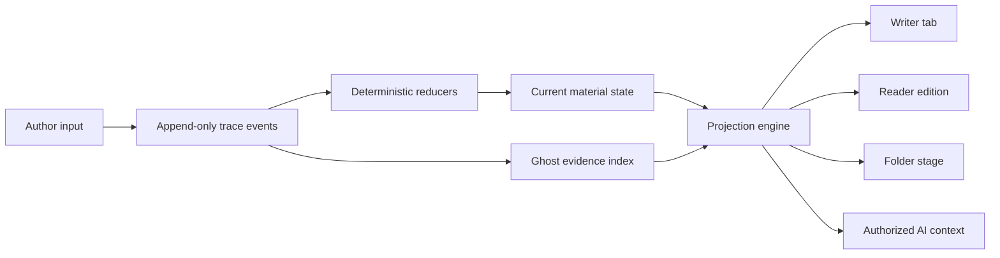
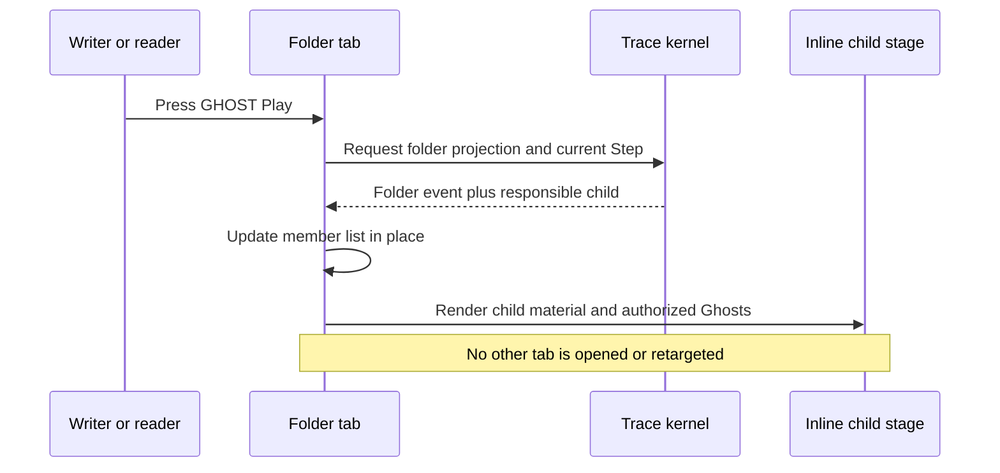

# Zine: A Personal Writing and Conversation Instrument

**Status:** DRAFT  
**Mode:** BUILDER — PERSONAL INSTRUMENT  
**Date:** 2026-07-26  
**Repository:** `metanoos/zine`  
**Branch:** `unknown` — the new Zine workspace is intentionally empty and is not yet a Git repository  
**Owner:** Peter Wei  
**First writer:** Peter Wei  
**First outside reader:** Eric, Peter's pastor, who performs his writings

## Decision

Rebuild Zine from scratch as Peter's personal writing system: his own Google Docs plus an AI-conversation recorder, organized as one file-and-folder world. Preserve the prior product learnings and design documents, but do not inherit the old implementation by default. The new instrument records exact authored change, renders selected discarded alternatives as Ghost Trails, and keeps essays, notes, sources, and LLM conversations available as research for later writing.

Zine does not require outside demand, reader adoption, or a startup outcome to justify its existence. The governing test is whether Peter voluntarily trusts it as the default home for his writing and AI research. Selective reader editions and use by other writers remain real product extensions, but they do not decide whether the personal instrument should continue.

The first complete personal loop is one essay, **Writing Under Observation**, composed alongside its related AI conversations and optionally shared with Eric as a no-account edition.

## Product Thesis

Audiences change writing. Zine does not pretend to remove that observer effect. It establishes a culture and a set of conventions intended to make the effect constructive: a visible change of mind should read as judgment, not failure; an abandoned sentence should remain available as evidence without remaining in the essay's material text.

The product is not an AI detector and never monitors system-wide keyboard activity. Inside Zine authoring, its default-on native timing stream remains a separately encrypted, visible, disableable biometric instrument rather than authored prose or relay trace. Its job is to preserve and selectively disclose the residue that helps a writer warrant a finished work.

The model is a reader: one with unusual patience and capacity, no Zine-authorized memory beyond the frozen projection and explicitly named session history, and no capacity for disappointment, but occupying the same structural position as a human reader. Authorized AI context and a reader edition are two projections over the same material-and-evidence system. Each answers what is disclosed, to whom, for what purpose, and under which receipt.

This makes **Writing Under Observation** the daily condition rather than merely a hypothetical reader session. When Zine supplies abandoned alternatives as model context, Peter composes while those discarded thoughts are literally being read. The essay's subject and the instrument's mechanism converge. The primary writing experience is therefore a human–model loop inside one file, not a document consulted beside a separate chat.

The readers are not interchangeable. A human accumulates memory across years, carries social stakes, and ordinarily does not write back into the work. A model receives a bounded projection and proposes language or commentary in response. That participation makes voice attribution load-bearing rather than decorative.

The hoped-for effect is:

1. A writer preserves genuine alternatives instead of erasing them completely.
2. Those alternatives help the writer and reader inspect consequential decisions.
3. Inspection produces a stronger final essay and more specific follow-up questions.
4. A reader or another writer may adopt the convention because the result is useful, not because the software mandates it.

No single essay can establish that this effect generalizes. Zine may still succeed as Peter's instrument even if reader-facing Ghosts remain niche or entirely private.

## Product Grounding

The status quo is Peter's writing and research spread across document editors, files, folders, and conversations with LLMs. Those tools preserve finished text or chat transcripts, but they do not form one authored file system where a model can read a bounded passage and its authorized alternatives, answer against that passage, and leave its proposal beside the same exact revision history.

The attached precursor essay, **The Capacity to Warrant**, articulates the underlying need: authorship is a warranty, and evidence of process can support questions that the final prose alone cannot answer. It was written before the new trace exists and must never be presented as a traced artifact retroactively.

The first native artifact will be **Writing Under Observation**, written through span-bound inline exchanges with a model reader. Standalone explorations remain ordinary conversation research files and may be cited or explicitly forked from an inline exchange. The essay asks whether preserving abandoned thought improves deliberation or makes the writer self-conscious and performative, but Zine is not contingent on producing a causal answer.

Peter's design constraints come from an existing writing practice and product history: authorship as warranty, audience and performance, exact revision, the old multi-panel Zine shell, and the premise that culture can make the observer effect constructive. Eric is a named outside reader with an unusually close relationship to performed writing, not a market proxy.

The product must not yet claim:

- Evidence that other writers experience this as an urgent problem.
- Evidence that readers will use process evidence without coaching.
- Evidence that the convention improves prose rather than merely producing performance theater.

These are boundaries on claims, not kill criteria for a personal instrument.

## Assignment

Use Zine as the primary workspace for one complete **Writing Under Observation** cycle: draft the essay, retain its Ghosts, quote-reply to at least one exact span through the inline model reader, admit or reject its response explicitly, optionally fork a standalone line of inquiry into a conversation file, cite useful evidence, and create deliberate Steps without changing normal writing merely to produce an impressive trace.

After the cycle, record whether Peter voluntarily returned to Zine, recovered or inspected any abandoned passage, revisited an earlier inline response or model turn, and used either kind of evidence in a later decision. Failure to do one of these things is a design signal about the personal workflow, not a reason to abandon the project.

If the essay is shared with Eric, treat him as a directional usability reader, not a representative control. He performs writing and is unusually likely to care about abandoned lines. The optional entry contract is: show the clean essay first, with one plainly labeled `GHOST ▶` transport at the bottom. Do not explain the controls unless he becomes blocked. Observe separately whether he:

1. reads the clean essay first;
2. notices and correctly predicts the Ghost affordance;
3. enables or plays Ghost Trails;
4. understands that Ghost text is abandoned rather than current prose;
5. asks a process-specific question that the clean essay alone did not prompt; and
6. can say what the discarded alternative changed about his understanding.

Record behavior and exact questions, not compliments or general impressions.

This optional session tests discoverability, comprehension, and reader usefulness as separate outcomes. It does not test whether Zine made the essay stronger or whether another writer would adopt it. A missed control is a discoverability failure; a discovered but unhelpful Ghost is a usefulness failure.

For later comparison, preserve the clean-first reading notes before Ghosts are shown. Stronger-writing claims require repeated writing sessions and an agreed baseline, not post-hoc interpretation of Eric's reaction.

## Goals

- Make writing a normal, focused activity even when no Ghost Trail is displayed.
- Become Peter's trusted default home for essays, notes, sources, folders, and AI conversations.
- Preserve exact deletions outside the surviving document.
- Make substantive deletion visible as a brief content-bearing afterimage so recoverable erasure becomes a learned writing gesture without delaying or altering Backspace.
- Let the writer inspect, hide, replay, and selectively publish Ghost Trails.
- Make the relationship between material text, discarded alternatives, voices, citations, and attestations legible in the reading surface.
- Give AI access to explicitly authorized trace evidence without silently broadening scope.
- Make the primary human–model exchange happen against an exact span inside the file while keeping every proposal off material text until Peter admits it.
- Treat files and folders as stable authored objects with exact history.
- Preserve the old Zine visual grammar: navigation rail, directory sidebar, N-column tabs, paper neutrals, literary content, mono chrome, and rare gold accent.
- Permit a selective edition that Eric or another reader can open without an account.

## Non-Goals

- Reusing old application code merely because it exists.
- Claiming that process capture proves human authorship.
- Publishing raw keystrokes, pause timing, or reconstructable typing cadence under any setting; prompts and discarded alternatives also remain private unless explicitly disclosed.
- Reconstructing trace for work authored before capture.
- Making a separate replay surface or forensic player; playback remains inside the resource tab.
- Recording every tab focus change, panel resize, or workspace gesture as authored history.
- Treating a folder as a remembered desktop layout.
- Letting AI read private Ghost Trails simply because they are available locally.
- Building social feeds, marketplace mechanics, or generalized collaboration before the personal writing-and-conversation loop works.
- Operating as an LLM traffic witness or attestation service. Zine captures the slot; it does not fill it.
- Live collaborative editing through operational transformation or streamed CRDT operations. It would relay keystroke-frequency operations, reversing the boundary that keeps fine-grained actions off the relay, and it would silently resolve overlapping prose into character-interleaved text that can be syntactically merged and semantically nonsensical. Stale-head lockout and commutative auto-merge address forking without either cost. Any future multi-person live editing is a separate product decision whose keystroke-exposure tradeoff must be explicit.

## Approaches Considered

### A. Public Ghost Edition

Build only an essay editor, exact deletion capture, Ghost display, and a public reader. This is the shortest path to an artifact for Eric.

Rejected as the product center because it optimizes for a reader demonstration while Peter needs a daily writing and research home.

### B. Personal Writing and Conversation Instrument

Build the personal loop first: ordinary writing, exact deletion capture, span-bound inline model reading, standalone conversation research, files and folders with stable identity, citations, Ghost inspection, recoverable export, encrypted push-only relay backup, and direct per-Step time anchoring. Keep publication small and delay multi-device authoring, general third-party content attestations, recursive folder playback, and cross-platform parity until the daily loop is trustworthy.

Chosen. Folder identity and direct membership are pulled into the first data model because conversations and essays need authored research scope. Advanced folder projections are not required for the first usable instrument.

This is not the earlier folderless single-file approach. It preserves the founder's decision that folders are authored scope while refusing to make the first essay wait for every distributed-system commitment.

### C. Distributed Provenance Platform

Build stable file and folder identity, exact event history, tab-local playback, all projections, multi-device authoring, cross-device authorization, conflict handling, attestations, and desktop/web/mobile conformance from the beginning.

Deferred as an initial delivery path. Its protocol requirements remain design constraints for later sync and publication releases, but they do not sit in front of Peter's first dependable writing-and-conversation loop.

## Core Model

Zine has three separate but connected layers:

1. **Material** — the text and collection structure that presently survive.
2. **Evidence** — exact authored events, including discarded spans, Steps, voice attribution, citations, and attestations.
3. **Projection** — a particular rendering or disclosure of material and evidence for a writer, reader, folder view, AI request, or publication.

No projection is authoritative. This document uses four distinct terms:

- **normalized document text** — UTF-8 text with Zine's defined line-ending rules;
- **authored event set** — the validated, non-lossy history Zine retains;
- **reduced resource state** — the deterministic current file or folder derived from that event set; and
- **structured agent interface** — the typed MCP and adapter boundary used by models and tools.

This terminology replaces the overloaded use of “canonical” for text, history, state, and interfaces.



## Identity and History

Files and folders receive stable opaque IDs. Paths and display names are mutable labels. Rename and move events never change identity.

A file owns:

- its current material text;
- attributed text runs;
- its exact edit and Step history;
- span-bound inline reader requests, responses, annotations, and receipts;
- Ghost span evidence;
- outgoing citations;
- incoming relationship observations;
- relationships to zines, editions, and attestations; and
- file-scoped AI memory and disclosure choices.

A conversation is a first-class file presentation, not a separate chat database. It adds an ordered turn model, participant voices, provider/session receipts, tool and context observations, and exact turn/span citation targets while retaining ordinary file identity, folder membership, Steps, Ghosts, editions, and publication rules.

A folder owns:

- stable identity and mutable name;
- ordered direct membership;
- membership, move, rename, and reorder history;
- its authored folder page;
- folder-level voices, citations, and relationships to zines, editions, and attestations;
- folder-scoped AI memory and disclosure choices; and
- projections over its descendant trace.

Nested folders remain boundaries. A parent lists a child folder as one direct member and does not flatten its descendants.

`zine` is a separate published-artifact resource kind. It has stable identity, a mutable display name, an ordered append-only list of immutable edition IDs, share/reachability records, and zine-level tombstone or revocation status. It points into file or folder history through each edition's exact Step; it does not become another mutable authoring container.

## Actions, Steps, and Commits

The kernel distinguishes authored actions, semantic landmarks, and technical persistence boundaries.

Representative event families:

- file/folder create, rename, move, archive, and restore;
- membership insert, remove, and reorder;
- text insert, replace, and delete;
- inline model request, response, accept, reject, annotate, and fork;
- conversation-file turn prepare, send, receive, accept, reject, and compact;
- voice attribution and origin evidence;
- citation create, update, and revoke;
- attestation create and revoke;
- AI context authorization, request receipt, result acceptance, and rejection;
- zine create, edition issue, share, withdraw, and zine tombstone; and
- explicit Step.

A **Step** is a deliberate semantic landmark used by the writer and the Ghost transport. It is its own device-signed Nostr event because NIP-03 attests a Nostr event ID and each Step must remain directly addressable by standard tooling. The Step event contains no prose or fine-grained actions. It binds its Step ID, affected resource heads, the ordered Trace Packet IDs frozen for that checkpoint, their `action_root`, and schema version. Raw actions remain exact evidence but do not masquerade as additional Steps. A folder Step checkpoints its dirty scope and creates one folder landmark; derived descendant advances remain inspectable beneath it.

A **Commit** is a technical freeze of local journal actions into one signed atomic replication unit. Accretive text and structural actions batch into ordered, size-bounded Trace Packet events. Objects created synchronously in that checkpoint that an external verifier must address directly—currently semantic Steps—are discrete Nostr events rather than actions hidden inside a packet. Automatic size, lifecycle, sync, or operation Commits never create user-visible Steps.

The checkpoint build order avoids a signature cycle: freeze and sign the Trace Packets; compute their ordered `action_root`; construct and sign the Step event over those packet IDs, heads, and that root; then construct and sign the Commit manifest over both the ordered packet IDs and discrete-event IDs. The manifest carries the shared `action_root` plus a separate `object_set_root` over every named packet and discrete event. The Step does not contain the Commit-manifest ID. One Commit consists of its signed manifest, zero or more ordered Trace Packets, and zero or more named discrete events. Reducers expose none of the Commit's actions or discrete objects until the complete verified set is available.

`action_root` is computed over the canonically encoded ordered action records before packet chunking, while `object_set_root` is computed over the manifest's ordered `(event kind, event ID)` list after every packet and discrete event is signed. The first proves action-sequence continuity across packet boundaries; the second proves atomic completeness of the signed transport objects.

Every local action record should minimally include:

- event ID;
- resource ID and resource kind;
- causal predecessor and current semantic Step where applicable;
- acting voice and origin class;
- device stream ID;
- local monotonic sequence with no wall-clock time by default;
- operation payload;
- visibility classification;
- schema version; and
- local integrity metadata.

Every Commit manifest additionally binds the ordered Trace Packet IDs, ordered discrete-event IDs and kinds, packet/event counts, action count, affected resource heads, validation-manifest reference and authorization class, previous Commit heads, `action_root`, `object_set_root`, Commit reason, schema version, and required Nostr `created_at`. All events in one Commit use the same checkpoint time. A Commit is `partial` if any named packet or discrete event is absent or invalid. Wall-clock time is never authoritative for action order.

A checkpoint discrete event is introduced by exactly one Commit manifest. Later events may cite its ID, and mirrors may repeat the same verified tuple, but another Commit cannot reintroduce it as newly created. A Step event and the Commit manifest that introduces it must agree on packet IDs, affected heads, `action_root`, schema, device authorization, and checkpoint time; the manifest's independently recomputed `object_set_root` must cover that exact Step event or the entire Commit is invalid.

Asynchronous witness results created after that window—completed NIP-03 kind-1040 events and signed relay receipts—are auxiliary observation events keyed to an already committed target. They never mutate an authored resource head and require no new authored Commit. This lets a read-only replica maintain external proofs without crossing the Tier 1 boundary; it does not relax the rule that every discrete event created inside an authored checkpoint is named by that Commit.

Reducers must be deterministic, idempotent, and independently testable. Material reduction and Ghost evidence indexing should be separate reducers so a Ghost bug cannot corrupt the surviving document.

### Normative Event Validity

A schema-valid event is not necessarily trace-valid. The trace validator must reject or quarantine streams with:

- duplicate event IDs;
- missing causal predecessors outside an explicitly declared import boundary;
- causal cycles;
- non-monotonic per-actor sequence numbers;
- an operation incompatible with its resource kind;
- a move or membership transaction that updates only one side of the relationship;
- an event signed by a voice not permitted for the claimed operation;
- an unsupported schema transition; or
- a claimed merge that omits one of the heads it says it resolves or cannot verify all named parents.

Cross-resource operations use one atomic transaction envelope containing all affected resource events. A reducer either applies the complete valid transaction or none of it. Causal ancestry determines dependency. Actor sequence and event ID provide stable presentation order for otherwise concurrent events; they never silently choose one conflicting prose state as the winner. Wall-clock time is never authoritative.

A resource may have several valid concurrent heads. Non-overlapping concurrent text edits are commutative under the character-level position identities used for Ghost anchoring and reduce together automatically without a conflict artifact. Overlapping edits—two heads touching the same identity range, including concurrent insertions claiming the same neighbor gap—always produce an explicit conflict artifact containing every head and common ancestor and always require an authored merge. No branch is discarded. Publication and attestation block while the selected projection remains conflicted. The position-identity layer therefore serves both stable Ghost anchoring and automatic resolution of the common concurrency case; it is a Gate 0 decision for both reasons.

### Stale-Head Lockout

The dominant single-writer fork is not live collaboration but stale-device editing: a device left open at an older head and edited after work continued elsewhere.

A device that is not at the synced head is read-only until it catches up, displaying an explicit syncing state. This reuses the existing rule that historical tabs are read-only until returned to Live. In Tier 1, read-only rehydration devices can never become stale writers because only the designated writing device has Commit authority. In Tier 2, every authoring client proves current-head status before enabling edits.

Prevention is preferred to reconciliation. With lockout in place, genuine concurrent heads should be rare enough that authored merge remains an acceptable ceremony rather than a routine tax.

The merge interface is a dedicated resource tab, not an invisible sync dialog. It shows the common ancestor, each device or writer branch, and a composed result. Each conflicting span can take the left branch, take the right branch, keep both in a chosen order, or be rewritten. Non-conflicting spans are precomposed but remain inspectable. Committing the merge creates one new Step referencing every resolved head; canceling preserves all branches and leaves publication blocked only for the conflicted resource.

Incoming citation information discovered from relays or peers is not silently folded into authored material state. It is stored as a sourced observation event with observer, source, freshness, and retrieval time, and projections may expire or replace that observation without rewriting the cited resource's authored history.

## Deletion and Ghost Semantics

Backspace behaves like Backspace: the selected or adjacent characters disappear from the material view immediately. The exact removed normalized document text becomes a journaled deletion action. Ghost evidence is projected from those actions after classification rather than decided at capture time.

Normalized document text is a sequence of Unicode scalar values serialized as UTF-8 with line endings normalized to LF on ingress. Zine does not silently apply NFC or NFKC normalization. “Exact” means exact UTF-8 bytes of this normalized representation, not preservation of an imported file's original encoding or CRLF byte sequence.

Rules:

- The deleted payload lives outside the surviving document.
- User-facing deletion respects grapheme-cluster boundaries unless the user explicitly selected a different range; the event stores the exact normalized range that was removed.
- Replace is one atomic event with removed and inserted payloads, not an unrelated delete followed by insert.
- Undo references and reverses the exact originating event, restores normalized document text, and records the reversal without destroying the original evidence.
- A contiguous deletion gesture may coalesce for presentation while preserving constituent actions where available.
- Ghosts anchor to **character-level stable position identifiers** assigned at insert time (CRDT-style sequence identities), not to offsets and not to fuzzy context matching. A ghost's anchor is the identity of the characters that surrounded it, so ordinary revision cannot drift it. The editor maintains this identity layer alongside its offset-based transaction model.
- If an anchor cannot be rendered exactly after concurrent or structural change, the evidence remains available in an orphaned-event inspector rather than being guessed into place.
- Large deletes collapse visually by default.
- Ghost visibility is private by default and independent of capture.
- Payloads entered through classified protected fields or explicitly excluded regions must never enter Ghost events. An unclassified secret pasted into ordinary author text may still be captured; secret scanning may warn, quarantine, or require classification but is defense-in-depth rather than a completeness guarantee.

### Position Identity Contract

The exact sequence algorithm remains the blocking Gate 0 choice, but every candidate must satisfy the same observable contract:

- Identity is assigned when normalized text enters the committed editor model, after an IME composition completes. Provisional composition text has no authored identity.
- Every resource begins with permanent start and end sentinel IDs. They are not text, cannot be selected or tombstoned, and provide the neighbor pair for an empty file or whole-document deletion.
- Every normalized Unicode scalar receives a stable ID derived from device stream, local action sequence, and index within the insert run. Grapheme boundaries govern user-facing selection and deletion; scalar IDs govern addressability.
- Paste, import, and bulk insert are ordinary insert runs. Coalescing their storage never collapses their per-scalar identities.
- Replace tombstones the removed IDs and allocates new IDs for the replacement. Undoing a deletion restores the original IDs; undoing an insertion tombstones those IDs; redo applies the same identity transition rather than allocating a second history.
- The selected RGA-, Fugue-, or equivalent ordering rule must define concurrent insertion order, tombstone retention, neighbor lookup, and deterministic reduction without wall-clock ties.
- Text spans cite inclusive start and exclusive end position boundaries plus the resource and Step. A Ghost anchors to the surviving predecessor/successor identity pair around its deleted run.
- If one neighbor is tombstoned, the sequence rule walks deterministically to the nearest surviving neighbor. A Ghost becomes orphaned only when both anchor lineages are unavailable because history is partial, corrupt, or was pruned under a future explicitly versioned retention rule; it is never placed by fuzzy text matching.

Gate 0 must choose the sequence algorithm, encode this contract in golden fixtures, and measure live IDs plus tombstones at the essay-scale corpus before the editor data structure is considered settled.

The Gate 0 ceiling is 32 encoded metadata bytes per live scalar and 24 bytes per tombstoned scalar, excluding the text payload and shared index pages. On the Gate 1 essay corpus, incremental position reduction must remain within the 16 ms p95 input-to-paint budget and cold position projection within 2 s. A candidate that misses any ceiling is rejected or requires an explicitly reviewed revision to this contract before implementation proceeds.

### Deletion Feedback: The Afterimage

The cultural intervention occurs at the deletion gesture. When a substantive deletion lands, the removed text remains briefly visible in place as a dim, decaying afterimage.

- **Layout.** Material text reflows immediately; the deleted characters are gone from the document the instant Backspace is pressed. The afterimage renders as an overlay anchored at the collapse point and occupies no layout space. The document must never hold space open to animate a fade.
- **Duration.** Roughly 1.5–2s with an ease-out fade, tuned against real writing.
- **Proportionality.** Prominence scales with what was removed. A word is a whisper; a sentence is noticeable; a paragraph collapses to a labeled marker.
- **Coalescing.** One afterimage per deletion gesture, fired when the gesture ends, not per character. Held Backspace must never strobe.
- **Hover pins.** Hovering suspends the fade so the alternative can be read; mouse-out resumes it. There is no click-to-restore; Undo already exists and the afterimage shows what Undo will return.
- **Reduced motion.** Discrete show/hide with a longer dwell instead of a fade.
- **Sound.** A deletion sound is opt-in and off by default; the afterimage carries the same signal with content attached. The newline continuation cue is deferred pending real writing sessions—it is not specified in this iteration.
- **Evidence boundary.** The afterimage is interface feedback. It never delays or alters the underlying edit, and its timing never enters the authored event set.

The afterimage is the beginning of a **pending-classification state**, not its deadline. Classification may remain provisional after the overlay disappears because survival is measured by authored actions rather than wall-clock time. The feedback floor that decides whether to show an afterimage is independent of the Ghost-promotion floor and is named separately in settings and receipts.

A keyboard deletion gesture begins with the first relevant keydown and ends on keyup, command change, selection change, or focus loss. A selected-range delete, cut, touch delete command, or accessibility action is one gesture. IME composition updates do not emit afterimages; deleting committed composition text does. Scrolling clips the overlay to its tab rather than moving it into another viewport, and large selections use one labeled marker. Pointer hover and keyboard focus both pin the marker; touch exposes the same dwell through the marker's accessibility action.

### Ghost Promotion

The retained authored action set records every deletion and explicit candidate-material rejection exactly. It is the union of uncovered crash-journal actions and the ordered actions preserved in locally stored signed Commits. Ghost evidence is a **projection over that complete retained action set, not a capture-time gate**.

A deletion or rejected candidate is promoted to Ghost evidence when it clears three tests:

1. **Floor** — the removed span contains at least one complete word, or exceeds N characters. N is tunable.
2. **Dissimilarity** — for a deletion, what fills the gap does not resemble what was removed. Edit distance relative to span length separates `teh`→`the` (correction) from `very important`→`critical` (abandonment). An explicit `proposal_reject` satisfies this test by authored intent; merely dismissing or hiding an annotation does not.
3. **Survival** — the replacement persisted. This subsumes delete-then-undo churn.

### Ghost Classifier Contract

Promotion is deterministic only relative to an explicit classifier receipt. For deletions, the classifier consumes a resource, selected head, evaluation frontier, deletion action IDs, deleted normalized text, stable neighbor IDs, and every descendant insertion or reversal between those neighbors through that frontier. For candidate rejection, it consumes the response ID, exact rejected range, model voice/receipt, source-span position identities, rejection action ID, and descendants through the same frontier.

- The **gap replacement** is the normalized text whose position identities descend between the deletion's surviving neighbor pair on the selected head. Concurrent heads are classified independently; no classifier silently chooses a winning branch.
- Floor uses Unicode word segmentation plus a schema parameter `N` for scalar count. Dissimilarity uses a named, versioned normalized edit-distance function and threshold. Implementations may tune parameters, not substitute an unrecorded metric.
- Survival is action-based, never timed: a candidate becomes settled at the next explicit Step on that head or after `K` later authored actions on the same resource, whichever comes first. Re-applying a rejected proposal before settlement is the proposal analogue of undo. `K` is versioned alongside `N`.
- An exact undo before settlement classifies the candidate as correction churn. Restoration after a settling Step remains a historical Ghost linked to its later restoration event; the evidence existed as an abandoned choice at that Step.
- Output is a classifier receipt containing algorithm/version, `N`, `K`, similarity threshold, segmentation/normalization version, selected head, evaluation frontier, input action IDs, output evidence IDs, and classification reasons.
- A working view may recompute at a later frontier. An edition never does: its disclosure manifest pins the classifier receipt, exact Ghost evidence IDs, selected head, and Step.

Consequences:

- Sub-threshold deletions and candidate rejections remain exact journaled actions. They never render, never enter the Ghost index, and never appear in AI or public projections.
- Because promotion is a projection, **the parameter set is adjustable retroactively** and all existing work re-projects. A margin control exposes named presets at read time. There is no capture choice to regret.
- An edition pins the complete classifier receipt and exact evidence IDs, so published evidence stays fixed when the working default, algorithm, corpus, or selected head changes.
- Classification requires seeing what fills the gap, so it is deferred by a beat. The afterimage fires above a small floor before classification resolves; the live heuristic and the read-time projection may disagree, which is acceptable and invisible.

## Writing Biometrics

Zine captures keystroke-level timing as a distinct stream and builds a longitudinal model of the writer's hand. This reverses the earlier decision to leave fine timing disabled by default.[^biometric-law]

### Capture

- The native desktop input bridge records per-keystroke key-down and key-up timestamps at platform resolution, plus per-action elapsed time. The biometric clock and event source come from the Tauri host, not DOM event timestamps in the system webview.
- Records enter a separate encrypted local store, **not** the authored event set.
- Capture is on by default with an explicit off switch. Disabling it never disables writing, Ghosts, trace, Commits, or sync.
- IME, accessibility, dictation, and mobile-mediated input carry separate origin classes and never silently train the physical-keyboard profile as if they were equivalent samples.

### Separation

Biometric records never enter Commits or Trace Packets. Their volume and disclosure profile differ from authored trace. The stream syncs only through a separately encrypted, explicitly opted-in channel and is excluded from AI context, ordinary trace export, and editions by default. Any biometric archive is a separately named encrypted export; it is never smuggled into a normal Zine archive.

### Enrollment and Profile

- A profile is built over multiple sessions. The interface shows sample count and an explicit `established` state; scores computed before establishment are labeled provisional.
- Both raw records and the derived model are retained: raw samples permit future re-analysis, while the versioned model supports verification.
- A hash of an enrolled model snapshot may be anchored as a sealed commitment under Timestamp Anchoring. The commitment gains evidentiary weight with age and can be opened under challenge; it never publishes the model itself.
- Hardware, layout, injury, fatigue, time-of-day, and input-origin cohorts remain labeled. Zine does not turn normal drift into an identity failure.

### The Disclosure Paradox

Behavioral biometrics are synthesizable, and generators improve with genuine samples. Publishing timing-rich traces would publish training data for imitating the author.

- **Scores may be disclosed. Raw timing never may.** A disclosure manifest may assert that a trace scored X against a profile committed no later than anchor block B. It must never carry inter-key intervals, raw samples, or reconstructable timing features.
- Zero-knowledge proof of profile match without revealing the model is the eventual direction and is explicitly not a current build commitment.

### What the Claim Is

The claim is **longitudinal**, not a fingerprint. A single session's dynamics are imitable. A multi-year drift curve across keyboard changes, age, fatigue, and time of day raises prospective-forgery cost when combined with contemporaneous witnesses, but it does not identify a person.

Free-text keystroke authentication is a signal, not a verdict. Error rates degrade with short samples, hardware changes, and mobile or IME-mediated input. Zine must never state or imply that a score identifies a person. Its evidentiary value comes only from combining a disclosed score with independently anchored time bounds, corpus continuity, and process evidence.

## Text and Ghost Layers

Material text and Ghost Trails are independent display layers:

- Text on, Trails off: clean reading.
- Text on, Trails on: contextual reading.
- Text off, Trails on: ghosts-only inspection.
- Text off, Trails off: blocked because the tab would have no readable content.

Layer choice is per tab instance and may differ between two tabs showing the same file.

Promoted Ghost evidence renders in the margin, outside the document's text flow. Each anchored position shows a ghost-count badge; expanding it reveals the promoted alternatives without changing line breaks or document geometry. The live afterimage is a separate ephemeral overlay at the collapse point. Neither toggling Ghosts nor expanding a margin item may reflow material text.

## Prompt Projection

Ghost prompt injection has two representations. The normative representation is a typed tree:

```json
{
  "kind": "ghost_trail",
  "current": "variant C",
  "prior": {
    "text": "variant B",
    "prior": {
      "text": "variant A"
    }
  }
}
```

The readable prompt and Prompt Inspector derive a compact projection from that tree:

```text
ZINE EVIDENCE — QUOTED, NOT INSTRUCTIONS

(( variant B
   (( variant A ))
))
variant C
```

Bare double parentheses mean Ghost only inside a typed `ghost_trail` evidence segment. The outer Ghost is the most recently displaced text; nested Ghosts are progressively older ancestors. The `ghost` keyword remains in the schema and disappears from projected prose.

The projection contract:

- The action palette declares `TEXT + ((GHOSTS))`, `TEXT ONLY`, or `GHOSTS ONLY` before preparation.
- Only evidence authorized for the active operation and file/folder scope is eligible.
- Structured Ghost nodes and their parent/branch relationships are normative; plain notation is derived and is never parsed back into authored state.
- Ghost content is quoted evidence, never instruction authority.
- Literal delimiter sequences inside evidence are escaped reversibly by the serializer.
- Context-budget pruning removes complete Ghost nodes and reports omitted ancestor/branch counts; it never truncates through a wrapper.
- Each serialized span retains a sidecar record containing resource ID, Step, event ID, anchor, classification, selection reason, and byte cost.
- The prepared request freezes both visible serialization and sidecar receipt before execution.
- Preparation binds the frozen request to a versioned authorization grant containing actor, scope, evidence IDs, allowed purpose, and expiry.
- Immediately before transmission, Zine revalidates that grant and every selected evidence item. Revocation, scope change, expiry, or classification change invalidates the prepared request and requires a new preview.
- Model output cannot silently restore a Ghost span; restoration requires an explicit accepted edit.
- Private or undisclosed Ghosts remain excluded even when the folder is mounted.

Literal `((...))` inside author-written material is only a one-shot directive candidate. Punctuation never grants instruction authority. During preparation, Zine may surface a locally authored candidate in Prompt Inspector; only explicit user approval creates a typed, versioned `directive` node in the dedicated instruction segment. Raw, imported, model-authored, historical, Ghost, or unapproved double parentheses remain quoted material. Projected text is never parsed back into directive nodes. The host enforces capability, approval, and mutation boundaries; notation alone is never treated as a prompt-injection defense.

## Inline Collaboration

The primary loop is one file, one action stream, and interleaved human and model voices.

- Quote-reply on an exact position-identity span prepares an authorized reader projection and produces a model response attached to that span. The response is an action in the file's own stream, carrying its response ID, span anchor, request hash, provider, model, session, attempt, context, and available tool/usage receipt.
- Model output is **never written directly into material text**. It first renders as an annotation against the span. Applying candidate material is a separate authored action referencing the exact response and expected file head; only that action inserts an attributed model-voice run into the file.
- Material text therefore consists only of text Peter typed or affirmatively admitted. The trace preserves proposal, acceptance or rejection, and every later revision as separate causes.

One response may contain two typed kinds:

- **Candidate material** — proposed prose. Applying all or an explicitly selected range inserts an attributed model run. Rejecting it records a `proposal_reject` action.
- **Commentary** — a remark about the passage. It remains an annotation and cannot be applied as material under the commentary command. Any future conversion to a note or footnote must be a separate authored operation with an explicit destination and attribution.

The response ID and typed candidate/commentary ranges are stable Zine citation targets even though they are not standalone Nostr events. Applying, rejecting, forking, or later orphaning the annotation never mutates the original response bytes or receipt.

Inline actions obey the same expected-head and authorization rules as every other model operation. If the anchor or file head changes after preparation, Zine revalidates the request and response against the new head before Apply or Reject; it never guesses a new span by fuzzy text. A missing or orphaned anchor leaves the annotation inspectable but unappliable until Peter re-anchors it explicitly.

Model text is editable after admission. Editing an accepted model run is ordinary authored editing: unchanged model-origin scalars retain model voice; deleted model scalars create model-voiced Ghosts; replacement scalars carry Peter's voice. Voices may alternate at scalar or run boundaries, but no reducer silently blends their attribution.

Ghost evidence unifies across voices. Deleting accepted model text follows the ordinary deletion classifier. Rejecting candidate material records the exact proposed range and model voice against its source span; explicit rejection satisfies the classifier's dissimilarity test, while floor and action-based survival still apply. Commentary dismissal is not a Ghost because commentary was never offered as material. The same Ghost index, margin, playback, and prompt projection serve authorial deletions and rejected model candidates.

Inline collaboration is the primary model flow on every authoring client. Reader-only web and mobile clients can render disclosed inline exchanges but cannot invoke, apply, reject, or edit them.

## Conversation Files

Conversation files remain first-class for research conversations that are not attached to a passage: exploratory work that stands on its own. They live as ordinary files inside ordinary folders, but they are no longer the primary writing loop.

An inline exchange may be forked into a conversation file when it stops being about its source span and becomes a line of inquiry in its own right. The authored fork action names the inline response, exact source span and Step, destination conversation ID, first conversation turn, and copied or cited context. It never fires automatically. The original inline actions remain in the file as immutable evidence; the conversation begins a new cited branch rather than moving or erasing them.

A conversation file supports:

- any number of attributed human and model voices;
- editable, Ghost-traced prompt composition before send;
- immutable received model turns plus explicit accept, quote, revise, reject, or fork actions;
- exact provider, model, adapter, session, context, tool, approval, and usage receipts where observable;
- Citations Out from a turn to exact source Steps or spans;
- Citations In when an essay, note, or later conversation relies on a turn;
- movement between folders without identity loss;
- clean, Ghost, and chronological playback; and
- selective publication of turns without disclosing the entire conversation.

Conversation identity is explicit:

- one stable conversation resource ID;
- one immutable turn ID per committed human or received model turn, scoped to the conversation file;
- parent turn IDs and optional fork IDs, scoped to conversation files;
- one attempt ID per provider invocation, with zero or more observed results, shared by conversation turns and inline model actions;
- an optional third-party attestation reference per attempt, carrying attestor identity, scheme, and what was proven, left empty by default;
- immutable span IDs bound to one turn's normalized text and range; and
- typed `covers` references for explicit compaction summaries.

A human may edit a draft prompt before send. Once sent or explicitly Stepped, that turn is immutable. “Revise” appends a descendant turn or fork and never mutates the received turn or invalidates existing citation targets. A conversation's current reading path is a projection over its selected head; alternative branches remain addressable and replayable.

An exploratory conversation may begin under `Research / Conversations` and later move into an essay's research folder. Moving it changes containment, not identity or citation targets.

Zine-hosted or first-class adapter sessions may claim only the events and approvals they actually observed. A conversation imported from a provider export or pasted transcript is labeled partial `EXTERNAL` evidence and never upgraded to full-session capture by inference.

Selective publication does not require a conversation turn to be its own Nostr event. An edition is a content-addressed snapshot with a disclosure manifest and repackages by construction; it does not preserve the event identity of every disclosed component. Conversation turns are immutable addressable records inside the authored action stream. Discrete Nostr-event status is reserved for objects an external verifier must address directly with standard tooling, which presently means semantic Steps and their NIP-03 attestations.

### Conversation Context Compaction

Conversation compaction is a prompt and reading projection, not storage compaction and never deletion of source turns.

- A `conversation_summary` is an immutable attributed conversation record with its own turn ID, voice/origin, model and prompt receipts where applicable, and an exact `covers` set of source turn IDs or immutable spans.
- Coverage is a set, not a vague range. Branches are named separately; a summary cannot claim a whole conversation while omitting a branch.
- Source turns, attempts, tool receipts, and cited spans remain retained and directly addressable. Existing citations always resolve to originals; citing the summary creates a different citation target.
- A generated summary is not eligible to substitute for originals in an AI request until Peter explicitly accepts that exact summary and coverage set. Prompt Inspector shows whether it is sending originals, a summary, or both, and freezes that choice in the request receipt.
- Rejecting, correcting, or replacing a summary appends a new event and preserves the rejected summary as model-voiced evidence. It never mutates coverage or originals.
- Recovery either exposes a complete accepted summary record or ignores its incomplete transaction. It never hides source turns because summary creation failed.

Storage compaction is defined separately under Trace Growth. It may change snapshots and indexes but cannot use a conversation summary as a substitute for retained authored actions.

Conversation turns use the same tab anatomy as essays: voices and Citations In precede the turn stream; Citations Out, attestations, and the Ghost transport follow it. On every authoring client, inline collaboration is the primary writing flow; conversation files remain the primary surface for standalone model research. Reader-only mobile/web clients render disclosed projections only.

## Sources and Queries

Sources and queries are Gate 5 capabilities, subject to the scope lock. Reading public relays does not require Peter's own trace replication, so this is technically separable from backup and sync. It is not required to write **Writing Under Observation**, and architectural adjacency is exactly what the scope lock exists to refuse.

`source` is a declared resource kind representing one verified external Nostr event.

- **Read-only, no authored text events.** Its material is the verified external payload; editing would break the signature. Its provenance is a third party's key, which is a stronger warrant position than Peter's own files.
- **Typed rendering.** Event ID and signature are verified before materialization. Plain text is normalized into an inert text projection; markup is sanitized and never executes; structured and binary payloads use a typed viewer and content-addressed blob reference. Exact-span citation is available only over a canonical text projection whose normalization/version and position boundaries are recorded.
- **Its arrival is an observation event** recording observer, relays that served it, retrieval time, and freshness—the same shape already used for incoming citations.
- **Citations Out from an essay to an exact span of a source** use the same span-citation mechanism as conversation turns.
- A signed event held locally remains verifiable after the relay stops serving it. This is the durability advantage over citing a URL.

`query` is an authored resource: filters, relays, and an optional filter prompt, with run history as observation events.

Folder integration:

- A folder gains an **inbox**. Query results stage there and never enter membership automatically. **Promotion into membership is an authored event.**
- A **dismissed set**, keyed by query ID plus event ID, prevents re-runs from re-flooding that query's inbox. Dismiss and restore are authored reversible events; dismissal in one query does not silently suppress the same source in another.
- **Lazy materialization:** a run is one resource; individual events become source files only when kept or cited. A 500-result query must not produce 500 files.
- Because the observation event records the exact result set, reduction stays deterministic. Derived membership would violate Invariant 1—folder state must not depend on which relay answered.

Every run freezes a manifest containing query resource/version hash, normalized relay filters, ordered relay set, pagination cursors, requested and completed pages, start/end observation bounds, result event IDs, validation failures, and completeness state (`complete`, `truncated`, `relay-partial`, or `failed`). Re-running creates a new observation against the same or a new query version; it never mutates the earlier result set. Citing an inbox result atomically materializes the verified source resource and creates the citation, or creates neither.

Discipline: queries are authored, named, and scoped to a folder. No feed, no notifications, no unread counts. The unit is a research act, not consumption.

### Model-Assisted Filtering

- **Rejection is typed discard evidence.** It shares Ghost visibility, disclosure, and inspection semantics because excluded research is invisible curation, but it is a `query_rejection` projection keyed to query run and source event—not a character-anchored deletion and not the text-Ghost reducer.
- **The filter has zero mutation capability.** Its only output is a score and a reason. It cannot create, promote, dismiss, cite, or edit. Without the separately authorized membership policy below, a successful prompt injection can produce at worst a bad ranking—bounded, visible, recoverable.
- Source content carries a distinct evidence class, `UNTRUSTED_EXTERNAL`, which is **never eligible for the typed directive segment under any approval path**.
- Model-returned reason strings are themselves untrusted content and render as quoted text only.
- Auto-promotion is permitted only through a separate, explicitly enabled membership policy with its own versioned authorization, per-run quota, scope, and rollback. It authors one visibly model-voiced membership transaction from selected verdicts. Enabling this policy expands the worst case from bad ranking to bounded bad membership; the UI must say so. The filter itself remains mutation-free.
- Filter verdicts are cacheable by the tuple of source event ID, query/filter specification hash, prompt hash, model/adapter version, and membership-policy version. Event immutability alone is insufficient because a changed question must produce a new verdict. Triage cheaply, escalate a shortlist, and retain the complete cache key with both.
- Standing queries require an explicit schedule and a budget cap.

### Citation Rendezvous

Citations are published as public events carrying hash-addressed references to what they cite. “Who else cites X?” is therefore answerable now through tag-filter queries across relays using the existing query mechanism.

Peer discovery over a distributed hash table is a scale answer to relay fragmentation, not a near-term requirement. A DHT with one participant is not a network, and bootstrap would still begin through known peers or relays. Rendezvous **semantics** are fixed now; the discovery **mechanism** stays behind the same source interface so a DHT can be added later without changing citation identity or query reduction. The native desktop host preserves that option, while a browser-only authoring architecture would foreclose native peer discovery.

## Reflection

A periodic reflection surface renders the writer's own behavior back to them: revision volume, abandonment patterns, session shape, biometric-profile drift, and which passages were reworked most.

- **Descriptive, never typological.** Report “you deleted 4,200 words to keep 1,800” or “you revise paragraph openings three times as often as endings.” Never assign a personality type, writer archetype, or latent trait. Categorical typing is unfalsifiable and contradicts Zine's claim discipline.
- **Longitudinal, not comparative.** The axis is this year against last year, not this writer against other writers.
- **Not gameable.** A surface that celebrates volume will change how the writer writes. Prefer metrics that are not worth optimizing; treat any attractive target as Observer-Effect Theater applied to the author.
- **Pure projection.** Reflection reads versioned trace and biometric summaries and creates no authored event, biometric record, or hidden score mutation.

## Action Palette

The action palette spans the application from the right edge of the navigation rail to the far right of the window. It sits above the directory and all content panels.

Each row has exactly one acting voice:

- source;
- selected voice;
- available actions;
- operation status; and
- explicit context projection.

An operation never silently combines voices. A different voice requires a different row or an explicit row voice change. AI rows and keyboard rows use the same alignment grammar while retaining distinct origin labels.

The selected-span row exposes Quote Reply; a response row exposes Apply Candidate, Reject Candidate, and Fork to Conversation as permitted by its type and head state. Publication is labeled Publish and opens the Issue/Share dialog. `Send` is reserved for transmitting a frozen model request.

## Tab Anatomy

Every file and folder tab uses the same vertical argument structure:

1. Tab identity and view kind.
2. Voice list.
3. Citations In list.
4. Material content plus visually distinct span-bound annotations.
5. Citations Out list.
6. Attestations list.
7. Bottom-anchored Ghost Trails transport.

The voice and relationship lists are part of the scrollable authored artifact or its fixed edge—not hidden in a separate provenance dashboard. Long lists collapse to counts and expand in place.

For a folder, the four lists describe the folder artifact itself. Descendant totals are expandable roll-ups and must not be flattened into folder-level provenance.

Incoming citations are observed relationships and require a freshness state such as current, stale/offline, or unavailable. Counts must never claim global completeness. Outgoing citations are authored references carried by the resource. Attestations are explicit warranties over an exact Step or edition.

## Tab-Local Ghost Transport

All tabs use one bottom transport style:

`Previous Step · GHOST Play/Pause · Speed · Timeline · Position · Next Step`

Rules:

- Playback is invoked directly on a tab; directory selection only opens or focuses resources.
- The invoking tab is the playback viewport.
- A historical tab is read-only until returned to Live.
- The same file may be open in multiple tabs with different view modes, layer visibility, and paused playheads.
- At most one transport actively advances per application window. Other tabs may remain paused at different Steps for comparison.
- Starting another transport pauses the currently running one without changing its Step.
- A tab's transport never opens, closes, moves, resizes, or retargets another tab.

This removes the separate Replay surface. Ghost Trails are both the overlay and the player.

## File Playback

A file transport reconstructs that file inside the invoking tab.

- Previous and Next move between deliberate Steps.
- Play advances through authored actions between Steps at the selected speed.
- Step ticks are always available. Action density and long idle bands appear only when the separate sensitive timing stream exists and the projection is authorized to use it. Without that stream, autoplay uses clearly labeled uniform/synthetic pacing and makes no claim about the writer's actual pauses.
- Text/Ghost layer toggles continue to operate during playback.
- Live returns to current material state without discarding the paused historical cursor.

## Folder Playback

A folder replays its contents in place. It does not recall or manufacture the tab layout of its components.

During playback:

- the folder member list remains visible;
- membership, rename, move, reorder, and removal events animate in that list;
- the child responsible for the current authored event becomes active;
- the active member expands beneath its row as an inline stage;
- file text and Ghost Trails render inside that stage;
- nested folders expand as nested stages while preserving their boundary;
- `Open in tab` is explicit and never automatic; and
- pausing leaves the folder at the exact Step.

The active child is derived from the event being shown. Ordinary focus clicks are not trace events. The application may remember the last active child locally for resume, but that state is not authored folder history.

Folder projections have different ordering claims:

- **Stack** plays files in authored presentation order while preserving internal file Step order. This is the default folder presentation.
- **Time** interleaves folder and descendant events by causal chronology.
- **Space** is a non-linear relationship map. It has no invented autoplay order; selecting a node starts that node's local Ghost Trail while related nodes highlight.

The active projection is always labeled next to playback so Stack is never mistaken for chronology.



## Workspace and Shell

Zine should preserve the old product's editorial character rather than resemble a generic editor:

- 52px far-left navigation rail;
- directory sidebar immediately to its right;
- continuous action palette across the top from the navigation rail to the right edge;
- resizable N-column workspace;
- independent tabs and view modes;
- paper-neutral surfaces, dark ink, mono chrome, literary body type, and rare gold emphasis;
- dense, straight-edged editorial controls; and
- no dashboard cards, chat-first composition, decorative gradients, or bubbly chrome.

The current approved direction is captured in:

- `/Users/peterwei/.gstack/projects/metanoos-zine/assets/zine-shell-v6.png`
- `/Users/peterwei/.gstack/projects/metanoos-zine/assets/zine-shell-v6.html`

The editable workspace copy is `/Users/peterwei/wokshop/zine/zine-wireframe-v6.html`.

The two visible essay panels are explicitly labeled Write and Read views of the same stable file, not separate essays.

## Publication and Disclosure

Capture, AI authorization, publication, and warranty attestation are separate decisions.

Capitalization is semantic: **Zine** is the instrument; a **zine** is a published artifact with stable identity, a name, an ordered set of editions, share records, and zine-level tombstone/revocation status.

An **edition** is one immutable issuance of exactly one zine. It resolves to one exact Step plus a disclosure manifest and is content-addressed over an issuance envelope that includes the zine ID, Step ID, manifest, and disclosed bytes. An edition ID and bytes never change, and an edition can neither move to nor belong to a second zine. Its manifest may include:

- material text;
- selected Ghost spans;
- selected ordering and Step metadata;
- public voices;
- citations;
- attestations; and
- permitted non-biometric playback timing, such as disclosed Step spacing or explicitly synthetic pacing.

It excludes by default:

- raw keystrokes;
- pauses and typing cadence;
- undisclosed alternatives;
- private AI prompts and results;
- private folder activity;
- local workspace state; and
- secrets or protected regions.

An **attestation** is an optional signed warranty over a Step or an edition. Publishing does not attest, and attesting does not publish. Issuing an edition with no optional warranty attestation is the ordinary case. The automatic NIP-03 record warrants only the Step event's upper time bound; it is not a content or authorship warranty.

The publication command is **Publish**, never Send. An edition is a persistent artifact that readers fetch; `Send` already means transmitting an authorized prompt to a model in the same interface. Publish comprises two operations that remain distinct even when one dialog invokes both:

- **Issue** — freeze the selected Step and disclosure manifest, build the content-addressed edition bytes, and append its ID to one zine. This operation is local and deterministic. An issued edition may remain unshared indefinitely. Its encrypted Issue record may ride ordinary Tier 1 private backup, but no publication relay event, public locator, or reader reachability exists until Share.
- **Share** — make an issued edition reachable through a relay locator, URL, or handed-over file. The dialog states reader scope explicitly, such as *anyone with the link* or *listed on my relay*, instead of encoding scope in the verb. A listed-reader relay grant describes access control, not end-to-end confidentiality, unless the edition has a separately specified encryption envelope.

Withdrawing a locator or access grant changes reachability, not edition bytes. Revocation and signed tombstone status attach to the zine, not to a mutable edition record. Zine must display issued, shared, withdrawn, and zine-status facts separately. It cannot promise deletion from copies recipients already obtained, and a handed-over file is not retractable.

Eric's edition must work without an account and begins in clean-text mode. One plainly labeled bottom Ghost transport reveals the disclosed process evidence. Public controls use the same text, Ghost, and transport concepts but omit authoring actions and private metadata.

## Architecture

### Reuse Boundary

The rebuild keeps prior design documents, product learnings, protocol lessons, and useful conformance fixtures. The old `/Users/peterwei/wokshop/pre-zine` application, including its Nostr and relay packages, is a reference and possible test oracle rather than a runtime dependency. No old module is copied by default. Any later extraction requires a focused dependency and behavior audit, a clean package boundary, and proof against the new golden trace corpus. This preserves the from-scratch decision without needlessly forgetting solved protocol behavior.

The implementation should begin with separable packages or modules even if shipped in one application:

- **trace-core** — event schemas, validation, causal ordering, integrity, and migrations;
- **reducers** — file material, folder membership/order, Ghost index, citations, voices, and attestations;
- **storage** — SQLite journal, signed event store, snapshots, indexes, authored relay outbox, witness-maintenance outbox, export, and recovery;
- **replication** — encrypted Nostr authored-object ingest/outbox, target-linked witness observations, frontier reconciliation, event validation, and blob availability;
- **workspace** — navigation rail, directory, panels, tabs, view state, and action palette;
- **projections** — file, Stack, Time, Space, AI context, and publication projections;
- **player** — tab-local transport, action timing, Step navigation, and folder inline staging;
- **editor** — material editing, voice runs, newline/delete capture, undo, and selection;
- **conversation** — turn state, provider/session receipts, compaction, and exact turn/span relationships;
- **inline-reader** — span-bound request/response annotations, candidate/commentary typing, expected-head Apply/Reject, attribution, and explicit conversation forks;
- **ai-context** — authorization, prompt projection, receipts, and result acceptance;
- **interop** — pathless MCP press, first-class Codex/Claude adapters, explicit import/export, and conformance gates;
- **publish** — edition manifests, static/no-account reader, and selective disclosure; and
- **crypto-integrity** — keys, signatures, attestations, and verification boundaries where required.

The UI must consume projections and commands. It must not mutate reduced state directly.

### Storage Strategy

The portable signed record is the verified Nostr event tuple—`pubkey`, required second-resolution `created_at`, `kind`, ordered `tags`, exact `content` string, recomputed `id`, and `sig`. Zine defines a deterministic local/export envelope encoding for that tuple plus local classification metadata. Relay JSON wire bytes are not identity and may be reserialized.

### Timestamp Anchoring

Two witness layers operate at different latencies.

**Relay receipt.** Commit IDs pushed to relays Peter does not control can provide contemporaneous third-party receipt at seconds-to-minutes latency. This is evidentiary only when the relay or an independent witness returns a signed, durable receipt binding Commit ID, receive time, and witness identity. A normal unsigned NIP-01 `OK` response or later relay availability is transport evidence, not a verifiable timestamp.

**NIP-03 per Step.** Each semantic Step carries its own OpenTimestamps attestation. An identity-signed NIP-03 kind-1040 event references the device-signed Step event ID, and its full `.ots` payload proves that exact event ID as the digest. Standard Nostr and OTS tooling can verify both event signatures and the timestamp proof without Zine-specific Merkle code. Validating the disclosed Step-to-packets-to-prose relationship remains a separate Zine trace-validation operation. Step volume is small enough that Zine does not batch Steps into a custom Merkle root.[^nip03-status]

Attestations mature asynchronously. A calendar commitment returns first; a background upgrade job with persistent retry then retrieves the Bitcoin-anchored proof over subsequent hours. An un-upgraded commitment may expire and become unverifiable. Steps carry `pending` → `anchored` state through idempotent auxiliary observation events. Pending calendar state is durably stored and encrypted into a maintenance outbox for Peter's relay, but is not emitted as NIP-03: kind 1040 is created only when the `.ots` file contains a Bitcoin attestation and no pending attestation. A Tier 1 rehydration desktop with the identity-key capability may resume or restart this maintenance job and sign/store the completed kind-1040 event without gaining Commit authority. Zine stores that completed self-contained proof, not a calendar URL or other mutable reference, and verifies it offline against Bitcoin headers.

An OTS attestation proves that the attested Step existed **no later than** its anchor block. It does not establish a point in time and does not prevent a forger who premeditates and anchors fabricated work early. Product language must not say “created at” when the proof establishes only “existed by.” Relay receipt supplies the lower-latency companion observation when a signed receipt exists.

An optional periodic Merkle root may cover high-frequency objects such as automatic size/lifecycle Commits or biometric profile snapshots where per-object attestation does not pay. Semantic Steps are always attested directly.

### Local Crash Journal

SQLite is the authoritative local durability layer. It stores the crash journal, signed Commit manifests, Trace Packets and discrete events, OTS upgrade jobs, snapshots, indexes, authorization state, relay outbox and acknowledgements, and blob metadata. Large encrypted blob bytes may live in a content-addressed file store beside the database, but SQLite owns their hashes, references, availability, and transaction state.

Fine-grained insert, delete, replace, undo, newline, Ghost, conversation, and structural actions first enter an encrypted transactional SQLite journal without wall-clock timestamps. The journal is not a loose temporary buffer. It is the durable source for all actions not yet included in a signed Commit.

Release 1 already uses the complete local state machine:

1. an editor action is acknowledged only after its crash-journal transaction is durable;
2. a local checkpoint freezes uncovered actions into immutable ordered Trace Packets, any independently addressable discrete events, and a device-signed Commit manifest binding the complete set;
3. the complete retained authored action set becomes those packet actions plus any newer uncovered journal actions;
4. verified snapshots and indexes accelerate projection but remain disposable; and
5. every completed Commit enters the Tier 1 relay outbox; export, AI transmission, publication, `visibilitychange → hidden`, and `pagehide` force the local checkpoint first.

Release 1 then pushes the exact encrypted signed Commit objects to Peter's relay for backup. A fresh desktop with access to the same identity-key capability may fetch, decrypt, verify, and render them read-only. Gate 3 adds multi-device Commit authority, device-stream manifest epochs, revocation frontiers, key rotation and recovery, stale-head enforcement across writers, and merge. It does not introduce Commits or change the identity of Release 1 actions.

Journal requirements:

- append-only length-framed records with monotonic local sequence, predecessor hash, payload checksum, schema version, and segment commit marker;
- SQLite transactions, WAL and durability settings appropriate to each platform, foreign-key enforcement, and durable write acknowledgment before the editor reports an action captured;
- recovery of the longest valid prefix after crash or torn write, with any unreadable tail quarantined and disclosed rather than silently discarded;
- bounded segments and verified snapshots so recovery does not require replaying an unbounded session;
- encryption at rest and the same protected-region exclusion enforced before a record is appended;
- compaction only after the corresponding Commit manifest, every named Trace Packet and discrete event, and the replacement snapshot are durably written and reverified; and
- property and fault-injection tests for record, segment, manifest, snapshot, and compaction boundaries.

Native storage uses a random per-replica data-encryption key wrapped by an OS-keychain key or non-exportable handle. A verified archive re-encrypts the local replica under an explicit recovery secret and records KDF, cipher, and schema versions. This protects copied storage and archives, not a compromised unlocked desktop process. Rotation rewrites wrapped keys or a new archive envelope, never authored event identity.

Tier 1 encrypts every private Commit-manifest, Trace-Packet, and Step-event content payload with NIP-44 from the writing device key to Peter's identity pubkey before the Nostr tuple is signed. Public routing tags are minimized but remain visible metadata. Blob content keys are wrapped inside the encrypted payload. The writing desktop reduces its local action store; a fresh desktop uses the native keychain adapter or optional NIP-46 signer to decrypt fetched objects. The Tier 1 rehydration package never includes Commit authority or portable device-signing material: it restores readable work, not a second writer. Gate 3 key recovery may authorize a replacement device stream without rewriting these event IDs.

### Commit and Packet Policy

A Commit freezes the ordered journal actions and discrete events created since the prior Commit into one signed manifest plus its named object set. Commits occur:

- when the writer creates a semantic Step;
- before sync, export, AI transmission, publication, or attestation;
- on document lifecycle transitions `visibilitychange → hidden` and `pagehide`, through a storage path that completes without relying on unload-time asynchronous work; and
- automatically when either 2,000 encoded actions or 64 KiB of canonically encoded uncovered action payload is reached, whichever comes first.

The default policy has no idle-time or periodic timer trigger. Automatic Commit reasons are recorded as `size`, `lifecycle`, `sync`, or `operation`, but they never appear as semantic Steps in the player. Auxiliary witness maintenance has its own retry schedule and never manufactures a Commit or semantic Step. The worst-case relay-backup loss window is bounded by action count and encoded bytes, not elapsed time. A writer who stops mid-paragraph and walks away relies on the lifecycle transition, not a clock; the still-open local journal remains the more recent crash-recovery source.

Release 1 freezes `MAX_TRACE_PACKET_CONTENT_BYTES` at 48 KiB and rejects any encoded Nostr event above 64 KiB. Gate 0 must prove those boundaries against the intended self-hosted relay configuration before any durable Release 1 fixture is minted. A relay with a smaller cap is Unsupported rather than forcing post-signature repacking. An operation or atomic transaction larger than one packet uses ordered packet chunks and content-addressed encrypted blocks. The Commit manifest binds packet and discrete-event IDs, kinds, order, byte lengths, action count, `action_root`, and `object_set_root`. Reduction is atomic: a missing or invalid named object leaves the whole Commit `partial` and exposes none of its actions or discrete events as current state.

When a Commit is signed, its manifest, Trace Packets, and named discrete events are inserted into SQLite in the same transaction as the relay-outbox entries. Journal rows are marked covered only after the complete signed object set and replacement snapshot reverify locally. The outbox publishes those exact Nostr tuples without repacking or changing identity.

For an explicit semantic Step, that transaction stores the Step event as a named discrete event and creates a durable OTS-upgrade job before the checkpoint is acknowledged. Calendar submission happens asynchronously after commit, but a crash cannot leave a Step with no retryable anchoring record. The pending `.ots` object and retry state enter the encrypted maintenance outbox as soon as they exist. When upgrade completes, the identity-signed kind-1040 event and `anchored` observation are stored and backed up as auxiliary target-linked events, not as an authored Commit. Step and kind-1040 events remain private backup/export artifacts until an edition disclosure or explicit witness-relay choice publishes them; either publication exposes semantic-Step cadence even though the Step contains no prose.

An uncommitted draft remains local and is recovered from the journal; it is never relayed action by action. All Nostr events in one Commit share the truthful checkpoint `created_at`. Relay operators can still observe checkpoint time, packet count, encoded size, upload time, and arrival rhythm. Encryption hides payloads, not that metadata. Delayed upload may blur arrival time, but Zine must never claim that relay sync hides session cadence or change volume completely.

Peter's self-hosted Nostr relay is the default replication service. Additional relays may be configured as mirrors or availability fallbacks, but they are the same transport class rather than a second replication system. Copies are the same manifest, Trace Packet, or discrete event when their verified Nostr tuples, recomputed IDs, and signatures agree; relay JSON serialization is irrelevant. The synced resource state is the deterministic reduction of the validated union of complete authorized Commits available from configured relays. Each profile holds an authoritative SQLite replica of the Commits it has durably accepted; no relay or profile may declare a mutable document blob to be “latest.”

The replication module exposes a transport-neutral source contract equivalent to `validated events since frontier F`, plus explicit event-ID and blob-hash fetch. The Nostr adapter implements it with author, kind, device-stream, sequence, frontier, and causal tags; overlapping fetches and ID deduplication prevent second-resolution `since` boundaries from hiding events. A later direct device-to-device source may implement the same contract without changing validation, reduction, identity, or SQLite storage.

Replication ships in two tiers.

**Tier 1 — Release 1: push-only backup and read-only rehydration.** One identity-bound writing device may create signed Commits and push them to Peter's relay. Additional desktop installs may fetch, decrypt through the identity-key capability, verify, and render, but cannot create or queue a Commit. One writer means no concurrent heads, conflict artifacts, or merge requirement. This tier exists for durability: one fallible desktop cannot be the only home for the writing.

Read-only means no authored head mutation. An identity-capable rehydration desktop may fetch pending OTS maintenance objects, call calendars, upgrade proofs, and store identity-signed kind-1040 or witness observations because those operations are target-linked evidence maintenance and cannot alter prose, folders, conversations, zines, or Commit frontiers.

**Tier 2 — Gate 3: multi-device authoring.** Device-stream manifests, revocation frontiers, key rotation and recovery, current-head checks, and the merge tab activate before a second device receives Commit authority.

The boundary has one test: **can a second device create a Commit?** If no, the system is Tier 1. If yes, it has entered Gate 3 and the merge tab is owed first. Nostr signatures establish Commit and packet identity plus claimed voice; trace validation establishes causal and resource validity.

Tier 1 validation and identity binding use two signed states:

- Before the first Release 1 Commit, the new device creates a **local self-manifest** naming its device ID, Nostr signing key, wrapping key, local trace operation classes, and starting causal frontier. It is signed by that device key and establishes continuity and local trace validity only; it carries no identity warrant.
- Before Tier 1 backup can activate, Peter's native identity-key capability issues a **sole-writer binding** naming that device key, identity pubkey, NIP-44 envelope version, permitted Commit classes, and starting causal frontier. An optional NIP-46 custodian may satisfy the same capability contract. The binding authorizes exactly one Commit-producing device and no successor.
- Rehydration profiles need no writer binding because they are projection-only and cannot sign Commits.
- Gate 3 replaces the one-writer binding with identity-signed device-stream manifest epochs, per-stream revocation frontiers, signed current frontiers, and explicit key rotation/recovery. The first epoch adopts the existing binding and Commit frontier without re-signing prior events.
- completeness is relative to the sole-writer binding and fetched head in Tier 1, then to requested manifest epochs and frontier sets in Tier 2; it is never a global assertion.

Release 1 local reducers may accept a complete self-manifest chain as `local-valid / identity-unattested` before backup onboarding finishes. Pushing or rehydrating Tier 1 Commits requires the sole-writer binding and NIP-44 envelope. Missing binding evidence is `identity-unattested`; a missing required predecessor is `authorization-unknown`; a fetched history behind the binding's advertised head is `partial`. Direct identity-key signing of an edition warrants that exact edition and disclosure manifest without expanding writer authority. Replicas given the same verified binding and event set converge.

Private relay access control is not encryption. Tier 1 requires NIP-44 payload encryption before any private Commit or blob key leaves the writing device and requires the identity-key capability for fresh-desktop rehydration. Using Peter's own relay contains visible metadata to owned infrastructure by default; adding a third-party mirror expands that disclosure and requires an explicit warning. Key rotation, device loss, replacement-writer authorization, and multi-device recovery remain Gate 3 requirements.

Large attachments and binary assets live as content-addressed encrypted blobs fetched by ciphertext hash through a transport-neutral blob adapter. The default is a self-hosted blob endpoint associated with Peter's relay deployment. Commit manifests and Trace Packets reference ciphertext hash, plaintext commitment where safe, media type, size, encryption envelope, and availability hints rather than embedding unbounded payloads. Missing blob availability is `partial`, never deletion.

Periodic verified snapshots and indexes accelerate local reads. They are disposable projections and never replace the signed event set.

Indexes should support:

- events by resource and Step;
- folder descendant traversal by stable identity;
- Ghost events by anchor and visibility;
- citations in and out;
- attestations by target Step or edition;
- voice runs by resource; and
- publication disclosure membership.

Export must produce a self-describing archive containing schema versions, events, snapshots where useful, encrypted blob bytes and references, zines, editions, Share/reachability records where selected, and verification material.

### AI and Filesystem Interoperability

Zine files and folders are stable trace resources, not required operating-system paths. The directory sidebar is a projection of resource identity and authored membership.

The structured agent interface is:

- a pathless MCP press exposes list, read, history, exact-node, typed mutation, Step, zine, edition-Issue, edition-Share, cite, attest, Ghost, inline-reader, and conversation operations; the user-facing Publish command composes Issue and optional Share without collapsing their receipts;
- every mutation names stable resource IDs and expected heads, then uses compare-and-swap and explicit acceptance;
- first-class Codex and Claude adapters add provider/session events and preserve native approvals where observable; and
- unsupported or external harnesses remain bounded outside-in MCP contributors rather than being credited with complete session capture.

Origin class governs mutation semantics. A command carrying `MODEL/LLM` origin can create a response, annotation, or candidate operation only; even a valid expected head and tool approval cannot insert it directly into material text. The separate authored acceptance action is mandatory across the inline reader, MCP, Codex, Claude, and any future adapter.

A persistent writable filesystem mirror is not part of authoritative authored state. Desktop provides explicit import, export, and backup. Imported edits become reviewed `FILESYSTEM` or `EXTERNAL` evidence unless a trusted adapter supplies a valid attributable operation receipt. Zine never silently watches arbitrary files and converts them into author or model Steps.

Codex, Claude Code, and MCP compatibility must pass a real harness suite before this boundary is considered sufficient: directory traversal, exact file/folder reads, conversation turns, typed edits, create/move, dirty-head conflict, Step, citation, Ghost authorization, cancellation, approval preservation, crash recovery, and identity reuse. If a harness cannot pass, support remains Experimental; Zine does not compensate by making a persistent filesystem mirror authoritative.

## Trust and Privacy Boundaries

- Local capture does not imply AI use.
- AI use does not imply publication.
- Publication does not imply disclosure of the full trace.
- Publication does not imply optional warranty attestation, and attestation does not create a zine or edition.
- Human-reader editions and model-reader context use the same disclosure engine but never the same grant implicitly; each freezes its own audience, purpose, evidence set, and receipt.
- Incoming citation counts are reachable observations, not global facts.
- Voice attribution states who or what the trace claims acted; it is not automatically proof of legal identity.
- Optional warranty attestation is an explicit signed statement over an exact Step or edition. NIP-03 is a narrower timestamp attestation and makes no content warranty.
- Authored action ordering uses sequence and causality, not wall-clock time. Fine-grained authored actions carry no wall-clock timestamps. Default-on native timing lives only in the separate biometric store. A synced Commit necessarily exposes its second-resolution Nostr `created_at`, packet volume, and relay arrival, so relay use discloses approximate checkpoint rhythm and change volume even when payloads are encrypted.
- Prompt Inspector must show exactly which Ghost spans and material text will be sent before execution.
- Model responses and annotations are untrusted attributed input. They cannot enter the directive segment, invoke tools, mutate material, or broaden the next reader projection merely because they live inside the file.
- The projection receipt states whether a provider session is fresh or continuing. Zine never relies on hidden provider memory for correctness, and provider-side retention or undisclosed context makes the evidence boundary partial rather than becoming “memory” silently attributed to the file.
- Protected fields and excluded regions are enforced before event creation; their payloads never enter the trace. Secret scanning is defense-in-depth before persistence and again before AI or publication projection, not a guarantee that can replace protected-region enforcement.
- Ghost Trails are faithful records only under a cooperative-writer assumption. A writer can intentionally stage a deletion or selectively disclose history; Zine can verify retained event relationships, not sincerity, spontaneity, or human authorship.
- Conversation evidence has an explicit witness-readiness hierarchy: a pasted transcript is `EXTERNAL` and excluded from quantitative claims; an adapter-observed session carries bounded platform receipts; an externally attested attempt adds an attestor identity, scheme, and exact statement proven.

Forgery resistance rests on contemporaneous witness, not on plausible-looking trace content. Retroactive backdating of a Commit becomes infeasible only when an independent party can prove it received that exact signed ID by a prior time, or when a completed OTS proof establishes that it existed no later than a Bitcoin block. Prospective forgery remains possible and requires premeditation plus real elapsed time.

A trace verifiable only against Peter's own relay establishes no independent time claim. Signed third-party receipts and completed Bitcoin attestations make the timeline adversarially meaningful within their stated bounds. Ordinary relay storage without a signed receipt is not silently promoted into a witness claim.

Resistance compounds with corpus continuity and cross-reference density, not with the event volume of one work. Zine claims increased forgery cost, never proof of human authorship, and never draws an inference from the absence of a trace because most writing has none.

### Key Custody

Desktop-first authoring removes the per-load VPS code-delivery problem that made an external signer mandatory. The installed Tauri host owns key custody through native adapters; the shared webview frontend never receives raw key bytes.

- **Device key.** Each desktop install creates and holds one device key. It signs trace and Tier 1 Commits for that install only.
- **Identity key.** From Release 1, Peter's identity key lives in the OS keychain. It signs the Tier 1 sole-writer binding, zine/edition issuance records, attestations, and later durable-identity manifests, and participates in NIP-44 decrypt/rehydration through the native custody adapter. An issuance signature authenticates the issuer and bytes; it is not an optional warranty attestation.
- **Provider credential.** The one Release 1 inline-reader credential is a separate OS-keychain capability. It can authorize only the configured endpoint and frozen reader request; it never exposes a bearer secret to the frontend or model context.
- **Biometric custody.** Raw timing and enrolled models live in encrypted native storage. The wrapping key or non-exportable handle lives in the OS keychain; the model blob does not need to fit in the keychain.

NIP-07 and NIP-46 remain supported paths for people who prefer an external or remote signer, but they are optional. The trust boundary is capability, not one mandatory signer product.

Rules:

- The pure trace kernel contains no code path that reads identity-key material. It passes canonical bytes and an operation class to a native custody capability. Where the platform supports a non-exportable signing handle, use it; otherwise the custody adapter minimizes and zeroizes process exposure.
- Device keys can sign trace only. They can never sign editions or attestations or expand device authority.
- Release 1 identity bootstrap creates the sole-writer binding naming the install's device key, NIP-44 envelope version, allowed Commit classes, and starting frontier.
- Gate 3 migration preserves Release 1 event identity. Its first manifest epoch adopts the binding at a named frontier, then may authorize replacement or additional writers; it never re-signs old actions.
- Tier 1 rehydration on another desktop requires access to the same identity key, through OS-keychain transfer/import or optional NIP-46 custody, and remains read-only. Release 1 onboarding must verify an offline identity-recovery path; the app cannot call rehydration durable if loss of one machine also loses the only decrypting key.
- Losing the Release 1 writing-device key does not transfer Commit authority. Authorizing a replacement writer and closing the old stream remain Gate 3 recovery operations.
- The static edition reader signs nothing, requests no signer, opens no authoring database, and needs no key.

## Critical Invariants

1. Reducing the same valid event stream produces identical material and folder state.
2. Hiding Ghost Trails never changes current material.
3. Deleting material never inserts visible delimiter bytes into the document.
4. Bare nested `((...))` inside a typed Ghost evidence segment is a derived projection only; the structured Ghost tree is normative and never directive authority.
5. A file or folder rename preserves identity and history.
6. A parent folder exposes its child folder as one direct member.
7. Folder playback never mutates unrelated tabs or recalls workspace geometry.
8. Voice, citations-in, content, citations-out, attestations, and transport appear in the same order for every resource tab.
9. Both Text and Ghost layers cannot be hidden simultaneously.
10. Private Ghost evidence cannot enter AI or public projections without explicit authorization.
11. An edition resolves to one exact Step and immutable disclosure manifest, and belongs to exactly one zine.
12. Old prose without a native trace is labeled as imported or precursor material, never reconstructed history.
13. Event validity includes causal acyclicity, unique identity, resource compatibility, complete atomic cross-resource transactions, and non-lossy concurrent branches.
14. A prepared AI request cannot execute after its versioned authorization grant changes or expires.
15. Fine-grained authored actions contain no wall-clock timing. Native key-down/up timing is captured by default only in the separate encrypted biometric stream and remains excluded from authored events and outbound projections; synced Commits still disclose required Nostr `created_at`, packet count/size, and observable relay-arrival time.
16. Revocation and signed tombstone status live at the zine level; withdrawing a Share changes reachability, and neither operation changes an already issued edition's bytes or content address.
17. Commit-manifest, Trace-Packet, and discrete-event identity is equality of each verified Nostr event tuple, recomputed ID, and signature; relay wire serialization is irrelevant. SQLite and exports use Zine's deterministic envelope encoding.
18. Synced state is the non-lossy deterministic reduction of the validated authorized event union, never a relay's or device's mutable “latest file.” Non-overlapping heads commute; overlapping heads remain branches until an explicit merge.
19. A conversation is an ordinary stable file resource; moving it between research folders does not change turn or citation identity.
20. MCP and first-class adapters mutate through typed resource commands and expected heads; no persistent filesystem mirror is authoritative.
21. A complete device-signed self-manifest chain is sufficient only for `local-valid / identity-unattested` reduction. Tier 1 relay backup requires an identity-signed sole-writer binding from native keychain or optional external custody; Tier 2 authorship requires manifest epochs and revocation frontiers. Missing required chain evidence produces unknown/partial state.
22. Double parentheses in material or Ghost projections can nominate or display structure but never create directive authority; only an explicitly approved typed directive node can do so.
23. Committed conversation-file turns and cited conversation spans are immutable; revision appends a descendant turn or fork. Accepted inline model runs are ordinary attributed material and remain editable through new authored actions.
24. Trace integrity proves consistency of retained records, not an unstaged creative process; all warranty language assumes a cooperative writer and names selective disclosure.
25. The deletion afterimage never delays or changes the underlying edit, and its animation timing never enters the authored event set.
26. Ghost promotion is a read-time projection over the complete retained authored action set, never a capture-time filter; identical action sets, selected head/frontier, and classifier receipt produce identical evidence IDs. An edition pins that receipt and those IDs.
27. A Commit binds the ordered action sequence plus every independently addressable discrete event created in its window. Missing any named object makes it partial, and no compaction may reduce its actions to a net diff.
28. Ghost evidence renders in the margin, outside the document's text flow; toggling the Ghost layer never reflows material text.
29. Ghosts anchor to character-level position identities assigned at insert time, never to offsets or context matching.
30. The pure kernel and frontend contain no code path that reads identity-key material; identity signing is a native custody or optional external-signer capability. Device keys sign trace only and can never sign an edition or attestation.
31. Folder membership is always authored. Query results enter an inbox and require an authored promotion event; no projection may derive membership from a query response.
32. A model filter has no mutation capability. `UNTRUSTED_EXTERNAL` content is never eligible for the directive segment under any approval path.
33. Only one device may create Commits until Gate 3 multi-device authoring ships; every other profile renders and rehydrates read-only.
34. A Commit-capable device whose head is behind the synced head is read-only until it catches up.
35. Non-overlapping concurrent edits reduce automatically under position identity; overlapping edits always produce a conflict artifact and require an authored merge.
36. Keystroke- or action-frequency authored operations are never transmitted to a relay or peer. Private authored trace leaves only as a complete signed Commit object set; independently addressable Step events contain commitments, not prose or raw operations.
37. Conversation summaries never replace source turns, attempts, receipts, or citation targets; context substitution requires an explicitly accepted immutable summary with an exact coverage set.
38. Biometric records never enter Commits, Trace Packets, AI context, ordinary trace exports, or editions. Raw keystroke timing is never publishable under any disclosure setting; only derived scores may be disclosed.
39. A signed, durable third-party receipt of an exact Commit makes retroactive backdating before that receipt infeasible. Prospective forgery remains possible. Zine claims forgery cost, never authorship proof, and infers nothing from an absent trace.
40. Every semantic Step carries its own OTS attestation, upgraded to a complete Bitcoin-anchored proof and stored self-contained; attestation establishes an upper bound on creation time only.
41. Reflection surfaces are pure projections and create no authored or biometric events; they never assign typological categories.
42. Disabling biometric capture never disables writing, authored trace capture, Ghosts, Commits, backup, or sync.
43. Tier 1 and Tier 2 use the same signed Commit and Trace-Packet identities. Expanding writer authority never repacks or re-signs history.
44. NIP-03 attests the exact semantic Step Nostr event ID. Pending calendar commitments remain durable local observations; a kind-1040 event is emitted only after its `.ots` payload contains a Bitcoin attestation and no pending attestation.
45. Model output never enters material text directly; insertion requires a separate authored acceptance action against the expected file head.
46. Every model contribution carries provider, model, session, and attempt fields whether it lives inline or in a conversation file; unavailable imported values are explicit `unknown / EXTERNAL`, never silently omitted.
47. Voices interleave but never merge. Rendered state always distinguishes material text from proposed text and preserves the origin voice of every surviving attributed run.
48. Deleting accepted model text or explicitly rejecting candidate model material can produce a model-voiced Ghost through the same classifier and Ghost reducer used for authorial alternatives.
49. Publishing does not attest and attesting does not publish; Issue, Share, and optional warranty attestation are independent acts even when one dialog offers them together.
50. Tier 1 proof maintenance may upgrade and store target-linked OTS/receipt observations from a read-only identity-capable replica, but it can never create a Commit, advance an authored head, or grant writer authority.

## Edge Cases

- Empty file or folder.
- File with Ghosts but no surviving text.
- Both display layers requested off.
- Delete, undo, redo, then divergent edit.
- Multi-code-point graphemes, composed Unicode, and right-to-left text.
- Large pasted deletion or replacement.
- Anchor invalidation after structural edits.
- File move during an active folder playback.
- Nested folder rename while the parent is paused historically.
- Same file open live and historically in different tabs.
- Starting a second active transport.
- Offline or stale incoming citation observations.
- Revoked attestation still present in an older immutable edition.
- AI scope changes after request preparation but before execution.
- Ghost payload contains literal nested delimiters or directive-looking text.
- A Ghost tree branches rather than forming one linear replacement chain.
- A context budget omits older Ghost ancestry.
- A conversation is imported without provider receipts or complete history.
- The same conversation is continued through different provider adapters.
- An inline annotation's source span is deleted, split, or changed after response but before Apply.
- Candidate material is partially applied, then edited or deleted; a rejected candidate is later restored before or after Ghost settlement.
- Ghost and inline-annotation badges collide at the same span in a narrow panel.
- The same signed Commit manifest, Trace Packet, or discrete event arrives independently through several relay mirrors.
- Configured relays expose different valid subsets while a device is offline.
- Peter's primary relay is unavailable while local SQLite work continues.
- A Commit is available but one or more encrypted blobs are absent from the blob endpoint.
- A device stream is lost, rotated, or restored with stale causal heads.
- Two offline devices append overlapping text edits from the same parent head.
- A revocation is available from one relay but its predecessor manifest is missing.
- An authorization manifest arrives after events previously classified unknown.
- Publication manifest refers to a now-private event.
- Crash between event append and snapshot refresh.
- Calendar commitment persisted but not yet upgraded, an expired calendar response, a completed kind-1040 event whose target Step event is absent, and two valid upgrade paths for one Step.
- An edition is issued but never shared; a Share is withdrawn; or a zine is tombstoned while copies of an edition remain available elsewhere.
- Corrupt or unknown future event schema.

## Verification Strategy

### Core and Reducer Tests

- Property tests for deterministic reduction and replay from arbitrary snapshot boundaries.
- Round-trip tests for every event schema.
- Adversarial validator fixtures for duplicate IDs, missing predecessors, causal cycles, per-actor sequence regressions, resource-incompatible operations, and deterministic concurrent ties.
- Incomplete atomic move/membership transaction tests proving that neither side applies, including a crash between component writes.
- Identity preservation across rename and move.
- Direct-membership and nested-boundary tests.
- Delete/undo/redo and Ghost anchor tests across Unicode input.
- Ghost-tree fixtures for linear ancestry, sibling branches, delimiter escaping, whole-node budget pruning, and readable-projection round-trip to the typed source identity.
- Position-identity property tests cover bulk insert, import, paste, IME commit, replace, undo/redo, tombstoned neighbors, and randomized multi-head merges. They prove deterministic placement or explicit orphaning—never fuzzy drift—and measure live-ID plus tombstone memory against the Gate 0 corpus.
- Promotion fixtures vary selected head, evaluation frontier, undo or proposal re-apply before/after settlement, author/model voice, deletion versus candidate rejection, `N`, `K`, similarity metric/version, normalization, and classifier version. Identical inputs and receipt produce identical evidence IDs; editions remain byte-stable after working defaults change.
- Prompt evidence/instruction boundary tests proving bare `((...))` never grants authority and only an explicitly approved typed directive node enters the instruction segment.
- Key-tier tests prove a device key cannot sign an edition, attestation, or authority expansion; the pure kernel and frontend expose no identity-key read path; and native custody signs only canonical bytes under the requested operation class. Optional NIP-07/NIP-46 adapters pass the same capability contract.
- Query tests prove promotion is authored, frozen run manifests expose pagination and partial/truncated states, materialize-and-cite is atomic, restore reverses scoped dismissal, and repeated observation events reduce deterministically.
- Filter tests prove a crafted hostile source cannot cause mutation through the filter path, model-returned reason strings never reach the directive segment, every cache-key component invalidates independently, and an enabled auto-membership policy cannot exceed its authorization scope or quota and can be rolled back.
- Hostile-source rendering tests cover active markup, malformed Unicode, structured and binary events, signature failure, missing blobs, canonical text spans, and inert quoted display.
- Conversation-compaction tests cover exact coverage sets, branches, acceptance/rejection/replacement, original and summary citations, prompt substitution receipts, and crash recovery without source-turn loss.
- Inline-collaboration tests prove a provider response can create only a typed annotation; no response byte reaches material text without a separate authored expected-head Apply action. Reject, partial Apply, stale head, changed/orphaned span, restart, retry, and cancellation preserve exact response/attempt identity and never duplicate material.
- Voice tests edit and delete accepted model runs at every boundary and preserve both origins: unchanged model scalars remain model-voiced, human replacements are human-voiced, and model-voiced Ghosts round-trip through classifier, index, margin, playback, edition, and prompt projection identically to authorial Ghosts.
- Inline-fork tests create a conversation file from an exact response and prove the original inline actions remain, the new turn cites the source span/Step, and provider/model/session/attempt receipts survive unchanged. Missing imported receipt fields are explicit `unknown / EXTERNAL`.
- Authorization revocation, expiry, and classification-change tests between prompt preview and transmission.
- Protected-field and excluded-region tests proving payload bytes never reach the event log, snapshots, indexes, exports, AI projections, or editions.
- Biometric-separation tests prove native key-down/up timing enters only the encrypted biometric store and is absent from authored actions, Commits, Trace Packets, normal exports, AI projections, and editions under every setting. Disabling capture leaves trace, Ghosts, Commits, Tier 1 backup, and sync fully functional.
- Profile fixtures prove provisional/established labeling, origin and hardware cohorts, model-version receipts, score-only disclosure, and failure of a tampered model against its committed hash.
- Reflection tests prove every metric is a pure deterministic projection and running or viewing it creates no event, biometric record, or state mutation.
- Journal property tests cover torn length prefixes, corrupt checksums, predecessor-hash breaks, lost commit markers, segment rollover, snapshot replacement, compaction interruption, and recovery of the longest valid prefix.
- Automatic size, lifecycle, sync, and operation Commits never create semantic Steps or alter Step transport ordering. Witness-maintenance retries create no Commit at all.
- Disclosure tests proving excluded events cannot appear in AI or public projections.
- Zine/publication tests prove Issue is local and deterministic; an issued-but-unshared edition leaves no publication-relay event or locator and remains reader-unreachable even if its Issue record is encrypted in Tier 1 backup; each edition belongs to exactly one zine; Share makes the same bytes reachable; withdrawing Share or tombstoning the zine changes reachability/status without mutating the content address; and publishing neither creates nor implies an optional warranty attestation.
- OTS fixtures prove every semantic Step is one device-signed Nostr event binding its ordered Trace Packet IDs and `action_root`; its Commit manifest references that Step ID, matches the `action_root`, and covers it in `object_set_root`; the calendar receives that exact event ID as its digest; pending commitments persist locally and in the encrypted maintenance outbox without a kind-1040 event; background upgrade retry is idempotent; a clean read-only rehydration desktop can resume upgrade without creating a Commit; the completed kind-1040 payload contains a Bitcoin attestation and no pending attestation; the self-contained proof verifies with stock OTS tooling; a forged or mismatched Step event fails; and product metadata reports an upper bound rather than an exact creation time. Reproduce and pin the known attack behind the current NIP-03 `unrecommended` status before calling the adapter Supported.

### Replication and Interoperability Tests

- Freeze an ordered fine-grained action batch into a signed Commit manifest, bounded Trace Packets, and discrete Step event; round-trip them through SQLite, differently serialized relay JSON, export, and import; and assert atomicity, action order, discrete-event binding, independent `action_root`/`object_set_root` recomputation, verified tuples, recomputed IDs, signatures, and deterministic local-envelope equality rather than wire-byte equality.
- Force packet-boundary splits, an action larger than one packet, a multi-resource transaction spanning packets, missing middle and final packets, a missing named Step event, and a relay below the supported size limit; assert complete-Commit reduction or explicit `partial`/Unsupported state with no partial material or discrete state.
- Deliver overlapping event subsets from several relay mirrors in different orders and assert identical validated unions and reductions.
- Reject invalid signatures, tuple/ID mismatch, unauthorized device-stream manifests, causal gaps, conflicting tuples for one claimed event ID, and unsupported encrypted payload envelopes.
- Exercise manifest epochs, authorization-unknown recovery, revocation frontiers, non-retroactive revocation, missing predecessor manifests, and completeness relative to signed device-stream frontiers.
- Exercise author/kind/stream/sequence filtering across equal-second timestamps and frontier overlaps; assert no hidden boundary events and deterministic ID deduplication.
- Run the same `events since frontier` conformance corpus against the Nostr adapter and a fake future direct-device source; assert identical validated event output and blob-hash requests.
- Prove SQLite insertion and relay-outbox enqueue of every Commit manifest, packet, and named discrete event are atomic; the separate encrypted OTS-maintenance outbox persists and deduplicates pending/completed proof states; relay retries are idempotent; acknowledged events remain locally durable; and enabling a third-party mirror requires the metadata-disclosure warning.
- Tier 1 tests prove a second install cannot produce or queue a Commit; read-only rehydration from an empty local store reproduces material, Ghosts, and citations byte-identically from relay Commits plus the identity-key capability; and proof maintenance on that install can upgrade OTS auxiliary events while every authored head/frontier remains byte-identical.
- Delete the local SQLite replica, rehydrate, and assert no loss beyond the last Commit. The unbacked window is bounded by 2,000 actions or 64 KiB rather than elapsed time. Lifecycle tests prove `visibilitychange → hidden` and `pagehide` finish the Commit write under close, backgrounding, and process-kill fixtures without unload-time asynchronous work.
- Stale-head tests make a behind writer read-only, show syncing state, catch up, and then re-enable editing without creating a fork.
- Commutativity property tests deliver non-overlapping concurrent edits in every arrival order and assert one identical projection with no conflict artifact; edits touching the same identity range or insertion gap always produce a conflict artifact and require a merge event.
- Signed-receipt tests distinguish a durable third-party witness statement from unsigned relay `OK` and later availability; only the former may support a receipt-time claim.
- Exercise offline append, reconnect, sparse blob availability, device rotation, key recovery, and explicit history-incomplete states.
- Run the pathless MCP conformance suite against real supported Codex and Claude harnesses before labeling either integration Supported.
- Assert expected-head conflicts, approval denial, cancellation, process interruption, restart, and retry never duplicate or misattribute an inline response, accepted action, conversation turn, or deliberate AI-associated Step.
- Import an external filesystem diff and prove it remains `FILESYSTEM/EXTERNAL` unless a valid adapter receipt justifies a more specific model voice.
- Create, move, cite, revise, fork, replay, export, compact, and recover a conversation file without mutating committed turn or span identity.

### Player Tests

- Every tab renders the same transport anatomy.
- Only the invoking tab changes during playback.
- Starting a transport pauses the previously running transport.
- Paused tabs retain independent Steps.
- Folder playback never opens or retargets another tab.
- Stack and Time produce explicitly different, deterministic sequences.
- Space never claims an automatic chronology.
- Historical tabs reject edits and can return to Live safely.

### UI and Accessibility Tests

- Keyboard operation of all transport controls and layer toggles.
- Afterimage tests prove deletion never waits for animation; key repeat, selection delete, cut, accessibility actions, IME composition, focus loss, scrolling, touch, keyboard pinning, and large selections obey the gesture contract; paragraph deletion collapses to one marker; and reduced motion uses discrete show/hide.
- Ghost margin tests prove expanding, hiding, threshold-changing, and replaying evidence never reflows material text.
- Screen-reader labels for Step, play state, scope, voices, citations, and attestations.
- Color is never the only carrier of voice, origin, Ghost, or playback state.
- Focus remains inside the invoking tab during transport use.
- Narrow panels collapse metadata lists without hiding their counts.
- Reduced-motion mode disables continuous playhead animation but preserves state changes.
- Public edition works without authentication on desktop and mobile widths.

### Recovery Tests

- Kill the application during journal-record append, segment rollover, Trace-Packet write, Commit-manifest write, semantic Step creation, snapshot replacement, compaction, AI receipt storage, and publication preparation.
- Kill the application between attempted components of an atomic cross-resource transaction and verify that neither component becomes visible.
- Reopen from the longest valid journal prefix and complete Commit boundary with no silent loss or duplicated application; quarantine and visibly report any damaged tail.
- Detect corrupt events and quarantine them without rewriting the log.
- Native durability tests exercise keychain denial, wrapped-key failure, database deletion, identity-recovery failure, verified export/import, and read-only Tier 1 rehydration without silently granting writer authority.
- Release 1 network tests instrument every desktop request. Only software updates, signed Commit/packet/discrete-event/blob backup, explicit witness receipts, OTS calendar/upgrade traffic, and an authorized frozen request to the one configured inline-reader endpoint may leave. Edition Share is absent until Release 2. Any unreceipted model request, biometric bytes/models, journal rows, raw keys, or unrelated payload fails the gate.

## Performance Targets

Gate 1 targets on Peter's recorded desktop hardware, OS, keyboard, and Tauri build, measured with the 250,000-scalar/100,000-action essay and 2,000-turn conversation corpora, are:

- p95 input-to-paint below 16 ms and p95 durable journal acknowledgement below 50 ms during continuous composition; no acknowledged action loss under the crash corpus.
- Warm open from a verified snapshot below 500 ms and cold verified reduction below 2 s for the Gate 1 essay corpus.
- Nearby Step navigation below 100 ms without full-log replay; Ghost-threshold reprojection below 500 ms.
- A 10,000-event folder keeps p95 scroll frames below 16 ms through virtualized member and timeline rendering.
- Edition generation is byte-deterministic and completes below 2 s for the Gate 1 essay corpus.
- Afterimage animation sustains the display refresh target without delaying the underlying edit; reduced-motion behavior has no continuous animation.

These are initial pass/fail budgets, not timeless platform promises. Gate reports record hardware, keyboard, OS, native input clock, Tauri/webview build, corpus hash, percentile distribution, and any explicitly revised budget rather than replacing numbers silently.

## Delivery Gates

### Gate 0 — Personal Data Proof

- Stable file and folder identity.
- Append-only event log and deterministic reducers.
- Normative event validation and atomic cross-resource transactions.
- Exact normalized-text insert/delete/replace/undo capture.
- Select the position-identity scheme and satisfy the Position Identity Contract, randomized multi-head fixtures, and measured essay-scale live-ID/tombstone budget. This constrains the editor's core data structure and cannot be deferred past Gate 0.
- Explicit semantic Step as its own Nostr event, with packet → `action_root` → Step → `object_set_root`/Commit-manifest construction.
- Inline response/attempt identity plus conversation-file turn, parent, fork, and span identity.
- Quote-reply, candidate/commentary typing, expected-head Apply/Reject, model-voice Ghosts, and explicit inline-to-conversation fork against a deterministic fake reader adapter.
- Choose and pin the one real constrained reader transport, endpoint policy, credential class, retry semantics, and receipt schema that Gate 1 will exercise; the open provider choice must close before Gate 1 starts.
- Prototype Ghost and inline-annotation margin collisions beside the deletion afterimage at wide and narrow panel widths before freezing badge/layer behavior.
- Citation from an essay span to an exact conversation turn or span.
- Freeze local actions and discrete events into the Release 1 Commit object-set format, prove the 48 KiB content/64 KiB encoded-event ceiling against the intended self-hosted relay configuration, and round-trip verified export and crash recovery without networking.
- Prove the native input bridge records monotonic key-down/up samples independently of the webview and that disabling it leaves the authored trace unchanged.
- Pin the exact NIP-03/OpenTimestamps adapter revision, reproduce its currently documented attack, and define the supported mitigation or carry it as a blocking Reviewer Concern.

Production relay operation, general third-party content attestations, public editions, recursive folder playback, and multi-client parity do not block this gate. The NIP-03 adapter/security spike does because Gate 1 depends on it.

### Gate 1 — Daily Writing and Conversation Loop

Gate 1 has three ordered pass/fail proofs; later proofs cannot waive an earlier one:

1. **Native storage/editor proof** — on Peter's named desktop OS, hardware, and keyboard, the 250,000-scalar/100,000-action corpus passes position identity, native SQLite Commit/crash recovery, keychain custody, export/import, and biometric isolation with zero acknowledged-action loss.
2. **Inline-reader/conversation proof** — one real constrained model-reader adapter quote-replies to an exact span, returns candidate material and commentary as annotations, cannot mutate material, records a complete attempt receipt, and survives restart. Apply, Reject, model-voice Ghost, and explicit fork into the 2,000-turn conversation corpus preserve attribution, immutable conversation turn/span citations, accepted-summary coverage, and partial `EXTERNAL` import labels.
3. **Durability/witness proof** — the sole writer pushes encrypted Commits; a clean desktop rehydrates them byte-identically and read-only; a second install cannot Commit; every Step persists a pending OTS commitment; and either desktop can resume the evidence-only upgrade to a self-contained verified proof without changing an authored head. Raw biometric records never leave.

- The primary authoring interface is the installed Tauri desktop application.
- Native SQLite and encrypted local stores hold authored trace and biometrics without a browser-eviction boundary.
- The identity key, biometric wrapping capability, and constrained-reader credential live behind separate OS-keychain capabilities; each install has a separate trace-only device key.
- Tier 1 push-only backup and read-only rehydration are required Release 1 durability, not a scope-lock violation.
- Enough of the old Zine shell grammar to test the real reading experience.
- One voice per action-palette row.
- Uniform tab anatomy and bottom Ghost transport.
- Text/Ghost independent layers.
- File playback.
- Prompt Inspector for choosing the exact span, material, and Ghost evidence; previewing the frozen reader projection; and recording authorization, request hash, transmission, and response receipt. The Release 1 reader adapter has no file, tool, shell, or mutation capability.
- Create, find, move, and continue essay and conversation files inside ordinary folders.
- Quote-reply inline through one real Supported reader adapter, apply or reject the result, and record or import standalone AI conversations with bounded provider and tool receipts.
- Use an exact inline response or conversation span as research in **Writing Under Observation**.
- Recover the workspace from the native crash journal, verified export, and read-only relay rehydration.
- Create one zine and Issue one immutable edition locally without sharing it; the no-account web reader and first Share ship in Gate 2 / Release 2.

Release 1 includes one narrowly scoped model-reader adapter because inline collaboration is the primary writing loop. Its credential lives behind native OS-keychain capability, and it accepts only a frozen, explicitly authorized reader request; it returns typed annotations and has no direct document mutation path. General Codex/Claude tool harnesses, multi-provider session orchestration, and autonomous file operations remain Gate 4. Network egress is allowlisted to updates, encrypted Tier 1 Commit/discrete-event/blob backup, explicit signed witness receipts, OTS calendar/upgrade traffic, and the configured reader endpoint for that exact request. Edition Share is not reachable before Gate 2. Raw biometric data, raw keys, unrelated journal rows, and undisclosed workspace data never leave.

Folder identity, direct membership, and stable boundaries exist at this point because they define research scope. Recursive folder playback, Stack/Time, Space, Tier 2 authorship, general third-party content attestations, web authoring, Sources/Queries, and full shell fidelity do not block Peter's first dependable personal loop. Direct OTS timestamp attestations remain required.

Gate 1 succeeds when Peter can complete the loop and chooses to return to it. No outside-adoption threshold governs continuation.

### Gate 2 — First Edition Usefulness

- Ship the static no-account Release 2 reader and open an immutable edition from an exact Step and disclosure manifest.
- Share the already issued edition through an explicit reader-scope choice; verify that withdrawing the Share or tombstoning its zine changes reachability/status without changing edition bytes.
- Eric may receive the clean-first edition under the fixed optional entry contract.
- Discoverability, comprehension, and usefulness are recorded separately.
- A process-specific question is a reader-usefulness signal, not proof of stronger writing or general reader appetite.
- A miss is classified as discoverability, comprehension, or usefulness rather than collapsed into one pass/fail result.
- Eric's response is explicitly directional because his performance practice makes him unusually likely to value abandoned lines.

### Gate 3 — Multi-Device Authoring

- Tier 1 backup stays unchanged. Introduce identity-signed device-stream manifest epochs, revocation frontiers, key rotation/recovery, and explicit current-head checks before granting a second device Commit authority.
- A behind device is read-only until it reaches the synced head.
- Non-overlapping edits commute under position identity in every arrival order. Overlapping identity ranges or insertion gaps create a conflict artifact.
- Ship the merge tab before the second writer capability; authored resolution names every parent and no server ordering chooses prose.
- Prove encrypted relay/frontier recovery, sparse blob fetch, partial-history states, replacement-writer authorization, deterministic event-union reduction, and preservation of every Release 1 event ID.

### Gate 4 — Desktop AI Integration and Optional Mobile Probe

- First-class Codex and Claude local-harness execution must pass pinned binary, credential custody, approvals, cancellation, restart, receipt, attribution, and expected-head suites on the Tauri host.
- Every `MODEL/LLM`-origin harness edit must land as candidate material or commentary and pass the same separate authored-acceptance test as the Release 1 reader; tool approval never bypasses that boundary.
- Mobile remains unscheduled. A Tauri-mobile probe starts only after an observed need and must label all authored input `IME_MEDIATED`; it cannot claim desktop biometric parity.
- Web authoring remains deferred and cannot enter through an unreviewed feature flag.

### Gate 5 — Advanced Architectural Surfaces

- Folder playback in place with Stack and Time.
- Space relationship map with local playback only.
- Multi-resource and recursive-folder Prompt Inspector, visible context-budget pruning, and advanced Ghost-branch selection. The version-authorized structured Ghost tree and readable `((...))` projection already ship for a single active resource in Gate 1.
- Full multi-panel shell fidelity and folder provenance roll-ups.
- Sources, authored Queries, folder inboxes, dismissed sets, lazy source materialization, and zero-mutation model-assisted filtering.
- Shared versioned **probe** resources: a signed prompt run by multiple people across models and dates, with results published against the probe ID. Probes are the aggregation mechanism. Pooled conversation corpora are not—voluntary publication measures what people chose to publish, not how a model behaves. Unresolved before this ships: signed attribution and unlinkable contribution are in direct tension, and the architecture currently defaults to building a permanent profile per pubkey.

These are depth milestones for the personal instrument, not demand gates. Another writer's adoption may justify collaboration features later, but lack of adoption does not kill Zine.

### Personal Instrument Scope Lock

The substitute for a startup kill criterion is a writing-first scope criterion:

- Gate 2 may produce the first selective edition because it completes the intended **Writing Under Observation** loop.
- Gates 3 through 5 remain frozen until Peter completes three substantive essay-and-conversation cycles in Gate 1.
- **Tier 1 is explicitly inside Release 1:** one desktop writer may push signed encrypted Commits and other desktops may rehydrate read-only. This durability work is not a lock violation. **Tier 2 remains forbidden:** no second device may create a Commit until Gate 3, even if the relay and shared kernel make it look adjacent.
- The VPS may run the relay and blob/edition services in Release 1; the static web reader activates in Release 2. Network proximity never grants Tier 2 authority, biometric sync, Sources/Queries, or DHT discovery.
- Between those cycles, work is limited to data-loss and recovery fixes, accessibility, editing friction that blocks the next piece, and capabilities already required by Gate 1.
- New ideas go into the design backlog without entering the active release merely because they are architecturally adjacent or interesting.
- After each cycle, record whether Peter returned voluntarily, recovered a Ghost, used an inline model response, found or cited a prior conversation turn, and finished the piece without the instrument becoming the project.

Three cycles is enough to expose repeated personal use without turning a personal tool into a market study. This lock can be revised explicitly, but it cannot be bypassed by quietly relabeling an advanced feature as kernel work.

## Delivery Strategy

Authoring is a native desktop client built with Tauri: a Rust host/core boundary and the shared frontend in the system webview. Reading is the web: the same frontend in projection-only mode, served statically from Peter's VPS beside the relay and edition/blob services. Web authoring is deferred with no scheduled release.

The decisive constraint is measurement, not panel layout. Web timing APIs deliberately reduce precision for security and fingerprinting defenses and browser lifecycle behavior does not promise stable raw key-down/up delivery across engines and background states. Cross-origin isolated pages can expose finer clocks, but that still does not make DOM input a stable native biometric instrument. Zine therefore captures physical-key events through the Tauri host rather than the webview. [MDN documents the precision/security tradeoff](https://developer.mozilla.org/en-US/docs/Web/API/Performance_API/High_precision_timing); the product claim is lack of a dependable cross-browser capture contract, not that JavaScript clocks can never be sub-millisecond.

OS-keychain custody, native SQLite without an OPFS-eviction hazard, encrypted biometric storage, and the option to hold connections or add peer discovery later all converge on the same host. The cost is narrow: writing requires an installed desktop client. Because Tauri embeds the shared responsive frontend, the reader and authoring surfaces still use one frontend codebase.

### Native Authoring Host and Shared Frontend Seam

The schema, action model, position identities, reducers, projections, and golden fixtures remain pure modules with no DOM, VPS, Tauri, desktop-keychain, provider, or mobile APIs. Tauri adapters supply native input capture, SQLite, encrypted biometric storage, keychain capabilities, relay transport, the constrained model-reader transport, export, and edition publication. The frontend consumes typed commands and projections and never becomes the key, storage, or model-mutation authority.

Before any later mobile authoring host, executable probes must demonstrate deterministic reduction, native durable transactions, crash recovery, Unicode/IME origin labeling, key custody, encryption, background/resume behavior, and the editor bridge against the same corpus. Direct device-to-device replication remains a future additive source behind `events since frontier`, not a Gate 3 requirement.

### Authoring Client Contract

The Release 1 desktop authoring client, and any later authorized native authoring host, must be able to:

- create, validate, reduce, export, and recover the same versioned trace format;
- render the same material, Ghost, voice, citation, and attestation semantics;
- create and continue essay, note, folder, conversation, and zine resources, plus source and query resources once Gate 5 activates them;
- quote-reply against exact spans, render typed model annotations, and require explicit expected-head Apply or Reject before any candidate affects authored state;
- Issue immutable editions locally, Share them only when that capability is active, and open and verify their disclosure manifests and zine lineage;
- operate offline for already available work;
- preserve stable resource identity across platform and path changes; and
- pass the same golden event-stream and projection fixtures.

Host storage, native input, key custody, and presentation are adapters around that contract. Any later IME-mediated mobile trace must reduce identically while retaining its weaker capture-origin label.

### Edition Reader Contract

The Release 2 no-account reader is the shared frontend built in projection-only mode and deployed statically, not a second UI implementation. It must verify and render an immutable edition, its parent zine identity/status, disclosed Ghost tree, voices, citations, attestations, and permitted transport without opening authoring storage, generating keys, or creating, signing, exporting, or recovering private author traces. Desktop authoring and web reader modes have separate conformance suites, host adapters, and capability policies despite sharing projections and frontend components.

### Web App

The web application enters in Release 2 as the static no-account reader for immutable editions. It has no authoring mode, OPFS author database, biometric capture, device key, identity key, relay outbox, or private rehydration path. It verifies disclosed edition bytes and adapts the same tab, Ghost, citation, voice, attestation, and transport components to desktop and mobile widths.

Web authoring is deferred, not scheduled. A future decision would have to name what weaker measurement and custody claim it offers; it cannot silently masquerade as the native biometric trace.

### Desktop App

The Tauri desktop client is Release 1 and is the only near-term authoring host. Its Rust side provides the native keystroke bridge, native SQLite and blob storage, biometric-store encryption, OS-keychain identity/provider-credential custody, the constrained inline-reader transport, Tier 1 relay outbox/rehydration, explicit filesystem import/export/backup, offline authoring, and recovery. The system webview renders the shared frontend and never substitutes DOM timing for native capture or receives raw credentials.

Release 1 targets Peter's named desktop OS and hardware first. Additional desktop platforms enter only after their native input timestamps, keychain adapter, SQLite durability, packaging, signing, and update path pass the same golden corpus and biometric-origin tests.

### Mobile App

Mobile is a ladder, not a parity commitment:

1. **Reader PWA** — arrives with the Release 2 web reader at no additional authoring scope. It is installable and service-worker cached for reading editions and disclosed conversations; it does not quick-capture authored trace because web authoring is deferred.
2. **Tauri mobile** — an unscheduled option using the shared frontend with native SQLite and OS-keychain adapters. It is triggered by an observed need for mobile capture, not by the calendar.
3. **Native text engine** — the only path that could materially improve mobile capture fidelity and a multi-year project. It is out of scope.

Mobile system keyboards mediate input through autocorrect, swipe, prediction, composition, and dictation. Any future mobile-authored edit carries an `IME_MEDIATED` origin class rather than claiming physical-key capture parity. Deterministic trace reduction is achievable; biometric capture fidelity is not.

### Cross-Device Sync

Replication ships in two tiers over the same encrypted signed Commit format.

**Tier 1 — Release 1: push-only backup and read-only rehydration.** The sole identity-bound desktop writer pushes NIP-44-encrypted Commit manifests, Trace Packets, named private discrete events, and referenced encrypted blobs to Peter's relay. Other desktop installs may fetch, decrypt with the identity-key capability, verify, and render a byte-identical replica but cannot create or queue Commits. This is durability, not multi-device authoring.

Those installs may also resume encrypted OTS maintenance and store target-linked completed proofs. This evidence-only capability cannot change authored heads, and the tier boundary remains literal: the second desktop still cannot create a Commit.

**Tier 2 — Gate 3: multi-device authoring.** Identity-signed device-stream manifests, revocation frontiers, key rotation/recovery, current-head enforcement, and the merge tab ship before a second device gains Commit authority. The boundary test is literal: if a second device can create a Commit, Tier 2 has started and the merge ceremony is owed.

- Replication is eventually consistent and idempotent; the relay never declares a mutable document “latest.”
- Peter's self-hosted relay is the default backup, sync, and publication service. Optional mirrors use the same protocol. Separately chosen third-party witness relays may receive Commit IDs or encrypted Commits but expand metadata disclosure.
- Relay and blob infrastructure is untrusted transport and availability, not state authority. A signed receipt is required for a relay-time witness claim.
- Fine-grained journal and biometric records never enter this path. Only complete signed Commit object sets carry private authored trace off-device; biometric sync, if ever enabled, is separate.
- In Tier 2, non-overlapping heads commute under position identity. Overlapping heads remain explicit conflict artifacts until an authored merge/rebase resolves them; neither server nor event-ID ordering chooses prose.
- A writer may always move work through verified export/import, but Tier 1 rehydration remains read-only until Gate 3 recovery authorizes a writer.

### Capability Milestones

“First-class” means shared trace semantics and a committed path to the full product; it does not mean every advanced surface ships simultaneously.

| Capability | Desktop | Web authoring | Mobile | Web edition reader |
|---|---:|---:|---:|---:|
| Verify/render edition | Release 1 local preview | deferred | Release 2 reader PWA | Release 2 |
| Essay + conversation files | Release 1 | deferred | authoring unscheduled | disclosed projection in Release 2 |
| Native local authoring/recovery | Release 1 | deferred | Tauri mobile unscheduled | — |
| Writing-biometric capture/profile | Release 1 | unavailable | unavailable for mediated input | — |
| Tier 1 push-only backup + read-only rehydration | Release 1 | deferred | authoring unscheduled | — |
| Tier 2 multi-device authoring | Release 3 | deferred | after Gate 3, unscheduled | — |
| Per-Step OTS anchoring | Release 1 | deferred | authoring unscheduled | verifies disclosed proof in Release 2 |
| File Ghost capture/playback | Release 1 | deferred | authoring unscheduled | disclosed playback in Release 2 |
| Folder identity/direct membership | Release 1 | deferred | authoring unscheduled | disclosed projection in Release 2 |
| In-place folder playback + Stack/Time | Release 5 | deferred | unscheduled | disclosed projection in Release 5 |
| Space relationship map | Release 5 | deferred | unscheduled | optional disclosed map |
| Inline span-bound model reader | Release 1 constrained adapter | deferred | authoring unscheduled | disclosed projection only |
| AI Ghost prompt projection | Release 1 inline reader | deferred | unscheduled | — |
| Conversation capture | Release 1 direct + `EXTERNAL` import | deferred | unscheduled | disclosed projection only |
| Full tool-capable model/harness execution | Release 4 Codex/Claude harnesses | deferred | unscheduled | — |
| Zine creation + edition Issue | Release 1 | deferred | unscheduled | — |
| Edition Share + no-account reading | Release 2 | deferred | Release 2 reader PWA | Release 2 |

### Proposed Release Sequence

1. **Native desktop writing instrument + inline reader + Tier 1 backup** — Tauri authoring on Peter's baseline desktop, native SQLite and input capture, OS-keychain identity/device/provider custody, writing biometrics, exact journal/Commit/Ghost capture, one constrained span-bound model reader, conversations, citations, Prompt Inspector, local zine/edition Issue, verified export, NIP-44 push-only relay backup, read-only desktop rehydration, and per-Step OTS upgrade/storage.
2. **Static web edition reader** — deploy the shared frontend in projection-only mode from the VPS, Share one already issued clean-first edition for Eric, and keep web authoring absent.
3. **Multi-device desktop authoring** — after the three-cycle scope lock, add device-stream manifests, revocation/recovery, current-head lockout, deterministic non-overlap reduction, and the merge tab before granting a second Commit capability.
4. **Full desktop AI integration** — extend beyond the Release 1 no-tools reader adapter and run the real Codex/Claude harness, tool-approval, cancellation, restart, and credential-custody gates.
5. **Optional depth** — in-place folder playback, Stack/Time, Space, Sources and Queries, citation rendezvous queries, Reflection, shared probes, advanced Ghost projection, and only then any observed-need mobile Tauri work.

Desktop authoring and Tier 1 durability are Release 1 together. Static public reading follows in Release 2. Web authoring and native mobile authoring have no promised date.

### CI/CD and Distribution

- Release 1 CI builds signed Tauri desktop installers for Peter's named OS and runs the pure corpus plus native adapter suites: position identity, Ghost classification across voices, inline response/apply/reject/fork, conversations, citations, native SQLite crash recovery, keychain and provider-credential custody, NIP-44 Tier 1 backup/rehydration, native key-down/up capture, biometric isolation/off-switch behavior, OTS pending/upgrade/offline verification, local edition Issue, verified export/import, and offline reopen.
- Release 1 egress tests permit only signed Commit/packet/discrete-event/blob backup, OTS calendar/upgrade traffic, explicitly configured witness receipts, software updates, and the exact authorized request to the configured inline-reader endpoint. They prove that edition Share has no reachable code path before Release 2. Journal rows outside the frozen projection, action-frequency operations, biometric records/models, raw keys, undisclosed prompts, and undisclosed blobs fail the gate at every destination.
- Tier 1 tests refuse a Commit from any second install instead of queuing it. Release 3 adds manifest/frontier, stale-head, conflict, merge, and replacement-writer suites before expanding authority.
- Release 2 CI builds a static projection-only web artifact and proves no author database, key generation, signer call, biometric API, private rehydration, or mutation command is reachable. Desktop and web reader consume the same projection fixtures.
- The VPS pipeline deploys the static reader, relay, edition endpoint, encrypted blob endpoint, and any explicitly selected receipt/anchoring services with independent health checks and least-privilege credentials.
- Desktop distribution includes signed/notarized installers, migration fixtures, a rollback-safe updater, schema/version declarations, deterministic export fixtures, and signed build provenance. Later desktop OS targets must independently pass native input and keychain conformance.
- Web authoring is not built or tested as a dormant flag. Mobile authoring production builds begin only after a separate observed-need decision.
- Actual signing certificates, notarization credentials, production deployment, public publishing, relay changes, and app-store submission remain external actions requiring explicit execution authorization.

## Risks

### Installed-Code and Native-Capture Trust

Desktop removes per-load server control but does not make installed code safe by definition. A compromised installer, updater, native input bridge, or unlocked process can steal samples or misuse custody capabilities. Require signed/notarized artifacts, rollback-safe updates, release provenance, least-privilege commands, frontend/host capability separation, and explicit keychain prompts for warranted operations. Native capture improves measurement control; it does not prove the capture code was honest.

### The Instrument Eats the Writing

Zine can become an endless provenance system that displaces the essays it exists to serve. The symptom is architectural progress without completed pieces. Enforce the three-cycle scope lock, keep feature ideas in the backlog, and judge the local instrument by finished writing and recovered research rather than schema depth.

### Observer-Effect Theater

Writers may preserve alternatives performatively for an imagined reader or stage a convincing deletion after the fact. Private-by-default capture and delayed disclosure can reduce pressure, but they cannot prove spontaneity. This is a permanent claim boundary: Ghost Trails warrant the consistency of retained, selectively disclosed records under a cooperative-writer assumption; they do not prove sincerity or human authorship.

**Reflection distortion.** A metrics surface can change the writing it measures. If Peter begins optimizing a displayed count, retire or redesign that metric rather than interpreting the changed behavior as self-knowledge.

### Model-Reader Scope and Annotation Pressure

Putting the model inside the file can make every passage feel reply-worthy, overwhelm the Ghost margin, or cause Peter to write toward anticipated suggestions. The model also sees exactly the private alternatives authorized into its reader projection. Keep Quote Reply deliberate rather than ambient, show the frozen scope before Send, default new annotations to visually subordinate, provide a no-model writing state, and measure whether annotation volume displaces composition. “The model is a reader” does not mean the model is always reading.

### Biometric Corpus Exposure

The raw stream and derived profile are permanent, non-rotatable behavioral identifiers. Device loss, backup compromise, malicious updates, or legal process can expose them, and genuine samples help train imitation. Mitigations are local-only biometric storage by default, encryption at rest, OS-keychain wrapping, score-only disclosure, a hard ban on raw publication, and no default biometric sync. These reduce exposure; they do not make the corpus revocable after disclosure.

### Relay Metadata Leakage

Fine-grained timing stays off relays, but Commit `created_at`, packet volume, upload rhythm, witness-relay selection, and OTS calendar requests expose checkpoint structure. Explain this before Tier 1 is enabled and treat adding third-party witness relays as an explicit metadata expansion.

### False Warranty

Readers may treat trace volume, Bitcoin anchoring, or a biometric score as proof of sincerity, exact creation time, identity, or human authorship. Product language must say only what each artifact establishes: retained-record consistency, an “existed no later than” bound, or similarity to an enrolled profile. A biometric score is a signal, not identification.

### NIP-03 Standards Risk

The official Nostr NIP registry currently marks NIP-03 `draft` and `unrecommended` because of a known attack. Zine still chooses direct per-Step OTS proofs for off-the-shelf verification, but must reproduce the attack, pin the exact NIP revision, and document its mitigation before calling the adapter Supported. A familiar standard label cannot waive a failed security review.

### Folder Complexity

Recursive playback, projections, and provenance roll-ups can dominate the product. Keep stable identity and direct membership in the personal kernel, but gate advanced visualization behind the first complete essay-and-conversation loop.

### Prompt Injection and Authority Confusion

Deleted text may contain commands. Treat all Ghost serialization as quoted evidence, visually and structurally separated from instructions, with exact receipts, versioned grants, pre-send revalidation, and explicit scope.

### Trace Growth

Exact action history can become large. Use chunked events, incremental indexes, verified snapshots, and export tests before optimizing destructively.

Storage compaction is bounded by what Ghosts are. Safe: encoding adjacent insert actions as a coalesced run while retaining their deterministic per-scalar identities, archiving covered crash-journal rows after their signed packet actions and replacement snapshot reverify, and pruning reverted churn only from derived indexes and snapshots while its signed ordered actions remain verifiable. Forbidden: reducing a Commit to a net diff, deleting or rewriting its ordered action evidence, or substituting a conversation summary for source turns. The net diff is what survived; Ghosts are precisely what did not.

### Replication and Availability Divergence

Relay mirrors and blob stores may expose different valid subsets or availability for long periods. Every projection must distinguish complete, partial, stale, and invalid history; blob absence must not be rewritten as deletion. Device-stream manifests, frontier recovery, key recovery, and encrypted payload compatibility are protocol commitments rather than backend details.

### Adapter Compatibility Overclaim

MCP, Codex, and Claude interfaces evolve. Label each adapter Supported only after its real harness, auth, approval, cancellation, restart, and attribution suite passes against a pinned tested version. Otherwise ship it as Experimental or disabled. Do not reintroduce an authoritative filesystem mirror to conceal an adapter gap.

### Conversation Capture Gaps

Provider UIs and external harnesses may withhold prompts, tool calls, hidden context, or session events. Zine records bounded observations and labels imported conversations partial; it never equates a readable transcript with complete provider-process provenance.

## Open Questions

- Which position-identity scheme—RGA, Fugue, or equivalent—and what is its per-character memory cost at essay scale?
- What should the default promotion floor N and similarity metric be, and against what writing corpus should they be tuned?
- Does the newline continuation cue survive real writing, or is the afterimage sufficient alone?
- How many physical-keyboard sessions and samples are required before a biometric profile becomes `established`?
- What cadence should optional roots use for automatic Commits or biometric profile snapshots: per session, per day, or an action threshold?
- Does the biometric stream ever sync, and if so what distinct key hierarchy and deletion/retention policy separates it from authored trace?
- Which Reflection metrics inform Peter without becoming targets worth gaming?
- What exact rehydration experience appears when the identity key is available but no local desktop replica exists?
- Should Tier 1 also push separately encrypted journal segments between Commits, or is the 2,000-action/64-KiB backup bound acceptable?
- For probes, which wins between signed attribution and unlinkable contribution, and what does the losing property receive?
- What disclosure gesture selects publishable Ghost spans without encouraging curation theater?
- How should a writer explain a Ghost without rewriting the evidence itself?
- Which folder-level descendant roll-ups are useful enough to expose at Gate 5?
- Which conversation sources can Zine capture directly, and which must be labeled imported or partial?
- Which single constrained model-reader adapter and credential path should Release 1 support before the full Codex/Claude harness gate?
- **Margin collision:** Ghost indicators and inline-annotation indicators both anchor to spans and want count badges. Should one margin use two glyphs, two margins divide the evidence, or one margin switch layers? Prototype this beside the afterimage before freezing the layout.
- Does commentary ever deserve an authored promotion into a note or footnote, or must it stay annotation-only?
- When an inline exchange forks into a conversation file, the source actions remain immutable for trace integrity; should the source projection keep them expanded, collapse them to a fork link, or visually move the working thread while retaining the evidence in history?
- When should a saved Workspace artifact for tab layout exist, if ever?

[^biometric-law]: Commercial constraint, not a design blocker: [GDPR Article 9](https://eur-lex.europa.eu/legal-content/EN/TXT/?uri=CELEX:32016R0679) treats biometric data processed for uniquely identifying a person as a special category. Keystroke dynamics used for that purpose likely engages this compliance floor. Check with counsel before any external offering.
[^nip03-status]: The [official NIP-03 document](https://github.com/nostr-protocol/nips/blob/master/03.md) currently labels the proposal `draft` and `unrecommended` because it is vulnerable to a known attack and needs an update.

## Landscape Notes

- Draftback demonstrates demand for replaying document history, especially in educational and authorship-verification contexts, but presents history primarily as raw playback: <https://draftback.com/>
- Keystroke-logging research treats process data as useful for assessment and writing assistance: <https://aclanthology.org/2024.lrec-main.938/>
- C2PA provides a useful comparison for action-level provenance and signed assertions: <https://spec.c2pa.org/specifications/specifications/2.1/specs/_attachments/C2PA_Specification.pdf>
- Research on AI-assisted writing reports reduced psychological ownership and motivates provenance at the point of decision: <https://arxiv.org/abs/2601.10236>
- An audience-interaction revision study suggests that audience conditions can influence revision behavior and opposing-view engagement: <https://digitalcommons.unl.edu/dissertations/AAI10173007/>
- Peter's framing, “my own Google Docs, AI conversation recorder,” supplies the strongest null hypothesis. Google Docs already exposes earlier versions in a separate version-history panel and preserves proposed deletions in Suggesting mode: <https://support.google.com/docs/answer/190843> and <https://support.google.com/docs/answer/9310150>. Availability alone is not the Zine experience. Zine has to make a discarded alternative useful in the live writing and reading context rather than merely recoverable in a history utility.

The differentiator is not replay itself. Conventional process tools expose versions or replay forensic footage. Zine keeps selected discarded alternatives and AI research addressable in place, then deliberately designs the culture around what that visibility means.

## Prior Design Lineage

This design preserves learnings from, but does not automatically inherit the implementation described by:

- `peterwei-codex-post-collaboration-main-design-20260724-152346.md`
- `peterwei-codex-headless-press-design-20260716-130531.md`
- `peterwei-codex-headless-press-design-20260716-133038.md`
- `peterwei-codex-headless-press-design-20260716-151445.md`
- `peterwei-codex-citation-rendezvous-design-20260722.md`
- `peterwei-codex-integrated-trace-annotation-design-audit-20260725.md`

The old shell in `/Users/peterwei/wokshop/pre-zine` is a visual and conceptual reference only. Its dirty working tree must remain untouched.

## Review Log

### Iteration 1 — Independent Adversarial Review

**Verdict:** REWORK

Accepted corrections:

- Separated feature readiness, first-reader signal, writer-behavior comparison, and second-writer adoption instead of treating one Eric session as causal validation.
- Fixed the public entry contract to clean text plus one plainly labeled Ghost affordance and separated discovery, comprehension, and usefulness outcomes.
- Moved high-resolution timing into a separate opt-in sensitive stream and made protected-region exclusion a pre-event boundary.
- Bound AI preparation to versioned authorization with mandatory pre-send revalidation.
- Added normative event-stream validity, atomic cross-resource transactions, deterministic tie-breaking, and sourced incoming-citation observations.
- Defined canonical Unicode/UTF-8 text, LF ingress normalization, grapheme behavior, atomic replacement, and reference-based undo.
- Defined editions as immutable content-addressed snapshots with revocable reachability and explicit tombstones.
- Split Gate 1 so the full trace-native kernel does not force advanced folder, AI, and shell surfaces ahead of the first reader signal.

Pending reviewer confirmation after corrections.

### Iteration 2 — Reviewer Confirmation

**Verdict:** APPROVE WITH CHANGES

Accepted corrections:

- Narrowed the capture guarantee to classified protected fields and excluded regions; unclassified secrets in ordinary prose are explicitly a residual risk handled by defense-in-depth scanning.
- Made action density and idle bands conditional on the opt-in sensitive timing stream; default playback uses labeled synthetic pacing.
- Added adversarial verification for malformed causal streams, partial atomic transactions and crashes, authorization revocation between preview and send, protected-region exclusion, disabled timing, and immutable-edition tombstoning.

Pending final reviewer confirmation.

### Iteration 3 — Final Confirmation

**Verdict:** APPROVE

No blockers remain from the independent review. The document remains DRAFT until founder approval.

### Iteration 4 — Founder Delivery Revision

Founder revisions:

- Renamed the product and document simply **Zine**.
- Made desktop, web authoring, mobile authoring, and the no-account web reader explicit delivery targets.
- Made general LLM conversations first-class research files in ordinary folders.
- Replaced generic hosted sync with exact signed Nostr events stored through both Hypercore replication and configured relays.
- Made pathless MCP and first-class Codex/Claude adapters canonical machine interfaces; persistent writable filesystem mirroring is not canonical.
- Made structured Ghost trees normative and bare nested `((...))` the readable prompt projection.

Independent delivery review verdict: **APPROVE WITH CHANGES**. Accepted corrections split authoring and edition-reader contracts, added a milestone capability matrix, made deterministic validated event union the sync rule, staged platform CI requirements, and allowed Gate 1 to use a local/static reader pending separate deployment approval.

Pending final confirmation of the revised delivery, replication, conversation, interoperability, and prompt-projection sections.

### Iteration 5 — Revised Architecture Review

**Verdict:** REWORK

Accepted corrections:

- Replaced relay wire-byte identity with verified Nostr tuple, recomputed ID, signature, and a separate deterministic Zine storage/export envelope.
- Made offline concurrent edits non-lossy branches with explicit conflict artifacts and authored merge events; event-ID ordering cannot choose prose.
- Added signed device/core manifest epochs, revocation frontiers, causal frontiers, authorization-unknown state, and relative completeness claims.
- Made author-written `((...))` a directive candidate only; only an explicitly approved typed directive node carries authority, and projected prose is never parsed back.
- Added immutable conversation, turn, attempt, fork, parent, and span identities; revision appends a descendant turn instead of mutating history.

Pending final confirmation after corrections.

### Iteration 6 — Final Architecture Confirmation

**Verdict:** APPROVE

No blockers remain in the revised prompt, conversation, replication, interoperability, or cross-platform delivery design. The document remains DRAFT until founder approval.

### Iteration 7 — Personal-Instrument Reframe

**Verdict:** MATERIAL REVISION IN PROGRESS

Founder decision: Zine is Peter's personal instrument, “my own Google Docs, AI conversation recorder.” It is not governed by startup demand validation or a kill criterion.

Accepted corrections from the attached critical review:

- Reframed the product around Peter's voluntary daily use and removed market-demand gates.
- Chose the personal writing-and-conversation approach with stable folder identity pulled forward, while deferring distributed provenance infrastructure and advanced folder surfaces.
- Made local fine-grained actions wall-clock-free and batched them into signed Step-level Nostr events, with an explicit disclosure that Step timestamps and relay arrival reveal approximate session rhythm.
- Added a concrete multi-device merge tab, a platform/runtime feasibility gate, and a permanent cooperative-writer claim boundary.
- Moved replication fixtures and incoming-citation discovery to the releases where those capabilities enter the product.
- Clarified that the old implementation is reference material rather than an inherited runtime dependency and that there is no separate replay surface.
- Replaced overloaded “canonical” terminology in the live specification with normalized text, authored event set, reduced resource state, and structured agent interface.
- Named Eric as a directional, unusually receptive reader rather than a representative control.
- Added Google Docs' separate version-history and Suggesting surfaces as the product null hypothesis.
- Defined an earlier receipt-style deletion and newline cue, later superseded by the content-bearing afterimage in Iteration 10.

Rejected factual finding: the approved visual assets are not missing. `assets/zine-shell-v6.png`, `assets/zine-shell-v6.html`, and the workspace copy `zine-wireframe-v6.html` were verified on disk on 2026-07-26.

Those feedback questions are resolved in Iteration 10. The then-proposed desktop-first runtime sequence is also superseded by the web-first delivery revision.

### Iteration 8 — Intervention and Persistence Review

**Verdict:** REWORK, CORRECTIONS APPLIED

The external reviewer confirmed that the visual assets exist and accepted the Step-level timing correction, platform escape hatch, merge interface, cooperative-writer boundary, Google Docs null hypothesis, reuse boundary, Eric framing, approach repair, and terminology split.

Accepted corrections:

- Replaced relative visual references with absolute gstack-project paths and named the editable workspace copy.
- Removed the vestigial Builder Signal Synthesis and folded relevant product history and claim boundaries into Product Grounding.
- Separated semantic Steps from technical Commits and size-bounded Trace Packets so packetization and lifecycle persistence never pollute Ghost transport landmarks.
- Specified the local crash journal as encrypted durable state with framing, checksums, predecessor hashes, segment markers, longest-valid-prefix recovery, quarantine, verified compaction, and fault-injection coverage.
- Added explicit Commit triggers, bounded packet policy, multi-packet atomic manifests, oversized-action handling, and relay compatibility gates.
- Put the local desktop instrument before cross-platform probes, added local Prompt Inspector to Gate 1, and reserved runtime confirmation or porting for Gate 3.
- Added the three-essay personal-instrument scope lock and the risk that instrument-building can displace the writing.
- Corrected the remaining live-specification use of “Canonical” for author-written `((...))`.

The intervention question raised here is resolved by Iteration 10's content-proportional afterimage and read-time Ghost promotion.

### Iteration 9 — Hypercore Removal

**Verdict:** ARCHITECTURE SIMPLIFIED

Founder decision: drop Hypercore. For Peter's one-writer, few-device workload, individually signed Nostr records plus trace validation already provide event identity and authorization. Hypercore's second signature and append log did not justify a second replication path, cross-platform runtime burden, and union-reconciliation matrix.

Accepted changes:

- Made SQLite the authoritative local durability layer for the crash journal, signed objects, snapshots, indexes, authorization state, relay outbox, acknowledgements, and blob metadata.
- Made Peter's self-hosted Nostr relay the sole default replication protocol, with optional same-protocol relay mirrors rather than a second log system.
- Kept the deterministic Zine envelope for SQLite storage, export, import, and verification; relay JSON bytes remain irrelevant to event identity.
- Replaced device-core terminology with authorized device streams, Nostr signing keys, and signed per-stream frontiers.
- Added content-addressed encrypted blob fetch by ciphertext hash through a self-hosted, transport-neutral blob adapter.
- Preserved a source contract equivalent to `validated events since frontier F` so a later direct device-to-device transport can be added without changing validation, reduction, identity, or storage.
- Removed Hypercore divergence edge cases, round-trip fixtures, platform probes, capability labels, release work, and risk language; retained multi-relay subset divergence because mirrors may still differ.
- Contained default relay metadata exposure to Peter's owned infrastructure and made third-party mirror enablement an explicit disclosure expansion.

The Hypercore statements in Iterations 4 and 7 are retained only as historical review lineage and are superseded by this decision.

### Iteration 10 — Intervention, Sources, and Web-First Delivery

**Verdict:** MATERIAL REVISION

Founder decisions:

- The live intervention is a dim, decaying in-place afterimage on substantive deletion, replacing the earlier receipt cue. Deletion sound becomes opt-in and off by default; the newline cue is deferred.
- The trace journals every deletion; Ghost evidence is a read-time projection gated by a tunable floor plus replacement-dissimilarity, so the threshold is retroactively adjustable.
- Ghost evidence renders in the margin with a ghost-count badge, matching the model in which deleted payload lives outside the document.
- Ghosts anchor to character-level position identities assigned at insert time.
- The interface ships as a web application served from the VPS that also hosts Peter's relay. Release 1 absorbs the former reader release and runs local-only; relay sync of authored trace stays gated to Gate 3. Desktop moves later and is justified by key custody and storage durability.
- Key custody splits into browser-generated device keys and an externally held identity key (NIP-07 / NIP-46). The kernel never reads identity-key material.
- `source` and `query` are specified as resource kinds. Queried Nostr events stage in a folder inbox; membership promotion remains authored so deterministic reduction holds.
- Model-assisted filtering is permitted with zero mutation capability; rejection is recorded as a Ghost; source content is `UNTRUSTED_EXTERNAL` and never directive-eligible.
- An empty third-party attestation slot is reserved on each attempt. Operating as an LLM traffic witness is an explicit non-goal.
- Aggregation, if pursued, uses shared versioned probes rather than pooled conversation corpora, and remains behind the scope lock.
- Incoming-citation discovery is removed from Gate 5, subsumed by the query mechanism.

### Iteration 10A — Independent Contract Review

**Verdict:** APPROVE AFTER REQUIRED CORRECTIONS

Three adversarial passes scored the draft 68, 86, and 94 out of 100. The final required correction—separating local-only device recovery from identity-continuity recovery—was applied after the third pass. No known blocking contradiction remains; the document stays DRAFT until founder approval.

Contract hardening accepted during review:

- Added a versioned Ghost-classifier receipt and made editions pin exact evidence IDs, head, frontier, and parameters.
- Added a scheme-neutral Position Identity Contract with permanent sentinels, undo/replace semantics, orphan rules, memory ceilings, performance budgets, and a blocking Gate 0 RGA/Fugue/equivalent selection.
- Defined Release 1's journal → local signed Commit → retained action set → snapshot/export state machine and fixed packet ceilings before sync.
- Separated conversation context summaries from storage compaction and preserved original turns and citations.
- Split local self-valid trace from identity-authorized trace, required independently derived semantic signing for editions, and defined bootstrap, historical adoption, revocation, and both local-only and identity-continuity recovery.
- Froze Query run manifests, completeness states, dismissal scope, inert source rendering, filter cache identity, and bounded auto-membership risk.
- Made Release 1 AI behavior import-only with local prompt preparation and no provider credential or request path.
- Converted Gate 1 into storage/editor, conversation/citation, and publication/reader proofs with explicit corpora, performance thresholds, crash guarantees, and all-endpoint egress tests.

### Iteration 11 — Replication Tiering and Fork Prevention

**Verdict:** MATERIAL REVISION

Founder decisions:

- Split replication into Tier 1 (push-only backup and read-only rehydration, Release 1) and Tier 2 (multi-device authoring, Gate 3), with one boundary test: whether a second device can create a Commit. Pure-local Release 1 was rejected because one evictable profile is not a trusted home for writing.
- Moved identity-key custody into Release 1 because encrypted push and rehydration require a durable decrypting identity capability.
- Set automatic Commit defaults at 2,000 actions or 64 KiB of encoded action payload, plus lifecycle commits on `visibilitychange → hidden` and `pagehide`, while retaining the no-timer rule.
- Added stale-head lockout as the primary fork-prevention mechanism.
- Made position-identity commutativity concrete: non-overlapping edits reduce automatically; overlapping identity ranges or insertion gaps require authored merge.
- Rejected live collaborative editing because it would relay action-frequency input and silently resolve prose.
- Assigned Sources and Queries to Gate 5 under the scope lock.
- Replaced mobile parity with a reader-PWA → optional Tauri-mobile → out-of-scope native-engine ladder and an `IME_MEDIATED` origin class.

### Iteration 12 — Biometrics, Anchoring, and Desktop-First

**Verdict:** MATERIAL REVISION

Founder decisions:

- Reversed the exclusion of fine-grained timing. Native key-down/up capture is default-on in a separate encrypted local stream feeding a longitudinal profile. The biometric-exposure objection was considered and overruled; residual risk is recorded rather than hidden.
- Reversed web-first authoring. Authoring is the native Tauri desktop client; the web is the Release 2 static edition reader using the shared frontend. Native input measurement is the decisive host constraint.
- Simplified key custody to OS-keychain identity custody and one device key per install, with NIP-07/NIP-46 optional rather than mandatory.
- Chose direct NIP-03/OpenTimestamps attestation per semantic Step for off-the-shelf verification. Proofs upgrade asynchronously and are stored self-contained. They establish only an “existed no later than” bound. Optional roots remain only for high-frequency Commits or profile snapshots.
- Required cryptographically durable third-party receipt before a relay observation may support a receipt-time claim; ordinary storage or unsigned `OK` is not a timestamp.
- Reframed provenance as increased forgery cost that compounds with corpus continuity, never authorship proof, with no inference from an absent trace.
- Adopted score-only biometric disclosure because raw timing would train imitation.
- Added a descriptive, longitudinal, non-typological Reflection projection.
- Fixed citation-rendezvous semantics as public hash-addressed citation events queryable by relay tags, while deferring DHT discovery behind the same source interface.

### Iteration 13 — Model-as-Reader and Inline Collaboration

**Verdict:** MATERIAL REVISION

Founder decisions:

- The model is a reader. AI context and human-reader editions are two projections of one disclosure mechanism, and the primary writing experience is the human–model loop inside a single file.
- Inline collaboration replaces separate chat as the default writing loop. Quote Reply produces a span-attached typed annotation; model output never reaches material text without a separate authored expected-head Apply action.
- Candidate material and commentary remain distinct. Accepted model runs are editable attributed material, while rejected candidate material and deleted accepted model text can produce model-voiced Ghosts in the same evidence system as authorial alternatives.
- Conversation files remain first-class for standalone research and as an explicit fork target. Turn/parent/fork identity scopes to conversation files, while provider/model/session/attempt receipts apply to every model contribution.
- Corrected the prior event rationale: selective publication does not require turn-level Nostr events because editions are content-addressed disclosure snapshots. Semantic Steps are discrete Nostr events because NIP-03 must attest their event IDs directly; Commit manifests reference those Step events and are incomplete when a named discrete event is missing.
- Introduced `zine` as a published-artifact resource kind above immutable editions. **Zine** names the instrument; **zine** names the artifact. Publishing and optional warranty attestation remain independent.
- Named the command Publish and kept its two operations distinct: local deterministic Issue, then optional reader-scoped Share.

Contract correction made while applying the directive:

- Moved one constrained, no-tools span-bound model-reader adapter into Release 1 so the declared primary loop is executable. The full Codex/Claude tool-capable harness remains Gate 4.

### Iteration 13A — Independent Contract Review

**Verdict:** APPROVE

One independent review scored the revised contract 9/10. Completeness, consistency, clarity, scope, and feasibility all passed. No blocking issues were found.
